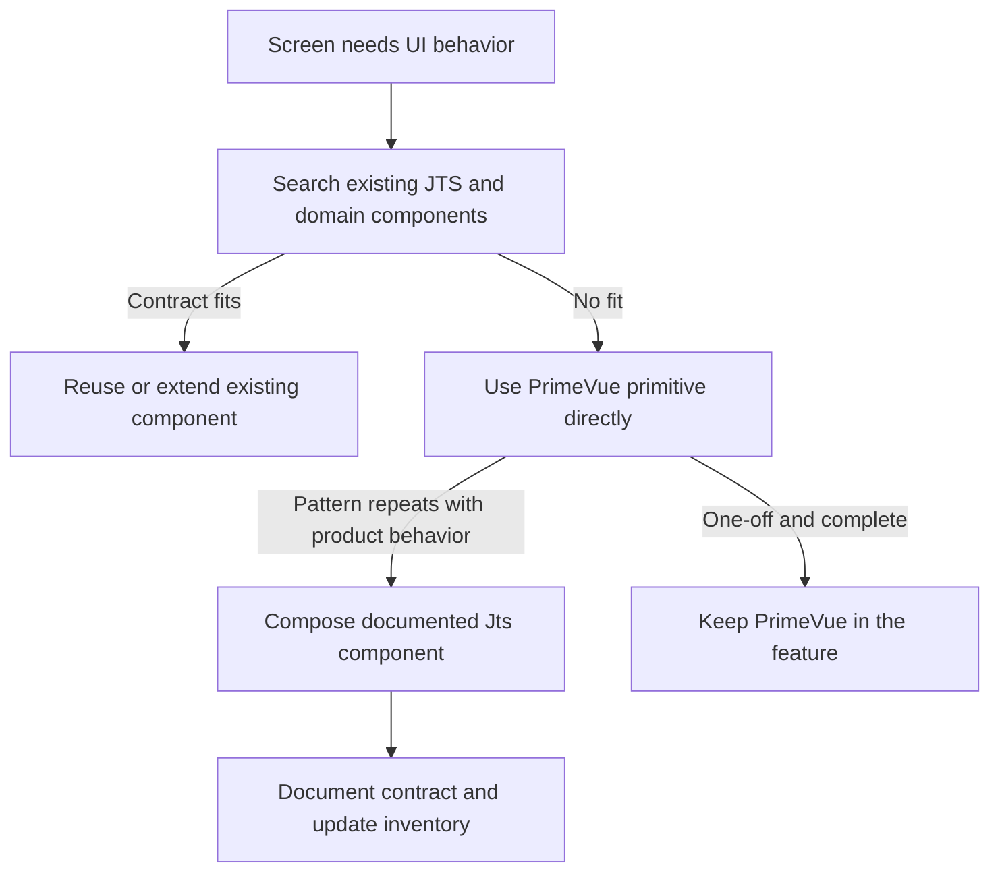

# Frontend component inventory

This is the first stop before adding UI. Search the source and this inventory,
then follow the reuse hierarchy in `apps/web/AGENTS.md`.

## Selection order

## Current inventory

### Shared UI primitives

| Component           | Contract                                   | Shared behavior                                                                                             |
| ------------------- | ------------------------------------------ | ----------------------------------------------------------------------------------------------------------- |
| `JtsPageHeader.vue` | [`jts-page-header.md`](jts-page-header.md) | Consistent page title, description and responsive action hierarchy across public, policy and admin routes   |
| `JtsSurface.vue`    | [`jts-surface.md`](jts-surface.md)         | Labelled content surface with heading, tone, density, action and footer seams                               |
| `JtsStat.vue`       | [`jts-stat.md`](jts-stat.md)               | Definition-list-safe operational metric with text-first status semantics                                    |
| `JtsDataTable.vue`  | [`jts-data-table.md`](jts-data-table.md)   | PrimeVue DataTable composition for accessible loading, empty/error, toolbar, overflow and pagination states |

### Domain components

| Component              | Scope               | Notes                                                                                                                                                                                   |
| ---------------------- | ------------------- | --------------------------------------------------------------------------------------------------------------------------------------------------------------------------------------- |
| `AdminNavigation.vue`  | Admin shell         | Responsive operations navigation; owned by the admin layout                                                                                                                             |
| `RegistrationForm.vue` | Public registration | [`registration-form.md`](registration-form.md) — fields, validation, first-error focus and terminal success presentation; uses the shared API client but does not define backend policy |

## Data-table policy

Use `JtsDataTable` when a product table needs the standard loading, empty/error,
responsive overflow, toolbar and pagination behavior. Use PrimeVue DataTable
directly only when that contract would be a poor fit. The shared component does
not own domain columns, row actions or API calls.

## Adding an entry

Document purpose, typed props/emits/slots, visual states, accessibility,
extension boundaries, source path and a minimal usage example. Use
[`../../documentation-standard.md`](../../documentation-standard.md) as the
shape; do not turn this index into the component's full manual.
