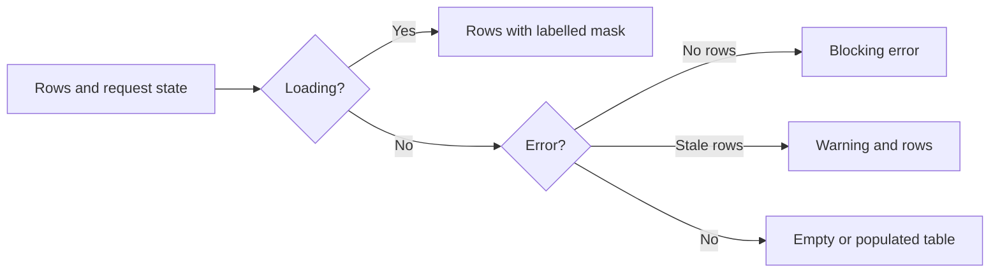

# JtsDataTable

`JtsDataTable` composes PrimeVue DataTable and Toolbar into the standard
operational table surface. It owns accessible naming, loading/empty/error
states, keyboard-reachable horizontal overflow and optional client pagination.
The page owns columns, formatting, row actions, fetching and domain rules.

Source: [`JtsDataTable.vue`](../../../apps/web/app/components/ui/JtsDataTable.vue)

| Input/slot                                    | Contract                                                   |
| --------------------------------------------- | ---------------------------------------------------------- |
| `rows`, `dataKey`, `title`                    | Required rows, stable identity and visible/accessible name |
| `description`                                 | Optional visible table description                         |
| `loading`, `error`                            | Loading mask; blocking error or stale-row warning          |
| `emptyTitle`, `emptyDescription`              | Ready-but-empty copy                                       |
| `paginator`, `pageSize`, `rowsPerPageOptions` | Client pagination, hidden when unnecessary                 |
| default slot                                  | Page-owned PrimeVue `Column` children                      |
| `toolbar-end`                                 | Page-owned table actions                                   |
| `empty-actions`, `error-actions`              | Domain-owned recovery controls                             |

The inner table receives `aria-labelledby`, `aria-describedby` and `aria-busy`.
Its scroll container is a named focusable region; the paginator has its own
label. The component does not fetch, retry or implement server pagination.

DataTable and Toolbar are local imports because this repository contains only
the client-rendered admin boundary. Add sorting, selection or lazy pagination
inputs only when a second real table requires a common contract.

PrimeVue DataTable 4.5.5 and its accessibility guide were verified 2026-07-22:
[DataTable](https://v4.primevue.org/datatable/),
[accessibility](https://v4.primevue.org/guides/accessibility/).
