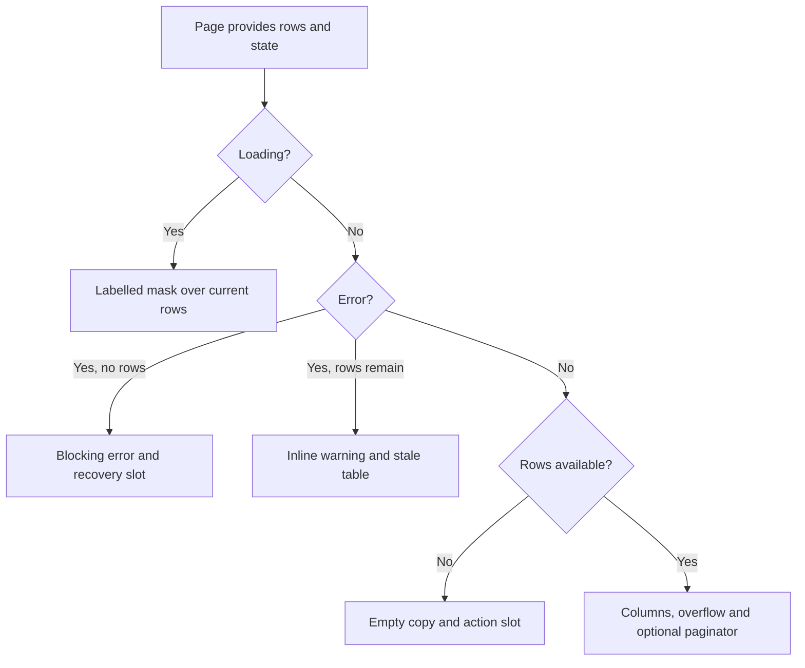

# JtsDataTable

## Purpose and boundary

`JtsDataTable` composes PrimeVue 4 DataTable and Toolbar into the product's
standard operational table surface. It owns accessible naming, loading,
empty/error presentation, keyboard-reachable horizontal overflow, toolbar and
client-side pagination seams. The consumer owns columns, cell formatting,
filters, row actions, API calls and domain rules.

Source: [`apps/web/app/components/ui/JtsDataTable.vue`](../../../apps/web/app/components/ui/JtsDataTable.vue).

## Contract

| Input/slot                                    | Type                        | Behavior                                                                    |
| --------------------------------------------- | --------------------------- | --------------------------------------------------------------------------- |
| `rows`                                        | `readonly T[]`, required    | Data passed to PrimeVue without mutation                                    |
| `dataKey`                                     | string key of `T`, required | Stable row identity; array indexes are not valid identities                 |
| `title`                                       | `string`, required          | Visible section/table accessible name                                       |
| `description`                                 | `string \| null`            | Visible supporting copy and table description                               |
| `loading`, `loadingLabel`                     | boolean/string              | Labelled loading mask; existing rows remain visible beneath refresh loading |
| `error`                                       | `string \| null`            | Blocking error with no rows; inline warning while stale rows remain         |
| `emptyTitle`, `emptyDescription`              | strings                     | Ready-but-empty copy                                                        |
| `paginator`, `pageSize`, `rowsPerPageOptions` | pagination inputs           | Standard bottom paginator, hidden for one page                              |
| `stripedRows`, `size`, `tableMinWidth`        | presentation inputs         | Deliberate density and overflow controls                                    |
| default slot                                  | PrimeVue `Column` children  | Domain-owned columns and cell templates                                     |
| `toolbar-start`, `toolbar-end`                | content/actions             | Adds controls without replacing the accessible title                        |
| `empty-actions`, `error-actions`              | recovery controls           | Consumer-owned recovery behavior                                            |
| `page` event                                  | `DataTablePageEvent`        | Exposes pagination changes without fetching data                            |

## Flow

## Invariants

- The internal `<table>` receives `aria-labelledby`, `aria-describedby` and
  `aria-busy` through PrimeVue `tableProps`; labelling only the DataTable root is
  insufficient.
- The internal scroll container is a named, keyboard-focusable region.
- The paginator has its own accessible label.
- Domain columns and row actions remain in the default slot. Navigation uses a
  real link or button in a column, never a pointer-only row click.
- `responsiveLayout` is not a PrimeVue 4.5.5 DataTable prop and must not be
  reintroduced as a decorative no-op.
- The component does not fetch, retry or infer server pagination rules.

## Failure and loading states

Loading with existing rows preserves context beneath the mask. An error with
rows preserves the stale table and adds a warning; an error without rows blocks
the table. Empty content appears only when the component is neither loading nor
failed. Recovery controls are explicit slots because retryability is a domain
decision.

## Extension points

Add explicit typed props/events when sorting, selection or lazy server
pagination becomes a repeated requirement. Do not forward arbitrary DataTable
attributes through `$attrs`; that would recreate PrimeVue with worse typing.

## Operations and tests

The admin overview is the reference consumer. Verify with frontend lint, strict
typecheck, tests and production build. Add focused mounted state tests when the
frontend introduces a component-test harness.

## Decisions and references

- PrimeVue DataTable 4.5.5, verified 2026-07-22:
  <https://v4.primevue.org/datatable/>
- PrimeVue accessibility guide, verified 2026-07-22:
  <https://v4.primevue.org/guides/accessibility/>
- PrimeVue remains pinned to the MIT-licensed 4.5.5 line; see
  [`../../frontend.md`](../../frontend.md).
