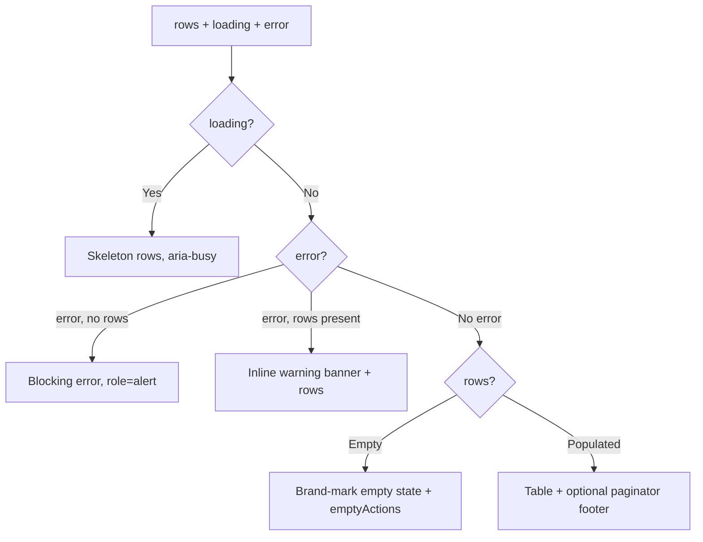

# JtsDataTable

`JtsDataTable` is the standard operational table surface: a TanStack Table
headless core (core/sorted/pagination row models) skinned with the HeroUI
`Table`. It owns accessible naming, the loading / empty / error states,
keyboard-reachable horizontal overflow and the optional client paginator. The
page owns columns, cell formatting, row actions, fetching and domain rules. It
does not fetch, retry or paginate on a server.

Source: [`JtsDataTable.tsx`](../../../apps/admin/src/components/ui/JtsDataTable.tsx)

## Contract

Generic over the row type `T`.

| Prop                 | Type                        | Contract                                                         |
| -------------------- | --------------------------- | ---------------------------------------------------------------- |
| `rows`               | `readonly T[]`              | Required. Presentation only — the page fetches and shapes.       |
| `columns`            | `ColumnDef<T>[]`            | Required. TanStack column definitions supplied by the page.      |
| `getRowId`           | `(row: T, index) => string` | Required. Stable identity so sorting/pagination keep row keys.   |
| `title`              | `string`                    | Required. Visible `h2` and the table's accessible name.          |
| `description`        | `string \| null`            | Optional visible caption; wired as `aria-describedby`.           |
| `loading`            | `boolean`                   | Shows the labelled skeleton in place of rows (`aria-busy`).      |
| `error`              | `string \| null`            | Blocking error (no rows) or a stale-data warning (rows present). |
| `emptyTitle`         | `string`                    | Ready-but-empty heading. Default `"Nothing to show yet"`.        |
| `emptyDescription`   | `string`                    | Ready-but-empty copy.                                            |
| `paginator`          | `boolean`                   | Enables client pagination, hidden while unnecessary.             |
| `pageSize`           | `number`                    | Initial page size. Default `10`.                                 |
| `rowsPerPageOptions` | `number[]`                  | Footer page-size choices. Default `[10, 25, 50]`.                |
| `toolbarEnd`         | `ReactNode`                 | Page-owned actions, right of the title.                          |
| `emptyActions`       | `ReactNode`                 | Domain recovery controls for the empty state.                    |
| `errorActions`       | `ReactNode`                 | Domain recovery controls for the error state.                    |

### Column contract (page-owned)

Columns are plain TanStack `ColumnDef<T>` — `accessorKey`/`header`/`cell` and
`enableSorting`. Alignment is the one presentation hook the surface reads from
each column, via a module augmentation:

```ts
// @tanstack/react-table ColumnMeta
meta?: { align?: "start" | "center" | "end" }
```

`meta.align` sets both header and body cell alignment (default `start`). The
first leaf column renders as the row header (`isRowHeader`). A column is sortable
only when its `ColumnDef` allows sorting; the surface reads `getCanSort()`.

## States



- **Loading** — skeleton bars in the body; the scroll region is `aria-busy`.
- **Blocking error** — no rows: a centred `role="alert"` panel with
  `errorActions`.
- **Inline error** — rows still present: a `role="alert"` warning banner above
  the retained rows.
- **Empty** — ready with zero rows: the six-dot brand mark, `emptyTitle`,
  `emptyDescription` and `emptyActions`.
- **Populated** — rows, plus the footer when paginating.

## Sorting and pagination

- Sorting is client-side, single column, held in local `SortingState` and
  bridged to HeroUI's `sortDescriptor` / `onSortChange`. Sorted headers tint
  `text-primary`.
- Pagination is client-side and only mounted when `paginator` is set. The footer
  (rows-per-page `Select` + compact `Pagination`) is hidden unless it is
  needed — i.e. more than one page, or more rows than the smallest page-size
  option. Page numbers are windowed: first, last and ±1 around the current page
  with ellipses.

## Accessibility

- The `section` is `aria-labelledby` the title `h2`.
- The scroll container is a focusable `role="region"` (`tabIndex=0`) labelled by
  the title, so overflow is keyboard reachable; it carries `aria-busy` while
  loading.
- `Table.Content` gets `aria-labelledby`, and `aria-describedby` when a
  `description` is present.
- Status is conveyed by text and tone, never colour alone.

## Invariants

- `getRowId` must be stable per row — it keys sorting and pagination.
- The surface owns states, framing and a11y; it never owns domain data,
  fetching, filtering or business rules.
- Rows may persist under `error` (stale-data warning); they vanish under
  `loading`.

## Extension points

- **Add a column** — edit the consumer's `ColumnDef[]` only; zero table edits.
  Align numeric columns with `meta.align`.
- **Make a column sortable** — set `enableSorting` in its `ColumnDef`.
- Add sorting/selection/lazy-pagination _props_ only when a second real table
  needs the shared contract — not speculatively.

## References

Verified 2026-07-23:

- [@heroui/react](https://www.heroui.com/) 3.2.2 —
  [Table](https://www.heroui.com/docs/react/components/table),
  [Pagination](https://www.heroui.com/docs/react/components/pagination),
  [Select](https://www.heroui.com/docs/react/components/select).
- [@tanstack/react-table](https://tanstack.com/table/v8) 8.21.3 —
  [Column defs](https://tanstack.com/table/v8/docs/guide/column-defs),
  [Sorting](https://tanstack.com/table/v8/docs/guide/sorting),
  [Pagination](https://tanstack.com/table/v8/docs/guide/pagination).
