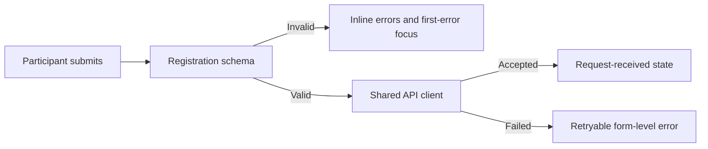

# RegistrationForm

## Purpose and boundary

`RegistrationForm` owns the public seat-request fields, client validation,
first-error focus, submission state and terminal success presentation. It does
not load event details, decide eligibility, confirm a seat or define backend
registration policy.

Source:
[`apps/web/app/components/registration/RegistrationForm.vue`](../../../apps/web/app/components/registration/RegistrationForm.vue).

## Contract

| Input/event | Type               | Behavior                                                          |
| ----------- | ------------------ | ----------------------------------------------------------------- |
| `eventSlug` | `string`, required | Included with the validated request sent to `POST /registrations` |

The component has no public slots or emitted events. A successful request
replaces the form with an acknowledgement; it does not claim the seat is
confirmed.

## Flow

## Invariants

- The Zod schema in `app/features/registration/schema.ts` owns client parsing;
  the backend still validates independently.
- Every error is associated with its control through `aria-describedby`, and a
  failed submit moves focus to the first invalid control.
- `eventSlug` comes from the route and is not treated as trusted event data.
- Sensitive medical details are explicitly discouraged.
- Success copy distinguishes a request from a confirmed seat.

## Failure and loading states

The submit button exposes PrimeVue's loading state while the mutation is in
flight. Network and server failures preserve the entered values and show a
generic retryable message; raw server messages are never rendered.

## Extension points

Add or change fields through the registration schema and form together. Event
loading, availability and booking policy belong to the route/API boundary, not
new implicit behavior inside this component.

## Operations and tests

`apps/web/test/registration-schema.spec.ts` covers the accepted input and
field-addressable errors. Run frontend lint, strict typecheck, tests and build
after changing the form contract.

## Decisions and references

- Nuxt 4.5.0 component discovery, verified 2026-07-22:
  <https://nuxt.com/docs/4.x/directory-structure/app/components>
- Vue 3.5.40 TypeScript Composition API, verified 2026-07-22:
  <https://vuejs.org/guide/typescript/composition-api>
- PrimeVue 4.5.5 forms and accessibility, verified 2026-07-22:
  <https://v4.primevue.org/forms/> and
  <https://v4.primevue.org/guides/accessibility/>
