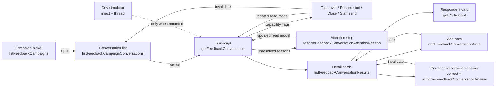

# Post-event feedback conversations screen

Status: accepted, verified 2026-07-27 (WP9, design pass and staff notes in
WP12, conversation-list pass, extraction status, two-pane bento layout).

The operator surface for the post-event feedback feature: one campaign's
WhatsApp conversations in a two-pane inbox over a strip of detail cards, the
actions that move a conversation between bot and human control, and the
campaign's collected results. It implements U1–U4 and D17/D18 of
[`POST_EVENT_FEEDBACK_PLAN_2026-07-25.md`](../history/post-event-feedback-plan-2026-07-25.md)
and is the operator half of
[`backend/modules/post-event-feedback.md`](../backend/modules/post-event-feedback.md).

## Purpose and boundary

This screen owns reading and steering conversations. It does not own the
conversation itself: lifecycle, control, extraction and delivery are backend
concerns, and the screen renders what the read models report.

It **does** own: pane layout and selection, filtering and grouping, the status
vocabulary, confirmation copy for each action, polling cadence, and the
`«άγνωστος συμμετέχων»` fallback.

It **does not** own: whether an action is allowed (capability flags), whether a
conversation may reopen (it never does), question copy (backend constants), or
any rule about who is a valid subject — including for a staff note, whose
subject the backend re-checks against the live D16 candidate set.

| Route                                 | View                    | Owns                                       |
| ------------------------------------- | ----------------------- | ------------------------------------------ |
| `/admin/feedback`                     | `FeedbackCampaignsPage` | Choosing or launching a campaign           |
| `/admin/feedback/:campaignId`         | `FeedbackInboxPage`     | The inbox (U1), actions, dev composer (U2) |
| `/admin/feedback/:campaignId/results` | `FeedbackResultsPage`   | The campaign's answers and notes (U4)      |

The selected conversation lives in `?conversation=<id>` so a thread is
linkable and survives reload, while the list beside it stays put.

## Contract

Every product call goes through the generated hooks in
`apps/admin/src/api/generated/` — `useListFeedbackCampaigns`,
`useListFeedbackCampaignConversations`,
`useGetFeedbackConversation`, `useListFeedbackConversationResults`,
`useListFeedbackCampaignResults`, `useTakeOverFeedbackConversation`,
`useResumeFeedbackConversationBot`, `useCloseFeedbackConversation`,
`useSendFeedbackConversationStaffMessage`, `useUpdateFeedbackNoteReviewStatus`,
`useResolveFeedbackConversationAttentionReason`,
`useAddFeedbackConversationNote`, `useCorrectFeedbackConversationAnswer`,
`useWithdrawFeedbackConversationAnswer`, `useStartFeedbackConversation`,
`useListEventFeedbackCandidates` and the campaign
launch/pause/resume/close/get hooks.

| File                                         | Owns                                                                                       |
| -------------------------------------------- | ------------------------------------------------------------------------------------------ |
| `src/features/feedback/labels.ts`            | Status vocabulary: tones, badges, delivery precedence, note origin, D18                    |
| `src/features/feedback/conversationView.ts`  | Progress, badge rows, search folding, ordering, grouping, selection, message anchor ids    |
| `src/features/feedback/extractionStatus.ts`  | Greek copy for the detail-pane extraction block (unread, due time, failure, model)         |
| `src/features/feedback/answerCorrections.ts` | Which control a recorded answer gets, the «corrected by» line, the withdrawal wording      |
| `src/features/feedback/staffClose.ts`        | Staff close reason vocabulary, confirm-dialog labels, the «Closed as …» summary line       |
| `src/features/feedback/polling.ts`           | The U3 intervals and the stop-when-closed rule                                             |
| `src/features/feedback/simulator.ts`         | Zod schemas for the two dev-only simulator endpoints                                       |
| `src/lib/feedbackSimulator.ts`               | The dev simulator facade over the shared `ofetch` client                                   |
| `src/components/admin/feedback/`             | The two panes, the attention strip, the detail cards, the badge row, and the dialogs       |
| `src/features/participants/profileFields.ts` | Participant storage codes as display text, shared with the WP11 profile route              |
| `src/components/ui/JtsLiveIndicator.tsx`     | The shared polling mark both live panes use ([contract](components/jts-live-indicator.md)) |

`features/feedback/` has no React imports and carries the screen's rules, so
they are unit-tested directly in `apps/admin/test/feedback-inbox.spec.ts`.

## Flow

## Invariants

- **Capabilities decide, not the client.** Take over, resume, close and staff
  send are rendered only when the conversation's `capabilities` say so. A
  STOP-closed conversation publishes none and its action row disappears. No
  lifecycle rule is re-implemented here.
- **Mutations return the read model.** Each action's response is written
  straight into the conversation query with `setQueryData` before the list is
  invalidated, so the panes never show an optimistic guess about what an
  operator may do next.
- **Selection survives polling.** `resolveSelectedConversationId` keeps the
  operator's choice while it remains visible and only falls back to the first
  row when it disappears.
- **Status is text plus tone.** Every badge carries its own label; colour is
  reinforcement. The transcript distinguishes actors by label, alignment and
  fill together.
- **A pill is the colour of what it says.** `FeedbackBadges` owns one pale
  pairing per tone — fill, hairline and text from the same status token — so a
  column of rows can be triaged by colour before a word of it is read. It is
  not a HeroUI `Chip`: that palette has no `info` slot, so every slate status
  fell back to the same grey as `neutral` and «Open» was indistinguishable from
  «Cancelled». The four `--color-*-border` bridge tokens exist for this; before
  them `border-warning-border` and its siblings emitted no rule at all.
- **A row never repeats its own heading.** The grouping answers "is anything
  waiting for me", so the heading carries that weight and
  `conversationRowBadges` strips whatever the heading already said: no «Needs
  attention» chip under NEEDS ATTENTION, no «Open» under OPEN, no bare «Closed»
  under CLOSED. A _named_ closing reason («Stopped», «Completed») and human
  control survive anywhere, because no heading states them. An ordinary open
  conversation therefore carries no chip at all, which is what makes a chip in
  this list worth looking at. The transcript header keeps the full
  `conversationBadges` set — it stands alone with no heading to inherit from.
- **Each fact appears once.** Goal progress is one number in words
  («3/4 done»), not a bar beside its own caption: the text is what a screen
  reader reads out of the row's name, and four goals give a bar five states it
  cannot express more precisely. `GoalProgress` publishes `settled` — the count
  the row shows — and no `percent`, which existed only to size that bar. The
  wording is `done` rather than `answered` because a skipped goal is settled
  without being answered. The same `settled/total` sits in the PROGRESS &
  ANSWERS card's own header rather than as a sentence above the goal rows,
  which restated in prose exactly what the labelled rows already said.
- **An answer replaces the badge.** PROGRESS & ANSWERS is one row per goal, and
  a goal that has answers shows them instead of a status chip: an answer is the
  strongest possible statement that a goal is answered, so «Score · Answered»
  above «SCORE · 5 / 5» below said the same thing twice. The badge is left to
  say the only things an answer cannot — not asked, awaiting a reply, skipped.
  A question can hold several answers (D16 subjects), so the row is a list.
- **Only the exception is badged.** An outbound message handed to the transport
  with nothing reported back is the ordinary end of every message, so
  `deliveryBadge` returns `null` for a bare `sent`. Queued, sending, held,
  cancelled, failed, delivered and read all keep their pill. A chip under
  almost every bubble is how a chip stops being read.
- **Attention is emphasised, not merely coloured.** `needsAttention` renders as
  a **solid** warning pill on inbox rows and in the conversation header, while
  every other badge stays tinted. It is still a labelled badge — the emphasis is
  hierarchy, not a second channel of meaning.
- **The badge says what, and can be cleared.** When the conversation carries
  unresolved `attentionReasons`, `ConversationAttention` renders one plain
  sentence per reason at the head of the transcript — the same tinted strip
  this pane already uses to say something is wrong, not a card that would push
  the messages down the screen. Each reason links to the message that caused it
  (`transcriptMessageAnchorId` is the anchor both ends share) and carries a
  one-press Dismiss: no dialog and no note, because the operator has just read
  that message and a confirmation per reason is how a badge ends up never being
  cleared. Resolved reasons are not shown, and the whole block is absent when
  nothing is unresolved. A reason whose message is no longer in the 150-message
  transcript keeps its sentence and drops the link rather than scrolling
  nowhere, and so does a reason that never had one: a voice note the transcript
  could not hold, a full document and a send that never went out are all about
  something the transcript does not contain, which is the point of saying so.
- **The cited message is explicit.** Participant messages with `attention`
  metadata replace their normal bubble fill with the warning surface and render
  labelled chips below the testimony. Categories and actions are fixed mappings,
  never model-authored copy: `sexual_misconduct` is `🍌 Sexual misconduct`, and
  human follow-up actions use the Lucide bell plus readable text. Colour and
  symbols only reinforce the labels. The chips are one row of equal-height flex
  items: the action icon is the chip's own child rather than a flex layer
  nested inside its label, because that layer made the icon the chip's baseline
  and left the action sitting 2.5px above the categories beside it.
- **D18 everywhere.** Any unresolved participant id renders
  `«άγνωστος συμμετέχων»` in italics — respondents, answer subjects and note
  subjects alike. Raw UUIDs never reach the screen.
- **A staff note is never participant testimony.** A note the backend reports as
  `origin: "staff"` carries a "Staff note" badge in the details pane and its own
  Source column on the Results tab. Extraction output is the unlabelled default
  because it is the pane's subject; the exception is what gets named.
- **One documented client exception.** Only `src/lib/feedbackSimulator.ts` and
  the pre-existing assistant call the transport directly; a test enforces that
  the list stays at exactly those two.

## Failure and loading states

- The list, transcript and results panes each own loading, empty and error
  states; the list distinguishes "no conversations yet" from "no matches", each
  with its own muted glyph.
- Action failures render in the transcript pane and leave the dialog's context
  intact rather than closing over the error. «Add note» is the exception that
  proves the rule: its failure renders **inside** its own dialog, because the
  operator's typed text is still on screen there and the transcript pane is
  behind the modal.
- The dev simulator's absence is the normal case in any non-simulated
  deployment: the probe fails quietly, the composer is not rendered, and no
  error is shown.
- `queryClient` retries are off repo-wide, so a failure is shown rather than
  hidden behind silent attempts.

## Polling (U3)

| Query             | Interval | Notes                                          |
| ----------------- | -------- | ---------------------------------------------- |
| Open conversation | 3 s      | Stops entirely once the list reports it closed |
| Conversation list | 10 s     | Also refetches on window focus                 |
| Answers and notes | 15 s     | Extraction lands after the message             |

TanStack Query's `refetchIntervalInBackground` stays at its default `false`, so
every interval pauses while the browser tab is hidden. There is no visibility
listener to maintain. WebSockets/SSE remain deferred.

Both live panes say so on screen. The list and transcript headers render
[`JtsLiveIndicator`](components/jts-live-indicator.md) bound to their query's
`isFetching`: a 14px muted icon that turns during a fetch and fades out
otherwise. It reserves its space so a poll never nudges the header, and it is
not a live region — a three-second poll that announced itself would be unusable.

## Layout

Two panes over a strip of cards. From `lg` the list sits beside the transcript;
under both, spanning the full width, the conversation's detail runs as three
small cards (three columns from `xl`, two from `md`, one below that). Each pane
is its own scroll container — `66vh` for the two panes, `44vh` for a card — so
switching conversations never costs an operator their place in the list.

It was one tall right-hand column of six stacked sections. Everything about a
conversation shared a single scrollbar, which meant the notes an operator had
just written sat below four screens of reference data, and the pane an operator
looked at most was the one they had to scroll furthest into. Splitting it puts
the three questions side by side — what the conversation produced, what staff
wrote about it, who it is with — and none of them is behind the others.

The screen deliberately does **not** take over the viewport the way the
assistant route does. The reason is the height budget, not a shell limitation:
`#root` at `min-height: 100dvh` plus `flex-1 min-h-0` on `AdminShell` and its
content column already hand a route a definite height — that chain is exactly
how `/admin/assistant` fills the shell, and the inbox could use it too. It was
measured and rejected. At 1280×720 the page header and the campaign summary row
leave roughly 320 px for the pane grid, which the `lg` two-column layout splits
into two rows of about 150 px — less than one message bubble plus a composer.
Capped panes with an ordinary document scroll keep the transcript readable at
that size.

A blank band above displaced panes while the document is scrolled is an
artifact of headless and automation Chromium screenshot surfaces, not a layout
fault; a plain page with no application CSS reproduces it in the same tools.
Real Chrome paints the scrolled inbox correctly at 1280×720 and 1600×1000 in
both themes (verified 2026-07-26 over the DevTools Protocol).

### The conversation list column

An operator scanning it asks three things in order: _is anything waiting for
me_, _who is it_, _how far did they get_. The first is answered by the
grouping, so the heading is the loudest thing in the column and the rows are
deliberately quiet.

| Part            | Treatment                                                                                                                                                               |
| --------------- | ----------------------------------------------------------------------------------------------------------------------------------------------------------------------- |
| Heading         | Sticky micro-caps strip: own fill, `border-border-strong` hairline top and bottom, a 14px glyph, the bucket count right-aligned                                         |
| NEEDS ATTENTION | `bg-warning-soft` / `text-warning` plus the signature 3px marker (`TriangleAlert`) — the only group that means "stop and read this"                                     |
| OPEN            | `bg-surface-sunken` / `text-ink` (`MessageCircleMore`), the working set at full contrast                                                                                |
| CLOSED          | `bg-surface-sunken` / `text-ink-muted` (`Archive`), the quiet archive                                                                                                   |
| Row             | Name (two lines, `break-words`, never one truncated line), time, then one metadata line: phone `·` `N/M done` `·` any chip. Chips only when the heading has not said it |

The glyphs are the campaign tallies' own — an operator reads «2 need attention»
in the summary row and meets the same triangle over the group. The other two
headings reserve the marker's 3px gutter with a transparent border so every
label starts on one line. The marker itself stays on the one group that earns
it: the motif means "this matters", and putting it on all three would mean
nothing.

Row height matters because the column cannot grow wider. At its declared
minimum (`15rem`) a 43-character Greek name still wraps to two lines and clamps
rather than being cut mid-name at one; «Κώστας Αργοπληκτρολογάκιας» wraps whole.
Verified in both themes at 240 px and 304 px over the DevTools Protocol
(2026-07-27).

### Where each control lives

Placement is the screen's answer to "what does this act on?".

| Control                        | Home                     | Why                                                                   |
| ------------------------------ | ------------------------ | --------------------------------------------------------------------- |
| «All campaigns»                | Above the page header    | Leaves the campaign — a back affordance (left arrow, link style)      |
| Results                        | Campaign header actions  | Reads this campaign's output                                          |
| Pause / Resume / Close         | Campaign header actions  | Changes this campaign's state; a hairline separates them from Results |
| «Start conversation» (D17)     | Conversation list header | It creates a row in that list, directly under the filter over it      |
| Take over / Resume bot / Close | Transcript, foot         | On the line that says who may write here — the question they answer   |
| «Add note»                     | NOTES card header        | Writes into the list it sits above                                    |
| Correct / withdraw an answer   | On the answer's own row  | Acts on that one recorded answer, beside the value it disagrees with  |

## Closing a conversation

Close still lands as lifecycle `cancelled` — that is the state-machine answer
— and the confirm dialog asks **why**. The operator picks from
`abusive | unresponsive | handled_offline | duplicate | other` and may add an
optional note (≤ 500). Both travel on `closeFeedbackConversation`'s body and
come back on the detail read model as `staffClose`, rendered under the
transcript header as «Closed as …». Without that line every human close still
read as the bare «Cancelled» badge a month later.

Every one of them carries a 16px muted stroke icon; the accent stays reserved
for interactive emphasis. Icons are for orientation, never decoration — which
is also why an empty state never reuses the glyph of the section it sits in
(`Hourglass` under ANSWERS, `PenOff` under NOTES, `MessageSquareDashed` under
the `Inbox`-marked list). An icon that repeats inside its own section has
stopped carrying information.

### The detail cards

Each card repeats the two panes' own shell — hairline border, its own header,
its own scroll container — so the screen reads as one set of panels rather than
two panes plus some boxes. Inside, the participant profile's section grammar
(WP11) still applies: a tracked micro-caps label with a muted icon.

| Card               | Icon         | Contains                                                                                                                     |
| ------------------ | ------------ | ---------------------------------------------------------------------------------------------------------------------------- |
| PROGRESS & ANSWERS | `ListChecks` | `settled/total` in the header, then one row per goal carrying its answer (with its correct / withdraw controls) or its badge |
| NOTES              | `StickyNote` | Note cards with origin and review badges, plus «Add note»                                                                    |
| RESPONDENT         | `UserRound`  | Monogram and profile link, then the participant's own record (see below)                                                     |

Two things that used to live here now belong to the transcript, because both
are about the messages rather than about the conversation as a record: the
capability-gated actions, and the ΑΝΑΓΝΩΣΗ reading status.

### The respondent card

It reads the stored participant through the same `getParticipant` endpoint the
WP11 profile route uses — email, the phone on file, neighbourhood, age band and
the feedback opt-in — and formats the storage codes with the shared
`features/participants/profileFields.ts`, so `55_plus` cannot end up displayed
two different ways. Before, the card knew only the display name and the number
the campaign launched against, which was the least useful thing on screen at
the moment an operator is deciding whether a disclosure needs a phone call.

The number the campaign launched against is frozen on the conversation. When
the profile's number has since changed, the card says so rather than quietly
showing two different numbers for one person. An unresolved id (D18) has no
record to fetch, so the query never runs for one and the card says why.

### Extraction status

A feedback conversation is read by a delayed background job, not on arrival,
and `ReadingStatus` is the only place that says so. It renders at the foot of
the transcript, on the same line as the actions: «why has that answer not
appeared yet» is a question about these messages, and it is answered under
them. `getFeedbackConversation` publishes an `extraction` object; the list
endpoint never touches Redis for this — anything shown on a row would have to
come from data already loaded.

It gets one line. Current reading is the normal case and the transcript is what
the pane is for, so the normal case costs a single row of muted text and only a
backlog or a failure takes a tinted block. The model id shows only when the
reading is behind or has failed — that is when it explains something.

| Field                       | Source                                                                       | What the screen may say                                            |
| --------------------------- | ---------------------------------------------------------------------------- | ------------------------------------------------------------------ |
| `unreadParticipantMessages` | Document alone (participant turns beyond `cursorSeq`)                        | «N μηνύματα δεν έχουν διαβαστεί ακόμα»                             |
| `nextRunAt`                 | Earliest delayed extract job for an unread seq                               | «Επόμενη ανάγνωση 11:47» — a time, never a spinner                 |
| `runInFlight` / `runQueued` | BullMQ `active` / waiting-or-delayed among those jobs                        | «Ανάγνωση σε εξέλιξη» / «Ανάγνωση στην ουρά»                       |
| `lastRunFailed`             | Retained failed extract job, or a `deterministic_fallback` note while unread | «Η ανάγνωση απέτυχε · απάντησε η εναλλακτική διαδικασία»           |
| `lastRunAt` / `model`       | Conversation document                                                        | Quiet provenance; a stub id is a different thing from a real model |

**No unresolving spinner.** A dead worker looks identical to a busy one; the
pane states a time when there is one and failure as failure. When unread
testimony exists but no job is retained, the schedule line is «Ώρα επόμενης
ανάγνωσης άγνωστη» — retention removal, a lost enqueue and "already ran" are
indistinguishable once the Redis row is gone, and inventing «έτοιμο» would lie.

The line is a polite live region (`role="status"` / `aria-live="polite"`).
Unread count and due time change under the reader as the quiet window runs;
identical text across a three-second poll does not re-announce. The polling
indicator beside the transcript stays deliberately silent — that is a fetch
mark, not operator-actionable state.

Greek copy lives in `src/features/feedback/extractionStatus.ts`; every colour
is a token (`warning-soft` for backlog, `danger-soft` for failure).

### The campaign line

Above the panes the campaign states itself in one quiet line — status pill,
`N conversations · N open`, and the attention count only when there is one, on
the same triangle the list's NEEDS ATTENTION heading uses. It was a bordered
summary bar under a paragraph of instructions. The list beside it already
groups and counts the same conversations, and an operator does not re-read a
description of the screen they are working in, so both were spending vertical
space the transcript needed.

## Staff notes

«Add note» writes an ordinary `feedback_notes` row through
`addFeedbackConversationNote`, so a manual note lands in the same conversation
pane, Results tab and review queue as everything else.

- **Type** is the existing note vocabulary; **text** is bounded at 500
  characters, matching the column's check constraint.
- **About** is optional and lists only the campaign event's current D16
  candidates, read from `listEventFeedbackCandidates` — the same endpoint
  extraction resolves subjects with. The backend re-checks and refuses anyone
  else, so the picker is convenience, not the rule.
- The note is stored with staff provenance and therefore renders with the
  "Staff note" badge everywhere. Nothing about a model is invented.
- It is **not** capability-gated. Writing down what you learned is not steering
  the conversation, so it stays available after the thread closes — unlike
  every control that could send a message.
- On success both readers are invalidated: this conversation's results and the
  campaign-wide Results query.

## Correcting an answer

An operator who reads a score the model got wrong can fix it from the row it is
wrong on. Two controls, because they are two different statements — see
[the backend module](../backend/modules/post-event-feedback.md#operator-corrections-to-recorded-answers-wp12b)
for how each is recorded.

- **A score** is an inline edit: press the pencil beside the value, pick from
  1–5, save. `correctFeedbackConversationAnswer` answers with the updated answer
  and both answer readers are invalidated. Offered only where the answer is a
  number (`event_score`); on `liked` / `meet_again` / `avoid` the subject _is_
  the answer, so there is no number to pick.
- **A wrong person** is a withdrawal: the same `ConfirmAction` dialog every
  consequential control on this screen uses, naming the person and the question
  and saying that it cannot be undone here. `withdrawFeedbackConversationAnswer`
  deletes the row; only the audit log remembers it.
- Neither is **capability-gated**, and that is the point: a closed thread is the
  case they exist for, because nothing will ever re-read it and a wrong number
  would stay wrong for good. `src/features/feedback/answerCorrections.ts` owns
  which control an answer gets and the line that says who corrected it.
- A corrected answer carries «Corrected by … · date» under its value.
  `createdAt` stops meaning "when this value was decided" the moment a correction
  lands, and a corrected number with no author was the thing that could not be
  told apart from the model's own reading.
- Failures are reported **on the answer's own row** rather than in the pane-level
  error line, because that is where the operator is looking and where the value
  they tried to save still is. It is not a workflow: nothing is assigned and
  nothing is approved.
- One thing the screen cannot do: re-aim an answer at the right person. There is
  no operator-authored answer path, so a withdrawal is the honest end of it.
  A goal already badged «answered» also stays badged after its only answer is
  withdrawn — that snapshot is monotonic in the conversation document.

## Campaign picker

`/admin/feedback` lists campaigns from `listFeedbackCampaigns` (newest first)
with event title, status, launched_at and conversation progress counts. Opening
an inbox is a plain link. Launching a campaign for a finished event that does
not yet have one is a separate confirmed action — `launchFeedbackCampaign` also
opens conversations and queues intros for newly eligible attendees, so it must
never be used merely to navigate. Event detail carries a nullable
`feedbackCampaignId` so screens can deep-link the inbox without launching.

## Accessibility

- One `h1` per route through `JtsPageHeader`; panes are labelled `section`s.
- **The grouping a screen reader hears is the grouping an operator sees.** Each
  bucket is a `section` whose `aria-labelledby` points at its own visible `h3`,
  so the region is named with the heading _and_ its count — Chrome reports the
  three regions as `"NEEDS ATTENTION 2"`, `"OPEN 3"` and `"CLOSED 1"`, matching
  the strips on screen exactly. The group icons are `aria-hidden`; the words
  carry the meaning.
- Conversation rows are buttons in a list; the selected row carries
  `aria-current`. Goal progress is announced as text (`3/4 done`), which is
  also why it is not a bar: a `<button>` may not contain the `div`-based HeroUI
  `ProgressBar`.
- A row's accessible name is computed from its own content — Chrome reports
  `"Ελένη Ριπομηνυματού 11:39 +30690000102 3/4 done"` (the `·` between phone
  and progress is `aria-hidden`, and an open conversation under OPEN adds no
  trailing badge). Do not add an `aria-label`
  here: it would replace that name with a shorter one that no longer contains
  the visible text, which is what WCAG 2.5.3 Label in Name forbids. Automation
  accessibility trees that report these rows as bare `button` entries are
  under-reporting name-from-content; `<button>text</button>`
  reproduces it with no application code involved.
- Every control on the route has a name: the inbox at rest, the start and
  confirm dialogs, and the small-viewport navigation drawer each audit to zero
  unnamed interactive nodes (verified 2026-07-26 over the DevTools Protocol).
  The «Add note» dialog joins that set with a labelled text area and two
  labelled selects.
- Each detail card is a labelled `section` with its own `h2`, and a subsection
  inside one keeps its `h3`; every section icon is `aria-hidden` and the label
  carries the meaning.
- Both composers have visually hidden labels naming the recipient and the
  channel; the simulator composer is additionally captioned as development-only.
  The «Add note» dialog labels its text area and both selects, and shows its
  failure in the dialog with `role="alert"`.
- The polling indicator is deliberately not a live region: the icon is
  `aria-hidden` and a hidden sentence states that the pane refreshes itself.
  The extraction status block **is** a polite live region — unread count and
  due time are operator-actionable state that changes under the reader, and
  identical text across a poll does not re-announce.
- Contrast was measured in both themes on the rendered screen. Two pairings
  needed correction and are commented at their call sites: the list timestamp
  uses `text-ink-muted` (`text-ink-subtle` measures 4.23:1 on `bg-primary-soft`),
  and the staff actor label uses `text-ink` (`text-copper` measures 3.93:1 on
  `bg-surface` at 10 px). **`--jts-color-accent` is not safe for small text on
  surface in the light theme** — worth a token-level decision rather than more
  per-call-site patches.
- The solid attention pill is `--jts-color-canvas` on `--jts-color-warning`:
  **5.53:1 in light and 8.95:1 in dark**, both clear of AA. Every `strong` tone
  uses the same pairing shape, which is what makes the emphasis a hierarchy
  decision rather than a contrast risk. `theme-tokens.spec.ts` asserts
  that pairing from `tokens.css` directly, so the emphasis cannot drift below AA
  unnoticed. No `attention` semantic token was added — `warning` already carries
  this meaning, and the admin contract prefers the nearest AA-safe existing
  token over a new one for a single component. The pill's fill is opaque in both
  themes, so it stays legible on a selected row's `bg-primary-soft`.
- The design pass introduced three pairings, all measured from `tokens.css` and
  now asserted alongside the pill: answer-card text on `surface-sunken`
  (**13.79:1 light / 16.77:1 dark**), its micro-caps label on the same fill
  (**5.07:1 / 10.33:1**), and the respondent link on `surface` (**8.98:1 /
  9.03:1**). The "Staff note" chip is HeroUI's soft `accent`, which the bridge
  points at the wine primary rather than the copper accent, so it measures
  **7.72:1 / 7.38:1** — the copper `--jts-color-accent` remains unsafe for small
  text and is still avoided. Asserting the chip meant teaching the spec's
  resolver `color-mix(in srgb, …)`, since every dark `-soft` token is built that
  way; without it no tinted pairing could be measured in the theme where it
  matters most.

## Tests

`apps/admin/test/feedback-inbox.spec.ts` covers the D18 fallback, delivery-badge
precedence, lifecycle badges, goal progress, accent-insensitive Greek filtering,
attention-first ordering, group pruning, selection stability under polling, the
polling policy, the campaign picker consuming `useListFeedbackCampaigns`, the
attention pill's emphasis (only that badge is `strong`, the tinted/solid tables,
and that both the list row and the conversation header render the badge row),
the pale pairing every tone owns, the four status-hairline bridge tokens, and
the API-boundary invariants (generated hooks on the screen, capability-gated
actions, exactly two hand-written transport callers).

The design pass adds: the staff-origin badge (present for `staff`, absent
otherwise) and that both the details pane and the Results tab render it, the
note write going through the generated hook and invalidating both readers, the
subject picker consuming the D16 candidate endpoint, «All campaigns» sitting
above the header as a back affordance, «Start conversation» living with the
list, and the polling indicator being bound to `isFetching` in both panes with
no live region.

The list-column pass adds `conversationRowBadges`: that the attention chip is
dropped under its own heading while the lifecycle survives there (open and
stopped are a real distinction inside that bucket), that an ordinary open
conversation ends up with no chips, that a named closing reason survives while
the bare «Closed» does not, that human control is never dropped, that the
transcript header still receives the full set, and that each reader calls the
function it should. It also pins the one title table both the headings and that
filter read, and asserts `GoalProgress` publishes `settled` and no `percent`
now that nothing draws a bar.

The bento pass adds that PROGRESS & ANSWERS resolves a goal's answers by
`questionKey` and keeps no second answers list, and that the respondent card
reads the participant record through the generated `useGetParticipant`.

The corrections pass adds `answerCorrections`: that a value edit is offered only
on a scored question and a withdrawal only on a directed one, that a corrected
answer says who decided it while an untouched one stays silent, that the
withdrawal dialog names the person, the question and the fact that it cannot be
undone, and that both controls live on the answer row with no capability gate.

The extraction-status pass adds `extractionStatusLines`: Greek unread wording,
a due-time line rather than a spinner, failure named as failure with the
fallback, «άγνωστο» when unread testimony has no retained job, that the block is
a polite live region without an indefinite spinner, and that the transcript —
not the page or a detail card — is what mounts it.

`apps/admin/test/theme-tokens.spec.ts` asserts the solid attention pill, the
NEEDS ATTENTION heading on its tint, the sunken card pairings (which the OPEN
and CLOSED headings share), the respondent link and the soft accent chip from
`tokens.css` in both themes.

## Decisions and references

- [ADR 0008](../decisions/0008-post-event-feedback-conversations.md) — feedback
  conversations, directed results and human control
- [Outbound queue](feedback-outbound-queue.md) — the sibling screen for messages
  that have not reached the participant yet, and the same «άγνωστο» rule applied
  to the delivery job
- [ADR 0009](../decisions/0009-generated-api-client.md) — generated admin API client
- [`frontend.md`](../frontend.md) — admin conventions; [`theming.md`](theming.md) — tokens
- [`backend/modules/post-event-feedback.md`](../backend/modules/post-event-feedback.md) — the campaign and conversation contracts
- [TanStack Query `refetchInterval`](https://tanstack.com/query/latest/docs/framework/react/reference/useQuery) (v5.101.4, verified 2026-07-25)
- [HeroUI v3](https://v3.heroui.com/docs/introduction) (3.2.2) — `Modal`, `Select`, `Input`, `Button`, `Avatar`
