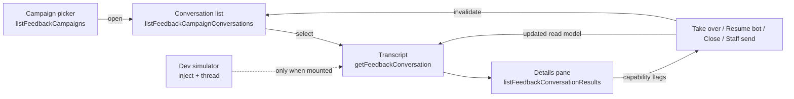

# Post-event feedback conversations screen

Status: accepted, verified 2026-07-25 (WP9).

The operator surface for the post-event feedback feature: one campaign's
WhatsApp conversations in a three-pane inbox, the actions that move a
conversation between bot and human control, and the campaign's collected
results. It implements U1–U4 and D17/D18 of
[`POST_EVENT_FEEDBACK_PLAN_2026-07-25.md`](../../POST_EVENT_FEEDBACK_PLAN_2026-07-25.md)
and is the operator half of
[`backend/modules/post-event-feedback.md`](../backend/modules/post-event-feedback.md).

## Purpose and boundary

This screen owns reading and steering conversations. It does not own the
conversation itself: lifecycle, control, extraction and delivery are backend
concerns, and the screen renders what the read models report.

It **does** own: pane layout and selection, filtering and grouping, the status
vocabulary, confirmation copy for each action, polling cadence, and the
`«άγνωστος συμμετέχων»` fallback.

It **does not** own: whether an action is allowed (capability flags), whether a
conversation may reopen (it never does), question copy (backend constants), or
any rule about who is a valid subject.

| Route                                 | View                    | Owns                                                  |
| ------------------------------------- | ----------------------- | ----------------------------------------------------- |
| `/admin/feedback`                     | `FeedbackCampaignsPage` | Choosing or launching a campaign                      |
| `/admin/feedback/:campaignId`         | `FeedbackInboxPage`     | The three-pane inbox (U1), actions, dev composer (U2) |
| `/admin/feedback/:campaignId/results` | `FeedbackResultsPage`   | The campaign's answers and notes (U4)                 |

The selected conversation lives in `?conversation=<id>` so a thread is
linkable and survives reload, while the list beside it stays put.

## Contract

Every product call goes through the generated hooks in
`apps/admin/src/api/generated/` — `useListFeedbackCampaigns`,
`useListFeedbackCampaignConversations`,
`useGetFeedbackConversation`, `useListFeedbackConversationResults`,
`useListFeedbackCampaignResults`, `useTakeOverFeedbackConversation`,
`useResumeFeedbackConversationBot`, `useCloseFeedbackConversation`,
`useSendFeedbackConversationStaffMessage`, `useUpdateFeedbackNoteReviewStatus`,
`useStartFeedbackConversation` and the campaign
launch/pause/resume/close/get hooks.

| File                                        | Owns                                                                    |
| ------------------------------------------- | ----------------------------------------------------------------------- |
| `src/features/feedback/labels.ts`           | Status vocabulary: tones, badges, delivery precedence, the D18 fallback |
| `src/features/feedback/conversationView.ts` | Progress, badge rows, search folding, ordering, grouping, selection     |
| `src/features/feedback/polling.ts`          | The U3 intervals and the stop-when-closed rule                          |
| `src/features/feedback/simulator.ts`        | Zod schemas for the two dev-only simulator endpoints                    |
| `src/lib/feedbackSimulator.ts`              | The dev simulator facade over the shared `ofetch` client                |
| `src/components/admin/feedback/`            | The three panes, the badge row, and the confirmation/start dialogs      |

`features/feedback/` has no React imports and carries the screen's rules, so
they are unit-tested directly in `apps/admin/test/feedback-inbox.spec.ts`.

## Flow

## Invariants

- **Capabilities decide, not the client.** Take over, resume, close and staff
  send are rendered only when the conversation's `capabilities` say so. A
  STOP-closed conversation publishes none and its action row disappears. No
  lifecycle rule is re-implemented here.
- **Mutations return the read model.** Each action's response is written
  straight into the conversation query with `setQueryData` before the list is
  invalidated, so the panes never show an optimistic guess about what an
  operator may do next.
- **Selection survives polling.** `resolveSelectedConversationId` keeps the
  operator's choice while it remains visible and only falls back to the first
  row when it disappears.
- **Status is text plus tone.** Every badge carries its own label; colour is
  reinforcement. The transcript distinguishes actors by label, alignment and
  fill together.
- **Attention is emphasised, not merely coloured.** `needsAttention` renders as
  a **solid** warning pill on inbox rows and in the conversation header, while
  every other badge stays tinted. It is still a labelled badge — the emphasis is
  hierarchy, not a second channel of meaning.
- **D18 everywhere.** Any unresolved participant id renders
  `«άγνωστος συμμετέχων»` in italics — respondents, answer subjects and note
  subjects alike. Raw UUIDs never reach the screen.
- **One documented client exception.** Only `src/lib/feedbackSimulator.ts` and
  the pre-existing assistant call the transport directly; a test enforces that
  the list stays at exactly those two.

## Failure and loading states

- The list, transcript and results panes each own loading, empty and error
  states; the list distinguishes "no conversations yet" from "no matches".
- Action failures render in the transcript pane and leave the dialog's context
  intact rather than closing over the error.
- The dev simulator's absence is the normal case in any non-simulated
  deployment: the probe fails quietly, the composer is not rendered, and no
  error is shown.
- `queryClient` retries are off repo-wide, so a failure is shown rather than
  hidden behind silent attempts.

## Polling (U3)

| Query             | Interval | Notes                                          |
| ----------------- | -------- | ---------------------------------------------- |
| Open conversation | 3 s      | Stops entirely once the list reports it closed |
| Conversation list | 10 s     | Also refetches on window focus                 |
| Answers and notes | 15 s     | Extraction lands after the message             |

TanStack Query's `refetchIntervalInBackground` stays at its default `false`, so
every interval pauses while the browser tab is hidden. There is no visibility
listener to maintain. WebSockets/SSE remain deferred.

## Layout

Three columns from `2xl`, two from `lg` (details below the transcript), and a
single stack below that. Each pane is its own scroll container capped at `78vh`,
so switching conversations never costs an operator their place in the list.

The screen deliberately does **not** take over the viewport the way the
assistant route does. The reason is the height budget, not a shell limitation:
`#root` at `min-height: 100dvh` plus `flex-1 min-h-0` on `AdminShell` and its
content column already hand a route a definite height — that chain is exactly
how `/admin/assistant` fills the shell, and the inbox could use it too. It was
measured and rejected. At 1280×720 the page header and the campaign summary row
leave roughly 320 px for the pane grid, which the `lg` two-column layout splits
into two rows of about 150 px — less than one message bubble plus a composer.
Capped panes with an ordinary document scroll keep the transcript readable at
that size.

A blank band above displaced panes while the document is scrolled is an
artifact of headless and automation Chromium screenshot surfaces, not a layout
fault; a plain page with no application CSS reproduces it in the same tools.
Real Chrome paints the scrolled inbox correctly at 1280×720 and 1600×1000 in
both themes (verified 2026-07-26 over the DevTools Protocol).

## Campaign picker

`/admin/feedback` lists campaigns from `listFeedbackCampaigns` (newest first)
with event title, status, launched_at and conversation progress counts. Opening
an inbox is a plain link. Launching a campaign for a finished event that does
not yet have one is a separate confirmed action — `launchFeedbackCampaign` also
opens conversations and queues intros for newly eligible attendees, so it must
never be used merely to navigate. Event detail carries a nullable
`feedbackCampaignId` so screens can deep-link the inbox without launching.

## Accessibility

- One `h1` per route through `JtsPageHeader`; panes are labelled `section`s.
- Conversation rows are buttons in a list; the selected row carries
  `aria-current`. Goal progress is announced as text (`2/4 answered`) with the
  bar `aria-hidden`, because a `<button>` may not contain the `div`-based HeroUI
  `ProgressBar`.
- A row's accessible name is computed from its own content — Chrome reports
  `"Σοφία 02:03 +306936888183 3/4 answered Open"`. Do not add an `aria-label`
  here: it would replace that name with a shorter one that no longer contains
  the visible text, which is what WCAG 2.5.3 Label in Name forbids. Automation
  accessibility trees that report these rows as bare `button` entries are
  under-reporting name-from-content; `<button>text</button>`
  reproduces it with no application code involved.
- Every control on the route has a name: the inbox at rest, the start and
  confirm dialogs, and the small-viewport navigation drawer each audit to zero
  unnamed interactive nodes (verified 2026-07-26 over the DevTools Protocol).
- Both composers have visually hidden labels naming the recipient and the
  channel; the simulator composer is additionally captioned as development-only.
- Contrast was measured in both themes on the rendered screen. Two pairings
  needed correction and are commented at their call sites: the list timestamp
  uses `text-ink-muted` (`text-ink-subtle` measures 4.23:1 on `bg-primary-soft`),
  and the staff actor label uses `text-ink` (`text-copper` measures 3.93:1 on
  `bg-surface` at 10 px). **`--jts-color-accent` is not safe for small text on
  surface in the light theme** — worth a token-level decision rather than more
  per-call-site patches.
- The solid attention pill uses HeroUI's `primary` chip variant, which the token
  bridge resolves to `--jts-color-canvas` on `--jts-color-warning`: **5.53:1 in
  light and 8.95:1 in dark**, both clear of AA. `theme-tokens.spec.ts` asserts
  that pairing from `tokens.css` directly, so the emphasis cannot drift below AA
  unnoticed. No `attention` semantic token was added — `warning` already carries
  this meaning, and the admin contract prefers the nearest AA-safe existing
  token over a new one for a single component. The pill's fill is opaque in both
  themes, so it stays legible on a selected row's `bg-primary-soft`.

## Tests

`apps/admin/test/feedback-inbox.spec.ts` covers the D18 fallback, delivery-badge
precedence, lifecycle badges, goal progress, accent-insensitive Greek filtering,
attention-first ordering, group pruning, selection stability under polling, the
polling policy, the campaign picker consuming `useListFeedbackCampaigns`, the
attention pill's emphasis (only that badge is `strong`, the variant mapping, and
that both the list row and the conversation header render the badge row), and
the API-boundary invariants (generated hooks on the screen, capability-gated
actions, exactly two hand-written transport callers).

`apps/admin/test/theme-tokens.spec.ts` adds the solid attention pill to its AA
contrast pairs, measured from `tokens.css` in both themes.

## Decisions and references

- [ADR 0008](../decisions/0008-post-event-feedback-conversations.md) — feedback
  conversations, directed results and human control
- [ADR 0009](../decisions/0009-generated-api-client.md) — generated admin API client
- [`frontend.md`](../frontend.md) — admin conventions; [`theming.md`](theming.md) — tokens
- [`backend/modules/post-event-feedback.md`](../backend/modules/post-event-feedback.md) — the campaign and conversation contracts
- [TanStack Query `refetchInterval`](https://tanstack.com/query/latest/docs/framework/react/reference/useQuery) (v5.101.4, verified 2026-07-25)
- [HeroUI v3](https://v3.heroui.com/docs/introduction) (3.2.2) — `Chip`, `Modal`, `Select`, `Input`, `Button`
