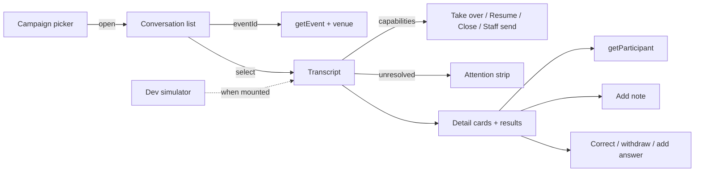

# Post-event feedback conversations screen

Status: accepted. Operator surface for post-event feedback: campaign picker,
two-pane inbox, capability-gated steering, detail cards and results. Backend
lifecycle, control, extraction and delivery:
[`post-event-feedback.md`](../backend/modules/post-event-feedback.md).

## Purpose and boundary

This screen owns reading and steering conversations. It renders what the read
models report; it does not own lifecycle, control, extraction or delivery.

| Owns                                                                 | Does not own                                                                                          |
| -------------------------------------------------------------------- | ----------------------------------------------------------------------------------------------------- |
| Pane layout, selection, filtering, grouping, status vocabulary       | Whether an action is allowed (`capabilities`)                                                         |
| Confirmation copy, polling cadence, `«άγνωστος συμμετέχων»` fallback | Whether a conversation may reopen (never); question copy; who is a valid note/answer subject (D16) |

| Route                                 | View                    | Owns                                 |
| ------------------------------------- | ----------------------- | ------------------------------------ |
| `/admin/feedback`                     | `FeedbackCampaignsPage` | Choose or launch a campaign          |
| `/admin/feedback/:campaignId`         | `FeedbackInboxPage`     | Inbox, actions, dev composer         |
| `/admin/feedback/:campaignId/results` | `FeedbackResultsPage`   | Campaign answers and notes           |

Selection: `?conversation=<id>` (linkable, survives reload). Narrow cover:
`?fullscreen=1` on the same transcript mount; history push so back clears the
cover before leaving the thread.

## Contract

Every product call uses generated hooks in `apps/admin/src/api/generated/` —
list/get campaigns and conversations, results, take over / resume bot / close /
staff send, attention resolve, notes, answer correct/withdraw/add, start
conversation, event + D16 candidates, campaign summary get/request, and
campaign pause/resume/close/launch. One documented transport exception:
`src/lib/feedbackSimulator.ts` (plus the assistant). Tests pin the list at two.

| File                                               | Owns                                                                              |
| -------------------------------------------------- | --------------------------------------------------------------------------------- |
| `src/features/feedback/labels.ts`                  | Status vocabulary, tones, delivery precedence, note origin, D18                   |
| `src/features/feedback/conversationView.ts`        | Progress, badges, ordering, grouping, selection, message anchors                  |
| `src/features/feedback/revealTranscriptMessage.ts` | Pin pane, scroll `[data-transcript-scroller]`, flash cited bubble — never `scrollIntoView` on the message |
| `src/features/feedback/extractionStatus.ts`        | Greek automation / reading copy                                                   |
| `src/features/feedback/answerCorrections.ts`       | Which control a recorded answer gets; «corrected by»; withdrawal wording          |
| `src/features/feedback/directedAnswers.ts`         | Directed-question grouping, tones, contradictions, add cost                       |
| `src/features/feedback/campaignSummary.ts`         | Summary status labels, pending phase, Generate vs Refresh                         |
| `src/features/feedback/staffClose.ts`              | Close-reason vocabulary and «Closed as …»                                         |
| `src/features/feedback/staffMessageDraft.ts`       | Staff/simulator draft identity across retry                                       |
| `src/features/feedback/polling.ts`                 | Poll intervals and stop-when-closed                                               |
| `src/features/feedback/simulator.ts`               | Zod for the two dev-only simulator endpoints                                      |
| `src/lib/feedbackSimulator.ts`                     | Dev simulator facade over shared `ofetch`                                         |
| `src/components/admin/feedback/`                   | Panes, attention strip, detail cards, badges, dialogs                             |
| `src/features/participants/profileFields.ts`       | Participant storage codes as display text                                         |
| `src/components/ui/JtsLiveIndicator.tsx`           | Shared poll mark ([contract](components/jts-live-indicator.md))                   |

`features/feedback/` has no React imports; rules are unit-tested in
`apps/admin/test/feedback-inbox.spec.ts`.

### Campaign summary UI

`CampaignSummary` under `CampaignHeader` loads
`GET /feedback/campaigns/:campaignId/summary` and regenerates via
`POST …/summary`. Polls only while `pending`. Ready v2 `document`: score /
directed-edge strip; tinted `wentWell` / `wentWrong`; bulleted `curiosities`,
`gossip` (nested, closed by default, omitted when empty), `actions`. Legacy
markdown when `document` is null → `AssistantMarkdown`. Backend contract:
[Campaign summary](../backend/modules/post-event-feedback.md#campaign-summary).

`pending` is durable intent, not activity — never «Generating…» from status
alone. `campaignSummaryPendingPhase` uses the published lease: future
`claimExpiresAt` → `generating`; else `executionEpoch` `0` → `queued`, higher →
`retrying`. Elapsed from `requestedAt`, computed against `dataUpdatedAt` (not
render time) so structural sharing does not freeze the label. Simulator
rehearsals suppress automatic summaries; explicit staff request still runs
(`manual` trigger).

## Flow

## Invariants

| Rule                         | Contract                                                                                                                                 |
| ---------------------------- | ---------------------------------------------------------------------------------------------------------------------------------------- |
| Capabilities decide          | Take over, resume, close, staff send render only from `capabilities`. STOP-closed publishes none — action row gone. No lifecycle reimplementation. |
| Mutations return the model   | Action responses `setQueryData` on the conversation query, then invalidate the list — no optimistic capability guess.                    |
| Composer draft identity      | Staff send UUID / simulator inject key kept on failure or unknown outcome; edit rotates identity; success clears only the submitted draft. |
| Selection survives polling   | `resolveSelectedConversationId`: URL pin while visible; else sticky previous id (component state, not URL) so desktop auto-select does not chase `visible[0]` and mobile is not forced open. |
| Venue is orientation         | Header shows current event venue via `useGetEvent`; never invents historical reply provenance.                                           |
| Status = text + tone         | Every badge labelled. Same-actor runs named once at start; every bubble keeps `sr-only` actor.                                           |
| Badge colour pairing         | `FeedbackBadges` pale fill/hairline/text per tone (not HeroUI `Chip` — no `info` slot). Uses `--color-*-border` bridge tokens.           |
| Row never repeats heading    | `conversationRowBadges` strips group-expected chips; newsworthy close reasons and human control survive. Ordinary rows may be chipless.  |
| Transcript header            | No status badge row. Attention = strip; who writes = composer / foot; Take over / Resume / Close opposite contact. Closed end = one icon pill + tooltip. |
| Reply foot line              | `automation.running` + live lease → «The bot is replying»; open bot handoff with `awaitingHuman` → «Waiting for staff». Capabilities ≠ activity. |
| Each fact once               | Goal progress is `settled/total` words («N/M done»), no bar/`percent`. Answers replace goal badges; badges keep not-asked / awaiting / skipped. |
| Delivery pills               | Bare `sent` → no chip. `failed` / `cancelled` pill; other states `InlineDeliveryStatus`.                                                 |
| Attention emphasis           | List: solid warning pill. Transcript: strip with reasons, link to `transcriptMessageAnchorId`, one-press Dismiss (no dialog). >2 reasons → disclosure. |
| Cited message                | Participant bubble keeps actor surface; labelled chips below (fixed category/action maps). Missing message → sentence without link.      |
| D18                          | Unresolved ids → italic `«άγνωστος συμμετέχων»`. Never raw UUIDs.                                                                       |
| Staff notes                  | `origin: "staff"` → «Staff note» badge / Results Source column. Not capability-gated.                                                    |

## Failure and loading states

- List, transcript and results each own loading / empty / error. List
  distinguishes «no conversations yet» from «no matches».
- Action failures stay in the transcript pane (dialog context intact). «Add
  note» failures render inside its dialog (`role="alert"`).
- Failed staff send / unknown simulator inject keep text and client identity for
  retry; edit creates a new intent.
- Dev simulator absence is quiet (no composer, no error) outside simulated
  deploys.
- `queryClient` retries are off repo-wide.

## Polling (U3)

| Query             | Interval | Notes                                          |
| ----------------- | -------- | ---------------------------------------------- |
| Open conversation | 2 s      | Stops when list reports closed                 |
| Conversation list | 5 s      | Also on window focus                           |
| Answers and notes | 10 s     | Extraction lands after the message             |
| Campaign summary  | 3 s      | Only while `pending`                           |

`refetchIntervalInBackground` stays default `false`. List and transcript
headers bind [`JtsLiveIndicator`](components/jts-live-indicator.md) to
`isFetching` (hysteresis; not a live region). WebSockets/SSE deferred.

## Layout

Two panes over a detail-card strip. From `lg`: list beside transcript; under
both, full-width cards (3 cols `xl`, 2 `md`, 1 below). Pane scroll containers
cap at `calc(100lvh - 10rem)`; cards at `44vh`. List `self-start`; transcript
stretches to the row. Narrow: same mount → fixed `100lvh` cover via
`?fullscreen=1`.

Below `lg`, grids use `minmax(0, 1fr)` and zero min-width on pane items so
cached content cannot force ~371 px min-content on a 320–360 px document.

Does **not** take the assistant-style full shell height: capped panes + document
scroll keep the transcript budget; detail cards stay one scroll away.

### Conversation list

Groups answer «is anything waiting for me» first.

| Part            | Treatment                                                                                         |
| --------------- | ------------------------------------------------------------------------------------------------- |
| Heading         | Sticky micro-caps: fill, strong hairline, 14px glyph, count right-aligned                         |
| NEEDS ATTENTION | `bg-warning-soft` / `text-warning`, 3px `TriangleAlert` marker                                    |
| OPEN            | `bg-surface-sunken` / `text-ink` (`MessageCircleMore`)                                            |
| CLOSED          | `bg-surface-sunken` / `text-ink-muted` (`Archive`); selected row keeps full strength              |
| Row             | Name (wrap, never single truncate), time, phone · `N/M done` · chips only when heading did not say it |
| NOT STARTED     | D17 foot group: present attendees without a conversation; confirmed «Start» on hover/focus (always in DOM) |

### Control placement

| Control                        | Home                     |
| ------------------------------ | ------------------------ |
| «All campaigns»                | Header top left (`JtsBackLink`) |
| Simulated flask / Results / Pause / Resume / Close campaign | Header actions; icon-only below `sm` where noted |
| «Start» (D17)                  | NOT STARTED row          |
| Take over / Resume bot / Close | Transcript header right (Close icon-only; others icon-only below `sm`) |
| «Add note»                     | NOTES card header        |
| Correct / withdraw / add       | PROGRESS & ANSWERS edit mode |

### Detail cards

| Card               | Icon         | Contains                                                              |
| ------------------ | ------------ | --------------------------------------------------------------------- |
| PROGRESS & ANSWERS | `ListChecks` | `settled/total` + «Edit»; score slider; directed people groups        |
| NOTES              | `StickyNote` | Origin / review tint; «Add note»                                      |
| RESPONDENT         | `UserRound`  | Monogram, profile link, `getParticipant` fields; badge only «Not opted in» |

Respondent uses shared `profileFields.ts`. Launch phone frozen on conversation;
profile number drift is stated. D18 → no fetch, card explains.

### Campaign chrome

- `CampaignHeader`: compact own `h1` (not `JtsPageHeader`); back + actions share
  top line from `sm`.
- `CampaignContext`: unfilled outline for venue + exceptional campaign state
  (paused/closed pill, parked count). Absent when empty. Simulated flask is
  toolbar icon-only. Attention count lives only on the list NEEDS ATTENTION
  heading.
- Venue: `VenueCompact` from `useGetEvent` (focus refresh). No Places API /
  `GooglePlaceDetails`. Current venue only — not per-message provenance
  ([events](../backend/modules/events.md)).

## Closing a conversation

Confirm asks **why**: `abusive | unresponsive | handled_offline | duplicate |
other`, optional note ≤ 500. Body on `closeFeedbackConversation`; detail
`staffClose` → «Closed as …» under transcript header. Lifecycle still
`cancelled`. Vocabulary in `staffClose.ts`.

## Reading and automation status

`ReadingStatus` pins to the transcript foot (outside message scroll): polite
live region. Copy in `extractionStatus.ts`. Reads published `automation`
(`idle | scheduled | running | parked`) plus extraction facts — not BullMQ jobs.
Claim tokens / epochs never cross HTTP. Backend semantics:
[`post-event-feedback.md`](../backend/modules/post-event-feedback.md).

| Signal                        | UI may say                                                              |
| ----------------------------- | ----------------------------------------------------------------------- |
| `unreadParticipantMessages`   | «N μηνύματα δεν έχουν διαβαστεί ακόμα»                                  |
| `automation.nextActionAt`     | Next action time — never a spinner                                      |
| `automation.state`            | scheduled / running / parked / idle                                     |
| `automation.claimExpiresAt`   | Public claim deadline only — not worker liveness                        |
| `lastRunAt` / `model`         | Quiet provenance when behind or failed                                  |

Unread + `idle` is an invariant failure only for open bot-controlled threads in
a launched campaign; human control / pause are labelled stops; closed remains
danger. No unresolving spinner.

## Staff notes

`addFeedbackConversationNote` → same pane, Results tab and review queue.

- Type from existing vocabulary; text ≤ 500.
- Optional About: current D16 candidates via `listEventFeedbackCandidates`
  (backend re-checks).
- Not capability-gated (available after close).
- Success invalidates conversation results and campaign Results.

## Changing what was recorded

Operator fixes live in PROGRESS & ANSWERS behind one «Edit» / «Done». Backend
recording rules:
[corrections](../backend/modules/post-event-feedback.md#operator-corrections-to-recorded-answers-wp12b),
[operator answers](../backend/modules/post-event-feedback.md#operator-recorded-answers-wp12c).
Not capability-gated (closed threads are the point). Failures on the answer row.

| Control        | UI                                                                                                      |
| -------------- | ------------------------------------------------------------------------------------------------------- |
| Score          | Full-width 5-step Slider; save on thumb release via `correctFeedbackConversationAnswer`                 |
| Withdraw person| `×` inside that pill → `ConfirmAction` → `withdrawFeedbackConversationAnswer`                           |
| Add person     | `+` on question heading → D16 minus already recorded; states contradiction cost; `addFeedbackConversationAnswer` |
| Staff mark     | `UserPen` + `sr-only` «Recorded by staff» from answer `origin`                                          |
| Corrected line | «Corrected by … · date» under value                                                                     |

Directed groups (`liked` / `meet_again` / `avoid`): own glyph and tone.
`directedAnswers.ts` mirrors backend contradiction rules for picker copy. Goal
badges stay bot-ask/got semantics (monotonic); operator edits do not rewrite
them. Re-aim = withdraw then add (two auditable statements).

## Campaign picker

`listFeedbackCampaigns` (newest first): event title, status, launched_at,
progress. Live/paused: 3px left marker; closed unmarked/desaturated. Opening
inbox is a link. Launch is a separate confirmed action
(`launchFeedbackCampaign` also opens intros). Event detail may carry nullable
`feedbackCampaignId` for deep-link without launch.

## Accessibility

- One `h1` per route (`CampaignHeader` compact exception on inbox). Panes and
  detail cards are labelled `section`s; group `aria-labelledby` matches visible
  `h3` + count.
- Rows are buttons; selected `aria-current`. Accessible name from content — no
  replacing `aria-label` (WCAG 2.5.3). Goal progress as text (no bar inside
  `<button>`).
- Composers: visually hidden labels; simulator also development-only caption.
- Polling indicator not a live region; extraction status **is** polite
  `aria-live`.
- Contrast: token pairings asserted in `theme-tokens.spec.ts` /
  `palettes.spec.ts` (solid attention pill, sunken cards, soft accent «Staff
  note» chip). Prefer nearest AA-safe existing token over new semantics.

## Tests

`apps/admin/test/feedback-inbox.spec.ts` pins D18, badges/grouping/selection,
polling, capability-gated actions, generated-hook boundary (exactly two
hand-written transport callers), staff notes, D17 start rows, live indicator,
minute grouping, answer corrections / directed answers, reading-status lines,
venue orientation. `theme-tokens.spec.ts` asserts the attention / heading /
chip pairings.

## Decisions and references

- [ADR 0008](../decisions/0008-post-event-feedback-conversations.md)
- [Outbound queue](feedback-outbound-queue.md)
- [ADR 0009](../decisions/0009-generated-api-client.md)
- [`frontend.md`](../frontend.md) · [`theming.md`](theming.md)
- [`post-event-feedback.md`](../backend/modules/post-event-feedback.md)
- [`events.md`](../backend/modules/events.md)
- [TanStack Query `refetchInterval`](https://tanstack.com/query/latest/docs/framework/react/reference/useQuery) (v5.101.4)
- [HeroUI v3](https://v3.heroui.com/docs/introduction) (3.2.2)
