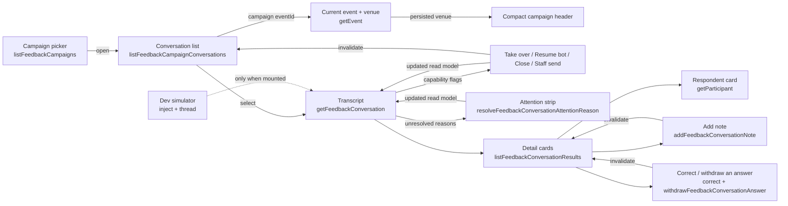

# Post-event feedback conversations screen

Status: accepted, verified 2026-07-27 (WP9, design pass and staff notes in
WP12, conversation-list pass, extraction status, two-pane bento layout);
transcript-density pass verified 2026-08-01; venue orientation verified
2026-08-02.

The operator surface for the post-event feedback feature: one campaign's
WhatsApp conversations in a two-pane inbox over a strip of detail cards, the
actions that move a conversation between bot and human control, and the
campaign's collected results. It implements U1–U4 and D17/D18 of
[`post-event-feedback-plan-2026-07-25.md`](../history/post-event-feedback-plan-2026-07-25.md)
and is the operator half of
[`backend/modules/post-event-feedback.md`](../backend/modules/post-event-feedback.md).

## Purpose and boundary

This screen owns reading and steering conversations. It does not own the
conversation itself: lifecycle, control, extraction and delivery are backend
concerns, and the screen renders what the read models report.

It **does** own: pane layout and selection, filtering and grouping, the status
vocabulary, confirmation copy for each action, polling cadence, and the
`«άγνωστος συμμετέχων»` fallback.

It **does not** own: whether an action is allowed (capability flags), whether a
conversation may reopen (it never does), question copy (backend constants), or
any rule about who is a valid subject — including for a staff note, whose
subject the backend re-checks against the live D16 candidate set.

| Route                                 | View                    | Owns                                       |
| ------------------------------------- | ----------------------- | ------------------------------------------ |
| `/admin/feedback`                     | `FeedbackCampaignsPage` | Choosing or launching a campaign           |
| `/admin/feedback/:campaignId`         | `FeedbackInboxPage`     | The inbox (U1), actions, dev composer (U2) |
| `/admin/feedback/:campaignId/results` | `FeedbackResultsPage`   | The campaign's answers and notes (U4)      |

The selected conversation lives in `?conversation=<id>` so a thread is
linkable and survives reload, while the list beside it stays put.

## Contract

Every product call goes through the generated hooks in
`apps/admin/src/api/generated/` — `useListFeedbackCampaigns`,
`useListFeedbackCampaignConversations`,
`useGetFeedbackConversation`, `useListFeedbackConversationResults`,
`useListFeedbackCampaignResults`, `useTakeOverFeedbackConversation`,
`useResumeFeedbackConversationBot`, `useCloseFeedbackConversation`,
`useSendFeedbackConversationStaffMessage`, `useUpdateFeedbackNoteReviewStatus`,
`useResolveFeedbackConversationAttentionReason`,
`useAddFeedbackConversationNote`, `useCorrectFeedbackConversationAnswer`,
`useWithdrawFeedbackConversationAnswer`, `useAddFeedbackConversationAnswer`,
`useStartFeedbackConversation`,
`useGetEvent`, `useListEventFeedbackCandidates`, `useGetFeedbackCampaignSummary`,
`useRequestFeedbackCampaignSummary`, and the campaign
launch/pause/resume/close/get hooks.

The inbox accordion (`CampaignSummary`, under `CampaignHeader`) loads the
campaign summary through `GET /feedback/campaigns/:campaignId/summary` and
refreshes it after `POST /feedback/campaigns/:campaignId/summary` when staff
explicitly request regeneration. It polls only while status is `pending`, and
surfaces Generate / Refresh from the same status helpers in
`campaignSummary.ts`. A ready v2 summary exposes `document`: deterministic score
and directed-edge metrics render as a number strip; `wentWell` / `wentWrong`
use soft tinted blocks; `curiosities` (Αξιοπερίεργα), `gossip` (Κουτσομπολιό)
and `actions` are plain bulleted lists — section title and icon carry the
meaning. Gossip sits in a nested disclosure closed by default and is omitted
when empty. Legacy
markdown bodies (where `document` is null) still fall back to
`AssistantMarkdown` until refreshed. See
[Campaign summary](../backend/modules/post-event-feedback.md#campaign-summary).
The control remains usable in a simulator-backed rehearsal: automatic summaries
stay suppressed there, while this explicit staff request records a durable
`manual` trigger and runs the separately billed summary model.

`pending` is durable intent, not activity, so the header never says
«Generating…» on the strength of the status alone. `campaignSummaryPendingPhase`
splits the row on the execution lease the read model publishes
([the module](../backend/modules/post-event-feedback.md)): a `claimExpiresAt`
still in the future is `generating`, otherwise `executionEpoch` `0` is `queued`
and anything higher is `retrying` — a run that stopped without settling, with
BullMQ holding the next one behind its backoff. The header carries the wait with
it (`Generating… (2 min)`, `Queued (5 s)`, `Waiting to retry — attempt 2
(16 min)`), counted from `requestedAt` so it spans the runs that died; `retrying`
takes the warning tone, because the row still self-heals but is the one worth a
second look. The expanded body names which side is holding the work, and a
pending row adds its exact `Requested` clock to the meta line for reading
against a worker log.

The elapsed time is computed against `dataUpdatedAt` rather than render time.
That is what keeps it moving: structural sharing hands back an identical `data`
object on an unchanged poll, so a render clock would sit frozen on exactly the
stalled row the label exists to expose.

| File                                         | Owns                                                                                                                                     |
| -------------------------------------------- | ---------------------------------------------------------------------------------------------------------------------------------------- |
| `src/features/feedback/labels.ts`            | Status vocabulary: tones, badges, delivery precedence, note origin, D18                                                                  |
| `src/features/feedback/conversationView.ts`  | Progress, badge rows, search folding, ordering, grouping, selection, message anchor ids                                                  |
| `src/features/feedback/revealTranscriptMessage.ts` | Pin the transcript pane, smooth-scroll the messages box, flash the cited bubble — never `scrollIntoView` on the message            |
| `src/features/feedback/extractionStatus.ts`  | Greek copy over durable conversation automation                                                                                          |
| `src/features/feedback/answerCorrections.ts` | Which control a recorded answer gets, the «corrected by» line, the withdrawal wording                                                    |
| `src/features/feedback/directedAnswers.ts`   | The three person-shaped questions as a group: tone per question, what contradicts what, who is left to add, and what recording will cost |
| `src/features/feedback/campaignSummary.ts`   | Campaign summary status labels, the pending phase and how long it has waited, Generate vs Refresh, partial-warning copy                  |
| `src/features/feedback/staffClose.ts`        | Staff close reason vocabulary, confirm-dialog labels, the «Closed as …» summary line                                                     |
| `src/features/feedback/staffMessageDraft.ts` | Staff and simulator draft identity across edits, successful settlement and unknown retries                                               |
| `src/features/feedback/polling.ts`           | The U3 intervals and the stop-when-closed rule                                                                                           |
| `src/features/feedback/simulator.ts`         | Zod schemas for the two dev-only simulator endpoints                                                                                     |
| `src/lib/feedbackSimulator.ts`               | The dev simulator facade over the shared `ofetch` client                                                                                 |
| `src/components/admin/feedback/`             | The two panes, the attention strip, the detail cards, the badge row, and the dialogs                                                     |
| `src/features/participants/profileFields.ts` | Participant storage codes as display text, shared with the WP11 profile route                                                            |
| `src/components/ui/JtsLiveIndicator.tsx`     | The shared polling mark both live panes use ([contract](components/jts-live-indicator.md))                                               |

`features/feedback/` has no React imports and carries the screen's rules, so
they are unit-tested directly in `apps/admin/test/feedback-inbox.spec.ts`.

## Flow



## Invariants

- **Capabilities decide, not the client.** Take over, resume, close and staff
  send are rendered only when the conversation's `capabilities` say so. A
  STOP-closed conversation publishes none and its action row disappears. No
  lifecycle rule is re-implemented here.
- **Mutations return the read model.** Each action's response is written
  straight into the conversation query with `setQueryData` before the list is
  invalidated, so the panes never show an optimistic guess about what an
  operator may do next.
- **One exact composer draft has one client identity.** The staff composer sends
  its UUID through the generated mutation; the development simulator sends the
  same kind of stable identity as its inject idempotency key. Both keep the key
  and text when a request fails or its outcome is unknown. An unchanged retry
  therefore reaches the same durable intent. Editing creates a new identity;
  success clears and rotates only the exact submitted draft, so a newer edit is
  never erased by an older request settling late.
- **Selection survives polling.** `resolveSelectedConversationId` keeps the
  URL pin (`?conversation=`) while that row remains visible. Without a URL pin,
  a sticky previous id keeps the desktop auto-select from chasing `visible[0]`
  when the list reorders under attention / latest-activity sorting — only when
  both are gone does it fall through to the first visible row. The sticky id
  stays in component state (not the URL) so mobile master/detail is not forced
  open by the desktop empty-pane fallback.
- **The venue is current orientation, not testimony or message provenance.**
  The header renders the event read model and never infers that an existing bot
  reply used that venue. Historical context belongs to the backend's durable
  outbox decision log.
- **Status is text plus tone.** Every badge carries its own label; colour is
  reinforcement. The transcript names a run of same-actor messages once, at
  the run's start, with alignment and fill carrying the actor through the
  run — every bubble keeps an `sr-only` actor label, so a screen reader still
  hears each speaker while the sighted operator is spared the same caps word
  under every bubble.
- **A pill is the colour of what it says.** `FeedbackBadges` owns one pale
  pairing per tone — fill, hairline and text from the same status token — so a
  column of rows can be triaged by colour before a word of it is read. It is
  not a HeroUI `Chip`: that palette has no `info` slot, so every slate status
  fell back to the same grey as `neutral` and «Open» was indistinguishable from
  «Cancelled». The four `--color-*-border` bridge tokens exist for this; before
  them `border-warning-border` and its siblings emitted no rule at all.
- **A row never repeats its own heading.** The grouping answers "is anything
  waiting for me", so the heading carries that weight and
  `conversationRowBadges` strips whatever the heading already said: no «Needs
  attention» chip under NEEDS ATTENTION, no «Open» under OPEN, no bare «Closed»
  under CLOSED — and a group's _expected_ state is not news either: «Open»
  disappears under NEEDS ATTENTION (an attention row is ordinarily still open;
  «Stopped» there is the exception that keeps its chip) and «Completed»
  disappears under CLOSED (the ordinary end of a thread; a run of green chips
  down the archive said nothing). A newsworthy closing reason («Stopped»,
  «Declined», «Expired», «Cancelled») and human control survive anywhere,
  because nothing else states them. An ordinary conversation therefore carries
  no chip at all, which is what makes a chip in this list worth looking at.
  The transcript header renders **no status badge row** (density pass,
  2026-08-01): every fact the pills carried is stated once, in the place it
  acts — attention is the strip below with its reasons, who writes is the
  composer or the transcript foot indicator, and the controls that change who
  may write sit opposite the contact block (Take over / Resume bot labelled
  from `sm` up and icon-only below; Close icon-only always). ΑΝΑΓΝΩΣΗ pins to
  that same foot so it stays visible while messages scroll. The reply line
  reads `automation.running` as «The bot is replying» only while a live
  execution lease exists; an open bot-controlled handoff uses the detail read
  model's explicit `awaitingHuman` and reads «Waiting for staff». Idle,
  scheduled and parked work claim neither.
  Capability flags never stand in for activity. The one fact nothing else
  states, the named end of a closed thread, is a single icon pill top-right —
  `lifecycleBadge` plus a per-reason glyph (`CircleCheck` completed, `Ban`
  stopped, `TimerOff` expired, `CircleSlash` declined, `SquareX` cancelled,
  `Archive` bare) — with `closedConversationLine`'s full sentence as its
  tooltip.
- **Each fact appears once.** Goal progress is one number in words
  («3/4 done»), not a bar beside its own caption: the text is what a screen
  reader reads out of the row's name, and four goals give a bar five states it
  cannot express more precisely. `GoalProgress` publishes `settled` — the count
  the row shows — and no `percent`, which existed only to size that bar. The
  wording is `done` rather than `answered` because a skipped goal is settled
  without being answered. The same `settled/total` sits in the PROGRESS &
  ANSWERS card's own header rather than as a sentence above the goal rows,
  which restated in prose exactly what the labelled rows already said.
- **An answer replaces the badge.** PROGRESS & ANSWERS is one row per goal, and
  a goal that has answers shows them instead of a status chip: an answer is the
  strongest possible statement that a goal is answered, so «Score · Answered»
  above «SCORE · 5 / 5» below said the same thing twice. The badge is left to
  say the only things an answer cannot — not asked, awaiting a reply, skipped.
  A question can hold several answers (D16 subjects), so the row is a list.
- **Only the exception is badged.** An outbound message handed to the transport
  with nothing reported back is the ordinary end of every message, so
  `deliveryBadge` returns `null` for a bare `sent`. Only `failed` and
  `cancelled` still carry a pill; every other state — queued, sending, held,
  delivered, read — carries `placement: "inline"` and renders through
  `InlineDeliveryStatus` instead. A chip under almost every bubble is how a chip
  stops being read.
- **Attention is emphasised, not merely coloured.** `needsAttention` renders as
  a **solid** warning pill on inbox rows, while every other badge stays tinted.
  It is still a labelled badge — the emphasis is hierarchy, not a second
  channel of meaning. In the transcript the same fact is the attention strip
  itself, which names the reasons instead of repeating the pill.
- **The badge says what, and can be cleared.** When the conversation carries
  unresolved `attentionReasons`, `ConversationAttention` renders one plain
  sentence per reason at the head of the transcript — the same tinted strip
  this pane already uses to say something is wrong, not a card that would push
  the messages down the screen. Each reason links to the message that caused it
  (`transcriptMessageAnchorId` is the anchor both ends share) and carries a
  one-press Dismiss: no dialog and no note, because the operator has just read
  that message and a confirmation per reason is how a badge ends up never being
  cleared. The link never calls `scrollIntoView` on the message — that walked
  document ancestors and yanked the page. `revealTranscriptMessage` pins the
  transcript pane 16px under the viewport top when it has drifted (so the whole
  chat breathes under the page chrome), smooth-scrolls only inside
  `[data-transcript-scroller]` to centre the cited message, focuses the row,
  and runs a one-shot `.jts-message-flash` pulse on the bubble (warning tokens;
  static tint under `prefers-reduced-motion`). Rows stay as dense as the
  collapsed disclosure (shared min-height, compact ghost Dismiss — HeroUI has
  no xs size, so sm is shrunk by class) with a hairline gap so adjacent
  controls do not touch. More than two unresolved reasons collapse into one
  native disclosure («N things need attention») so a stack of alerts does not
  out-size the transcript; one or two stay open. Resolved reasons are not
  shown, and the whole block is absent when nothing is unresolved. A reason
  whose message is no longer in the 150-message transcript keeps its sentence
  and drops the link rather than scrolling nowhere, and so does a reason that
  never had one: a voice note the transcript could not hold, a full document
  and a send that never went out are all about something the transcript does
  not contain, which is the point of saying so.
- **The cited message is explicit.** Participant messages with `attention`
  metadata keep their normal actor bubble and render labelled chips below the
  testimony — the fill is not swapped for the warning surface, because that is
  already the attention strip above and two warning slabs in one pane stop
  being read. Categories and actions are fixed mappings, never model-authored
  copy: `sexual_misconduct` is `🍌 Sexual misconduct`, and human follow-up
  actions use the Lucide bell plus readable text. Colour and symbols only
  reinforce the labels. The chips are one row of equal-height flex items: the
  action icon is the chip's own child rather than a flex layer nested inside
  its label, because that layer made the icon the chip's baseline and left the
  action sitting 2.5px above the categories beside it.
- **D18 everywhere.** Any unresolved participant id renders
  `«άγνωστος συμμετέχων»` in italics — respondents, answer subjects and note
  subjects alike. Raw UUIDs never reach the screen.
- **A staff note is never participant testimony.** A note the backend reports as
  `origin: "staff"` carries a "Staff note" badge in the details pane and its own
  Source column on the Results tab. Extraction output is the unlabelled default
  because it is the pane's subject; the exception is what gets named.
- **One documented client exception.** Only `src/lib/feedbackSimulator.ts` and
  the pre-existing assistant call the transport directly; a test enforces that
  the list stays at exactly those two.

## Failure and loading states

- The list, transcript and results panes each own loading, empty and error
  states; the list distinguishes "no conversations yet" from "no matches", each
  with its own muted glyph.
- Action failures render in the transcript pane and leave the dialog's context
  intact rather than closing over the error. «Add note» is the exception that
  proves the rule: its failure renders **inside** its own dialog, because the
  operator's typed text is still on screen there and the transcript pane is
  behind the modal.
- A failed staff send leaves its composer text and client UUID intact. The
  operator can retry the same intent without creating a second WhatsApp row;
  editing the draft deliberately creates a new intent instead.
- A failed or unknown simulator inject likewise leaves its text and idempotency
  key intact. A retry reuses the backend's provider-message identity and clears
  only after the inject endpoint confirms the intent already exists or was
  inserted.
- The dev simulator's absence is the normal case in any non-simulated
  deployment: the probe fails quietly, the composer is not rendered, and no
  error is shown.
- `queryClient` retries are off repo-wide, so a failure is shown rather than
  hidden behind silent attempts.

## Polling (U3)

| Query             | Interval | Notes                                          |
| ----------------- | -------- | ---------------------------------------------- |
| Open conversation | 2 s      | Stops entirely once the list reports it closed |
| Conversation list | 5 s      | Also refetches on window focus                 |
| Answers and notes | 10 s     | Extraction lands after the message             |
| Campaign summary  | 3 s      | Only while status is `pending`                 |

TanStack Query's `refetchIntervalInBackground` stays at its default `false`, so
every interval pauses while the browser tab is hidden. There is no visibility
listener to maintain. WebSockets/SSE remain deferred.

Both live panes say so on screen. The list and transcript headers render
[`JtsLiveIndicator`](components/jts-live-indicator.md) bound to their query's
`isFetching`. The indicator owns show/hide hysteresis so a snappy background
poll does not flash the icon; when a fetch lingers, a 14px muted icon turns and
fades out over 300 ms. It reserves its space so a poll never nudges the header,
and it is not a live region — a two-second poll that announced itself would
be unusable.

## Layout

Two panes over a strip of cards. From `lg` the list sits beside the transcript;
under both, spanning the full width, the conversation's detail runs as three
small cards (three columns from `xl`, two from `md`, one below that). Each pane
is its own scroll container, capped at `calc(100dvh - 10rem)` (cards at
`44vh`). The list sizes to its rows (`self-start`); the transcript stretches to
meet that row so a short thread is not a stub, without forcing empty space
under the last conversation. Switching conversations never costs an operator
their place in the list.

Below `lg`, both grids declare a `minmax(0, 1fr)` base column and every direct
pane item has a zero minimum width. This is required for route navigation, not
just unusually long copy: when the campaign queries are already cached, the
populated inbox participates in the first layout and an implicit `auto` column
otherwise adopts the panes' min-content width (about 371 px), widening a
320–360 px document. A cold reload initially renders the loading state and can
therefore conceal the fault.

It was one tall right-hand column of six stacked sections. Everything about a
conversation shared a single scrollbar, which meant the notes an operator had
just written sat below four screens of reference data, and the pane an operator
looked at most was the one they had to scroll furthest into. Splitting it puts
the three questions side by side — what the conversation produced, what staff
wrote about it, who it is with — and none of them is behind the others.

### The height budget (density pass, 2026-08-01)

The transcript is the screen's primary content and it was getting a third of
the viewport. Two changes fixed that without a layout rework:

- **The campaign header is two rows, not four.** It stacked the back link, an
  eyebrow, the title with its own actions row, and the campaign line —
  ~230 px before the first message. On a wide screen the back link and campaign
  actions share the top line and the title spans the second; the eyebrow is gone
  (the sidebar item and «Back to campaigns» already place the page). On a narrow
  screen the DOM instead reads back link, `h1`, actions, so destructive controls
  never precede the name of the campaign they affect; the `sm` grid placement
  lifts only the actions back onto the top line. `CampaignHeader` renders its own
  compact `h1` with the six-dot title mark rather than `JtsPageHeader`, whose
  stacked eyebrow/description/actions grammar is right for every other page and
  wrong for a working surface. The back link itself is the shared `JtsBackLink`,
  so the exit reads the same here as on every other detail screen.
- **The venue and the exceptions are not part of the title.** They started under
  it — the venue in a sunken box 8 px below the six-dot mark, the exceptions
  floating bottom-aligned beside it — which glued two facts about the _campaign_
  onto the page's nameplate and put a second bordered block where the eye is
  still reading the heading. `CampaignContext` now owns one unfilled outline for
  the whole standing-facts band: venue and exceptions flow left to right inside
  it and wrap together on a narrow screen. The frame spans the working column,
  matching the summary and panes below instead of stopping a few pixels short
  when its content almost fills the row. It sits a full page gap (24 px) under
  the header and on the same 16 px rhythm as `CampaignSummary`; the outline
  states current context while the filled summary remains the heavier result.
  When there is no venue and nothing is wrong the band does not render at all,
  and the transcript gets the height back.
- **The pane cap is viewport-anchored.** `66vh` gave the panes two thirds of
  the screen regardless of what the header actually used; with the header
  compressed to about 9 rem including the main padding, both panes now cap at
  `calc(100dvh - 10rem)`. The transcript fills the row beside the list; the
  list itself stays content-sized so it does not grow a blank foot.
  Inside the pane the same pass cost every non-message row what it could spare:
  the transcript header is the two-line contact block every messaging app
  taught — name over number, the staff close line only when there is one; the
  attention strip dropped its visible
  caption for an `sr-only` heading, since the tint and the triangle every row
  now carries already say "attention" (the accessible name is unchanged); and
  the dev composer shrank from a captioned block to a single row — flask,
  «Dev», the input (whose placeholder says «— simulated»), an «Inject» button —
  because a dev affordance must not out-size the staff composer above it. Its
  full development-only sentence moved to the `sr-only` label and the form's
  `title`.

A second round took the remaining always-on rows out of the pane's chrome:

- **The header pills are gone.** See the badge invariant — the header's right
  carries the capability-gated conversation actions while the thread is open,
  and the named end of a closed thread as one icon pill once nothing can act —
  both answer "can I still act here?" in the same corner.
- **The reading status pins to the transcript foot,** outside the message
  scroll — see «Extraction status». Scrolling older messages must not hide
  why an answer has not appeared yet.
- **The foot chrome stays docked under the messages.** ΑΝΑΓΝΩΣΗ always; «The
  bot is replying.» / «Waiting for staff.» while a reply is in flight and
  there is no composer yet; then the composers. Conversation actions live in
  the header. The transcript is capped at every breakpoint so that foot stays
  on screen while the messages scroll (below `lg` the master/detail switch
  already hides the list, so the old nested-scroll trap does not return).
- **CLOSED rows recede.** An archived row's name drops to the muted ink its
  metadata already uses — a token swap, not opacity, because every muted
  pairing is measured AA and a faded chip is not. The selected row keeps full
  strength.

A third round took colour and repetition off the normal case, everywhere the
screen said something true of almost every row (the sleek pass):

- **Expected lifecycle chips are gone** — see the row-badge invariant: no
  «Open» under NEEDS ATTENTION, no «Completed» under CLOSED.
- **The campaign line is exceptions only** — see «The campaign line»: no
  «Launched» pill, no tallies, the simulator note muted.
- **Actor labels name runs, not bubbles** — see the status invariant.
- **The respondent card badges only «Not opted in»** (warning): everyone in a
  campaign is ordinarily opted in, so consent appears exactly when its absence
  is the compliance problem, and the card's badge row renders nothing at all
  otherwise.

A fourth round put the remaining interactions where a messaging app keeps
them (2026-08-01, same day):

- **Bubbles group by minute.** Within a run of one actor, a message in the
  same display minute as the one above it drops its meta line
  (`sameTranscriptMinute`); every bubble carries the exact date-and-seconds
  timestamp as its hover `title` (`formatExactTimestamp`), and a press on the
  message toggles the line back for touch. A held or failed delivery always
  forces the line — a paused message must not be quieter than a delivered
  one — and a collapsed message keeps an `sr-only` actor-and-time line.
- **PROGRESS & ANSWERS has an edit mode.** At rest every answer is plain text
  and pills with no controls. One «Edit» press in the card header opens the
  whole card at once: a score becomes a HeroUI 5-step `Slider` that saves on
  thumb release through the same correction hook, each person's pill grows the
  `×` that withdraws it, and each question grows the `+` that records one.
  «Done» closes them. (Edit mode was correct-and-remove only until the backend
  grew an operator-authored answer route the same day; see
  [changing what was recorded](#changing-what-was-recorded).)
- **A note wears its review state.** A note waiting for review is a
  warning-tinted card; a handled one is plain. The «Needs review» pill that
  sat in the corner of every unhandled note is gone; the «Staff note» origin
  badge stays, because origin is identity, not state.
- **D17 is a row, not a button.** The list's foot carries a NOT STARTED group:
  present attendees with no conversation yet, as quiet muted rows whose
  confirmed «Start» appears on hover or keyboard focus (the button stays in
  the DOM throughout, so focus and screen readers always reach it). The
  standalone «Start conversation» button and its picker dialog are gone.
- **On tinted surfaces, Dismiss is `secondary`.** A ghost button on the
  warning wash is the same colour as the card and reads as disabled; the
  bordered secondary variant keeps its own fill. Ghost remains right on plain
  cards.
- **Input text is muted.** The filter and both composers render their text in
  `text-ink-muted` — typed text is transient working material, not record,
  and full-strength ink made the input row the darkest text on the pane.

The screen still deliberately does **not** take over the viewport the way the
assistant route does. The reason is the height budget, not a shell limitation:
`#root` at `min-height: 100dvh` plus `flex-1 min-h-0` on `AdminShell` and its
content column already hand a route a definite height — that chain is exactly
how `/admin/assistant` fills the shell, and the inbox could use it too. It was
measured and rejected when the header stack was ~400 px tall, and the argument
survives the compressed header: a fixed-height grid would still split the
remaining space with the detail strip, while capped panes with an ordinary
document scroll let the transcript keep it all and the cards stay one scroll
away.

A blank band above displaced panes while the document is scrolled is an
artifact of headless and automation Chromium screenshot surfaces, not a layout
fault; a plain page with no application CSS reproduces it in the same tools.
Real Chrome paints the scrolled inbox correctly at 1280×720 and 1600×1000 in
both themes (verified 2026-07-26 over the DevTools Protocol).

### The conversation list column

An operator scanning it asks three things in order: _is anything waiting for
me_, _who is it_, _how far did they get_. The first is answered by the
grouping, so the heading is the loudest thing in the column and the rows are
deliberately quiet.

| Part            | Treatment                                                                                                                                                               |
| --------------- | ----------------------------------------------------------------------------------------------------------------------------------------------------------------------- |
| Heading         | Sticky micro-caps strip: own fill, `border-border-strong` hairline top and bottom, a 14px glyph, the bucket count right-aligned                                         |
| NEEDS ATTENTION | `bg-warning-soft` / `text-warning` plus the signature 3px marker (`TriangleAlert`) — the only group that means "stop and read this"                                     |
| OPEN            | `bg-surface-sunken` / `text-ink` (`MessageCircleMore`), the working set at full contrast                                                                                |
| CLOSED          | `bg-surface-sunken` / `text-ink-muted` (`Archive`), the quiet archive                                                                                                   |
| Row             | Name (two lines, `break-words`, never one truncated line), time, then one metadata line: phone `·` `N/M done` `·` any chip. Chips only when the heading has not said it |

The glyphs are the campaign tallies' own — an operator reads «2 need attention»
in the summary row and meets the same triangle over the group. The other two
headings reserve the marker's 3px gutter with a transparent border so every
label starts on one line. The marker itself stays on the one group that earns
it: the motif means "this matters", and putting it on all three would mean
nothing.

Row height matters because the column cannot grow wider. At its declared
minimum (`15rem`) a 43-character Greek name still wraps to two lines and clamps
rather than being cut mid-name at one; «Κώστας Αργοπληκτρολογάκιας» wraps whole.
Verified in both themes at 240 px and 304 px over the DevTools Protocol
(2026-07-27).

### Where each control lives

Placement is the screen's answer to "what does this act on?".

| Control                        | Home                     | Why                                                                                                                     |
| ------------------------------ | ------------------------ | ----------------------------------------------------------------------------------------------------------------------- |
| «All campaigns»                | Header top line, left    | Leaves the campaign — a back affordance (left arrow, link style)                                                        |
| Results                        | Header top line, right   | Reads this campaign's output                                                                                            |
| Pause / Resume / Close         | Header top line, right   | Changes this campaign's state; a hairline separates them from Results                                                   |
| «Start» (D17)                  | NOT STARTED row, hover   | The affordance lives on the person it would start, in the list it joins                                                 |
| Take over / Resume bot / Close | Transcript header, right | Opposite the contact — "can I still act here?"; Close icon-only always; Take over / Resume collapse to icons below `sm` |
| «Add note»                     | NOTES card header        | Writes into the list it sits above                                                                                      |
| Correct / withdraw an answer   | On the answer's own row  | Acts on that one recorded answer, beside the value it disagrees with                                                    |

## Closing a conversation

Close still lands as lifecycle `cancelled` — that is the state-machine answer
— and the confirm dialog asks **why**. The operator picks from
`abusive | unresponsive | handled_offline | duplicate | other` and may add an
optional note (≤ 500). Both travel on `closeFeedbackConversation`'s body and
come back on the detail read model as `staffClose`, rendered under the
transcript header as «Closed as …», beneath the header's own closed line.
Without it every human close still read as a bare «Cancelled» a month later.

Every one of them carries a 16px muted stroke icon; the accent stays reserved
for interactive emphasis. Icons are for orientation, never decoration — which
is also why an empty state never reuses the glyph of the section it sits in
(`Hourglass` under ANSWERS, `PenOff` under NOTES, `MessageSquareDashed` under
the `Inbox`-marked list). An icon that repeats inside its own section has
stopped carrying information.

### The detail cards

Each card repeats the two panes' own shell — hairline border, its own header,
its own scroll container — so the screen reads as one set of panels rather than
two panes plus some boxes. Inside, the participant profile's section grammar
(WP11) still applies: a tracked micro-caps label with a muted icon.

| Card               | Icon         | Contains                                                                                                               |
| ------------------ | ------------ | ---------------------------------------------------------------------------------------------------------------------- |
| PROGRESS & ANSWERS | `ListChecks` | `settled/total` and «Edit» in the header, then the score with its slider and one group of people per directed question |
| NOTES              | `StickyNote` | Note cards with origin and review badges, plus «Add note»                                                              |
| RESPONDENT         | `UserRound`  | Monogram and profile link, then the participant's own record (see below)                                               |

Two things that used to live here now belong to the transcript, because both
are about the messages rather than about the conversation as a record: the
capability-gated actions, and the ΑΝΑΓΝΩΣΗ reading status.

### The respondent card

It reads the stored participant through the same `getParticipant` endpoint the
WP11 profile route uses — email, the phone on file, neighbourhood, age band and
the feedback opt-in — and formats the storage codes with the shared
`features/participants/profileFields.ts`, so `55_plus` cannot end up displayed
two different ways. Before, the card knew only the display name and the number
the campaign launched against, which was the least useful thing on screen at
the moment an operator is deciding whether a disclosure needs a phone call.

The number the campaign launched against is frozen on the conversation. When
the profile's number has since changed, the card says so rather than quietly
showing two different numbers for one person. An unresolved id (D18) has no
record to fetch, so the query never runs for one and the card says why.

### Reading and automation status

A feedback conversation is read after a durable quiet window, not on arrival,
and `ReadingStatus` is the only place that says so. It pins to the transcript
foot, outside the message scroll and centred the way a read receipt ends a
thread: «why has that answer not appeared yet» is a question about these
messages, and scrolling older ones must not hide the answer.

The read model reports conversation work, never a retained BullMQ job:

```text
automation {
  state: idle | scheduled | running | parked
  nextActionAt
  revision
  claimExpiresAt
}
```

The extraction cursor, unread count, last run and model stay separate because
they describe what was processed; `automation` describes what the aggregate
currently owes. `parked` is the current recovery/failure signal rather than a
historical failed-job flag. Claim tokens and execution epochs are private
fencing material and never cross the HTTP boundary. Before interpreting an
`idle` state, the component also reads the already-published conversation
lifecycle, control mode and campaign status. Human control and a paused
campaign are intentional stops; closed state forbids new work. None may be
reported as a lost enqueue.

It gets one line. Current reading is the normal case and the transcript is what
the pane is for, so the normal case costs a single row of muted text and only a
backlog or a failure takes a tinted block. The model id shows only when the
reading is behind or has failed — that is when it explains something.

| Field                       | Source                         | What the screen may say                                                   |
| --------------------------- | ------------------------------ | ------------------------------------------------------------------------- |
| `unreadParticipantMessages` | Extraction cursor + transcript | «N μηνύματα δεν έχουν διαβαστεί ακόμα»                                    |
| `automation.nextActionAt`   | Durable conversation work      | «Επόμενη αυτόματη ενέργεια 11:47» — a time, never a spinner               |
| `automation.state`          | Durable conversation work      | scheduled / running / parked / idle                                       |
| `automation.claimExpiresAt` | Public claim deadline only     | «ενεργή ανάθεση έως 11:47» — not a claim that the worker process is alive |
| `lastRunAt` / `model`       | Extraction facts               | Quiet provenance; a stub id is a different thing from a real model        |

**No unresolving spinner.** A claim deadline is durable; worker liveness is not.
Unread testimony with `automation.state = idle` is rendered as an invariant
failure only while the conversation is open under bot control in a launched
campaign. Under human control or campaign pause it is a labelled intentional
stop; unread testimony after conversation/campaign close remains a danger
because no later automated action may consume it. The generated DTO publishes
`automation` directly; retained queue jobs are not a second status system.

The line is a polite live region (`role="status"` / `aria-live="polite"`).
Unread count and due time change under the reader as the quiet window runs;
identical text across a three-second poll does not re-announce. The polling
indicator beside the transcript stays deliberately silent — that is a fetch
mark, not operator-actionable state.

Greek copy lives in `src/features/feedback/extractionStatus.ts`; every colour
is a token (`warning-soft` for backlog, `danger-soft` for failure).

### Venue orientation

When the campaign's current event read model has a venue, `CampaignHeader`
renders `VenueCompact` directly under the title: the persisted label and any
stored type, area and price context, with a normal Google Maps deep-link. The
inbox does not mount `GooglePlaceDetails`, load the Places JavaScript API or
request live photos/metadata. `FeedbackInboxPage` gets the value through the
generated `useGetEvent` hook — the same event read already needed for NOT
STARTED attendees — and refreshes it when the window regains focus.

This is the current operator-confirmed venue, displayed whether or not
`useInFeedback` is enabled. It is not a historical badge on each message. If
staff later replace or clear the venue, the header follows the current event on
refetch; already-durable outbox bodies and transcript entries remain unchanged.
Per-reply provenance is the backend outbox log's nullable
`venueContextRevision`; the inbox does not invent an old label from a revision
number.

### The campaign line

The campaign states itself beside the title with exceptions only — a status
pill when it is paused or closed (launched is the normal state of every
working campaign and gets no pill), the attention count on the list's own
triangle when it is above zero, the parked count when a provider is down, and
the muted «Simulated transport» flask in development. A launched campaign with
nothing waiting states itself with silence. The line has shed, in order: a
bordered summary bar under a paragraph of instructions, its own row under the
header, and finally the `N conversations · N open` tallies — the list's
headings count exactly the same rows a hand's width away.

## Staff notes

«Add note» writes an ordinary `feedback_notes` row through
`addFeedbackConversationNote`, so a manual note lands in the same conversation
pane, Results tab and review queue as everything else.

- **Type** is the existing note vocabulary; **text** is bounded at 500
  characters, matching the column's check constraint.
- **About** is optional and lists only the campaign event's current D16
  candidates, read from `listEventFeedbackCandidates` — the same endpoint
  extraction resolves subjects with. The backend re-checks and refuses anyone
  else, so the picker is convenience, not the rule.
- The note is stored with staff provenance and therefore renders with the
  "Staff note" badge everywhere. Nothing about a model is invented.
- It is **not** capability-gated. Writing down what you learned is not steering
  the conversation, so it stays available after the thread closes — unlike
  every control that could send a message.
- On success both readers are invalidated: this conversation's results and the
  campaign-wide Results query.

## Changing what was recorded

An operator who reads a score the model got wrong, or a person under the wrong
question, can fix it from the card the answers are on. Three controls, because
they are three different statements — see the backend module for how each is
recorded ([corrections and withdrawals](../backend/modules/post-event-feedback.md#operator-corrections-to-recorded-answers-wp12b),
[recorded answers](../backend/modules/post-event-feedback.md#operator-recorded-answers-wp12c)).

All three live behind one «Edit» press in the PROGRESS & ANSWERS header, which
opens the whole card at once. At rest the card is plain text and pills with no
controls at all: reading it and changing it are two different visits, and a
per-answer toolbar rented space all day for an action that happens once a
campaign. «Edit» is offered even when nothing has been recorded yet — a
conversation whose questions all went unanswered is exactly the one an operator
has something to add to.

- **A score** becomes a 5-step HeroUI `Slider` on **a line of its own**, at the
  card's full width, with the question on the line above it and the value at the
  end of that line. Releasing the thumb saves through
  `correctFeedbackConversationAnswer` — the updated answer comes back and both
  answer readers are invalidated. Sharing one line with the label and the number,
  the slider had about a third of a narrow card to express five steps: the thumb
  moved a few pixels a point, for the one value on this screen that reaches a
  seating plan. Offered on every scored question — `event_score`, `table_fit`,
  `participation_ease` and `conversation_balance`; on the directed questions
  (`liked` / `meet_again` / `avoid`) the subject _is_ the answer, so there is no
  number to slide.
- **The people are pills, grouped under their own question.** Each of `liked`,
  `meet_again` and `avoid` is a small heading with its own glyph
  (`Heart` / `Handshake` / `Ban`) and its own status tone (success / info /
  danger), and the people sit under it as tinted pills on one wrapping line.
  They used to be right-aligned lines of text in a shared column, where «Μαρία»
  under LIKED and under AVOID — opposite facts about the same evening — looked
  identical. Tone is never the only signal: the heading, the glyph and each
  pill's own name all carry it.
- **A wrong person is a withdrawal**, and the control is the `×` **inside that
  person's pill**, so no × can be about the wrong name. It opens the same
  `ConfirmAction` dialog every consequential control on this screen uses, naming
  the person and the question and saying that it cannot be undone here.
  `withdrawFeedbackConversationAnswer` deletes the row; only the audit log
  remembers it.
- **The right person is a `+`** on the question's own heading row.
  `AddAnswerAction` offers the event's D16 candidates — the same list a note's
  subject comes from — minus anybody already under that question, and confirms
  through `addFeedbackConversationAnswer`. Two things it says before it acts:
  the row will be recorded as staff-written, and, when the person is currently
  under a question this one contradicts, that those answers are withdrawn in the
  same step. The option itself carries «· now under Liked and Meet again», so
  the cost is visible while choosing rather than after. `directedAnswers.ts`
  owns that rule, mirroring the backend's own, because a screen that does not
  know it cannot state it.
- **A staff answer says so where it is read**: a `UserPen` glyph on the pill with
  an `sr-only` «Recorded by staff», from the `origin` the read model publishes on
  every answer. A month later nobody should have to guess whether the participant
  named this person or somebody wrote it down after a phone call.
- Neither is **capability-gated**, and that is the point: a closed thread is the
  case they exist for, because nothing will ever re-read it and a wrong number
  would stay wrong for good. `src/features/feedback/answerCorrections.ts` owns
  which control an answer gets and the line that says who corrected it.
- A corrected answer carries «Corrected by … · date» under its value.
  `createdAt` stops meaning "when this value was decided" the moment a correction
  lands, and a corrected number with no author was the thing that could not be
  told apart from the model's own reading.
- Failures are reported **on the answer's own row** rather than in the pane-level
  error line, because that is where the operator is looking and where the value
  they tried to save still is. It is not a workflow: nothing is assigned and
  nothing is approved.
- Re-aiming an answer is still two statements rather than one control: withdraw
  the wrong person, record the right one. That is what an operator actually
  knows, and each half is separately auditable.
- The goal badges do not follow any of this. A goal already badged «answered»
  stays badged after its only answer is withdrawn (that snapshot is monotonic in
  the conversation document), and a recorded answer can sit under a goal still
  badged «awaiting reply» — the badges say what the bot asked and got, not what
  an operator learned on the phone.

## Campaign picker

`/admin/feedback` lists campaigns from `listFeedbackCampaigns` (newest first)
with event title, status, launched_at and conversation progress counts. Live and
paused cards carry the signature 3px left marker in their status tone
(`border-l-success` / `border-l-warning`); closed cards stay unmarked and
desaturated. Opening an inbox is a plain link. Launching a campaign for a finished event that does
not yet have one is a separate confirmed action — `launchFeedbackCampaign` also
opens conversations and queues intros for newly eligible attendees, so it must
never be used merely to navigate. Event detail carries a nullable
`feedbackCampaignId` so screens can deep-link the inbox without launching.

## Accessibility

- One `h1` per route — through `JtsPageHeader` everywhere except the inbox,
  whose `CampaignHeader` renders its own compact `h1` (see the height budget);
  panes are labelled `section`s.
- **The grouping a screen reader hears is the grouping an operator sees.** Each
  bucket is a `section` whose `aria-labelledby` points at its own visible `h3`,
  so the region is named with the heading _and_ its count — Chrome reports the
  three regions as `"NEEDS ATTENTION 2"`, `"OPEN 3"` and `"CLOSED 1"`, matching
  the strips on screen exactly. The group icons are `aria-hidden`; the words
  carry the meaning.
- Conversation rows are buttons in a list; the selected row carries
  `aria-current`. Goal progress is announced as text (`3/4 done`), which is
  also why it is not a bar: a `<button>` may not contain the `div`-based HeroUI
  `ProgressBar`.
- A row's accessible name is computed from its own content — Chrome reports
  `"Ελένη Ριπομηνυματού 11:39 +30690000102 3/4 done"` (the `·` between phone
  and progress is `aria-hidden`, and an open conversation under OPEN adds no
  trailing badge). Do not add an `aria-label`
  here: it would replace that name with a shorter one that no longer contains
  the visible text, which is what WCAG 2.5.3 Label in Name forbids. Automation
  accessibility trees that report these rows as bare `button` entries are
  under-reporting name-from-content; `<button><span>text</span></button>`
  reproduces it with no application code involved.
- Every control on the route has a name: the inbox at rest, the start and
  confirm dialogs, and the small-viewport navigation drawer each audit to zero
  unnamed interactive nodes (verified 2026-07-26 over the DevTools Protocol).
  The «Add note» dialog joins that set with a labelled text area and two
  labelled selects.
- Each detail card is a labelled `section` with its own `h2`, and a subsection
  inside one keeps its `h3`; every section icon is `aria-hidden` and the label
  carries the meaning.
- Both composers have visually hidden labels naming the recipient and the
  channel; the simulator composer is additionally captioned as development-only.
  The «Add note» dialog labels its text area and both selects, and shows its
  failure in the dialog with `role="alert"`.
- The polling indicator is deliberately not a live region: the icon is
  `aria-hidden` and a hidden sentence states that the pane refreshes itself.
  The extraction status block **is** a polite live region — unread count and
  due time are operator-actionable state that changes under the reader, and
  identical text across a poll does not re-announce.
- Contrast was measured in both themes on the rendered screen. The list
  timestamp uses `text-ink-muted` (`text-ink-subtle` measures 4.23:1 on
  `bg-primary-soft`), and is commented at its call site. The accent exception is
  gone: `text-copper` once measured 3.93:1 on `bg-surface`, and that was fixed
  at the token level rather than by more per-call-site patches. The staff actor
  label is `text-copper` today, and `theme-tokens.spec.ts` asserts
  accent-on-surface at AA in both modes — which is what keeps it that way.
- The solid attention pill is `--jts-color-canvas` on `--jts-color-warning`,
  clear of AA in both modes. Every `strong` tone
  uses the same pairing shape, which is what makes the emphasis a hierarchy
  decision rather than a contrast risk. `theme-tokens.spec.ts` asserts
  that pairing from `tokens.css` directly, so the emphasis cannot drift below AA
  unnoticed. No `attention` semantic token was added — `warning` already carries
  this meaning, and the admin contract prefers the nearest AA-safe existing
  token over a new one for a single component. The pill's fill is opaque in both
  themes, so it stays legible on a selected row's `bg-primary-soft`.
- The design pass introduced three pairings, all measured from `tokens.css` and
  now asserted alongside the pill: answer-card text on `surface-sunken`, its
  micro-caps label on the same fill, and the respondent link on `surface`.
  Exact ratios are deliberately not quoted here — they move whenever a token
  moves, and the six selectable palettes multiply every figure by six.
  `theme-tokens.spec.ts` and `palettes.spec.ts` are the authority, and they fail
  the build rather than let a pairing drift below AA. The "Staff note" chip is HeroUI's soft `accent`, which the bridge
  points at the wine primary rather than the copper accent, so it measures
  **7.72:1 / 7.38:1** — the copper `--jts-color-accent` remains unsafe for small
  text and is still avoided. Asserting the chip meant teaching the spec's
  resolver `color-mix(in srgb, …)`, since every dark `-soft` token is built that
  way; without it no tinted pairing could be measured in the theme where it
  matters most.

## Tests

`apps/admin/test/feedback-inbox.spec.ts` covers the D18 fallback, delivery-badge
precedence, lifecycle badges, goal progress, accent-insensitive Greek filtering,
attention-first ordering, group pruning, selection stability under polling, the
polling policy, the campaign picker consuming `useListFeedbackCampaigns`, the
attention pill's emphasis (only that badge is `strong`, the tinted/solid tables,
that the list rows render the badge row while the transcript keeps it for the
delivery exception only, and `closedConversationLine` naming a closed thread's
end — and only a closed one),
the pale pairing every tone owns, the four status-hairline bridge tokens, and
the API-boundary invariants (generated hooks on the screen, capability-gated
actions, exactly two hand-written transport callers).

The design pass adds: the staff-origin badge (present for `staff`, absent
otherwise) and that both the details pane and the Results tab render it, the
note write going through the generated hook and invalidating both readers, the
subject picker consuming the D16 candidate endpoint, «All campaigns» reading
as a back affordance before the title, D17 starting from the candidate's own
NOT STARTED row (derived from present attendees, confirmed «Start» on
hover/focus), the polling indicator being bound to `isFetching` in both panes
(with hysteresis inside the shared mark and no live region), and the transcript's minute grouping
(`sameTranscriptMinute` by display minute and day, `formatExactTimestamp`
carrying date and seconds for the hover/press reveal).

The list-column pass adds `conversationRowBadges`: that the attention chip is
dropped under its own heading, that only the exceptional lifecycle keeps a
chip there («Stopped» yes, the expected «Open» no), that an ordinary
conversation ends up with no chips, that «Completed» is chipless under CLOSED
but still named where it is news, that a newsworthy closing reason survives
while the bare «Closed» does not, that human control is never dropped, and
that each reader calls the function it should. It also pins the one title table both the headings and that
filter read, and asserts `GoalProgress` publishes `settled` and no `percent`
now that nothing draws a bar.

The bento pass adds that PROGRESS & ANSWERS resolves a goal's answers by
`questionKey` and keeps no second answers list, and that the respondent card
reads the participant record through the generated `useGetParticipant`.

The corrections pass adds `answerCorrections`: that a value edit is offered only
on a scored question and a withdrawal only on a directed one, that a corrected
answer says who decided it while an untouched one stays silent, that the
withdrawal dialog names the person, the question and the fact that it cannot be
undone, and that both controls live on the answer row with no capability gate.

The directed-answer pass adds `directedAnswers`: that exactly the three
person-shaped questions are grouped and the score is not, that each carries its
own tone, that the contradiction rule matches the backend's, that the picker
drops whoever is already recorded and marks every question a choice would move
somebody out of, and that the confirmation states the move in the plural when
two answers go. It also pins the layout the pass exists for — the slider at full
width rather than in a right-hand column, the people as tinted pills on one
wrapping line, one glyph per group — the new answer going through the generated
hook from the D16 list, and the staff mark on an operator's own answer.

The reading-status pass adds `readingStatusLines`: Greek unread wording, durable
scheduled/running/parked/idle semantics, the public claim deadline without a
liveness claim, and unread+idle as an invariant failure. It also asserts that
the block is a polite live region without an indefinite spinner, and that the
transcript — not the page or a detail card — is what mounts it.

The venue-orientation pass pins the generated `useGetEvent` source, window-focus
refresh, compact persisted venue under the campaign title, and the absence of
live Google UI or Places loading from the inbox header.

`apps/admin/test/theme-tokens.spec.ts` asserts the solid attention pill, the
NEEDS ATTENTION heading on its tint, the sunken card pairings (which the OPEN
and CLOSED headings share), the respondent link and the soft accent chip from
`tokens.css` in both themes.

## Decisions and references

- [ADR 0008](../decisions/0008-post-event-feedback-conversations.md) — feedback
  conversations, directed results and human control
- [Outbound queue](feedback-outbound-queue.md) — the sibling screen for messages
  that have not reached the participant yet, including durable ambiguous-send
  handling
- [ADR 0009](../decisions/0009-generated-api-client.md) — generated admin API client
- [`frontend.md`](../frontend.md) — admin conventions; [`theming.md`](theming.md) — tokens
- [`backend/modules/post-event-feedback.md`](../backend/modules/post-event-feedback.md) — the campaign and conversation contracts
- [`backend/modules/events.md`](../backend/modules/events.md) — current event venue and revision contract
- [TanStack Query `refetchInterval`](https://tanstack.com/query/latest/docs/framework/react/reference/useQuery) (v5.101.4, verified 2026-07-25)
- [HeroUI v3](https://v3.heroui.com/docs/introduction) (3.2.2) — `Modal`, `Select`, `Input`, `Button`, `Avatar`
