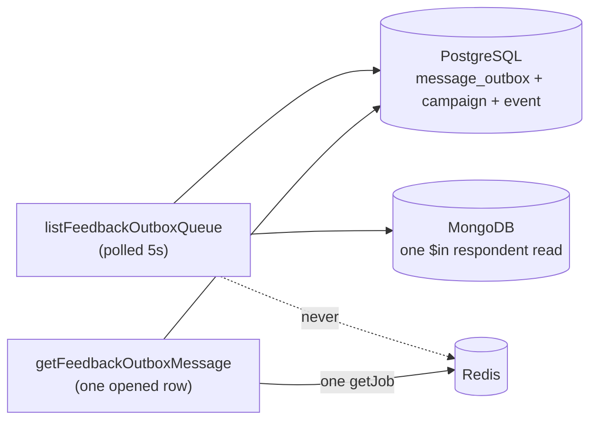

# Outbound queue screen

Status: accepted, verified 2026-07-27 in real Chrome over the DevTools Protocol
(light and dark, 1600×1000).

The operator surface for outbound post-event feedback messages that have not
reached the participant: what is queued, how long it has been waiting, and what
the delivery attempts are doing. It is the admin half of the `message_outbox`
relay documented in
[`backend/mechanisms/queues.md`](../backend/mechanisms/queues.md).

## Why it exists

A rehearsal on 2026-07-27 left replies unsent for up to 147 seconds while
extraction held every worker slot, and the only way to see it was a hand-written
script against Redis. Bull Board is mounted at `/admin/queues` when enabled, but
it sits behind separate Basic credentials, speaks in job ids and knows nothing
about which participant is waiting. This screen answers the same question in the
vocabulary the rest of the admin uses: a person, a campaign, and an age.

## Purpose and boundary

It **reports**. Nothing on it retries, cancels, promotes or re-enqueues
anything; both endpoints are `GET`, and the queue, the relay, the delivery
service and the extractor are untouched.

It **does** own: which statuses count as "not delivered", the age thresholds and
their tones, the status and job-state vocabulary, the honesty copy for a job
Redis cannot account for, the polling cadence, and the decision not to announce.

It **does not** own: whether a row is sent (the relay decides), retry policy
(`OUTBOX_RELAY_JOB_OPTIONS` and the five-minute `sending` recovery horizon), or
the `«άγνωστος συμμετέχων»` rule, which it inherits from
[the conversations screen](feedback-conversations.md).

| Route             | View                 | Owns                                   |
| ----------------- | -------------------- | -------------------------------------- |
| `/admin/outbound` | `FeedbackOutboxPage` | The queue, the summary, the opened row |

The opened row lives in `?message=<outboxId>` so a message is linkable and
survives reload, exactly as `?conversation=` does on the inbox.

**The route is deliberately not under `/admin/feedback/`.** The queue spans every
campaign, and `AdminNavigation` `end`-matches only `/admin`, so a nested path
would leave both «Feedback & safety» and «Outbound queue» carrying
`aria-current="page"` at once.

## Contract

| Operation                  | Reads                                            | Polled |
| -------------------------- | ------------------------------------------------ | ------ |
| `listFeedbackOutboxQueue`  | PostgreSQL + one batched MongoDB respondent read | 5 s    |
| `getFeedbackOutboxMessage` | PostgreSQL + **one** BullMQ `getJob`             | 5 s    |

Both are consumed through the generated hooks `useListFeedbackOutboxQueue` and
`useGetFeedbackOutboxMessage` ([api-contract](../backend/mechanisms/api-contract.md)).

| File                                                     | Owns                                                               |
| -------------------------------------------------------- | ------------------------------------------------------------------ |
| `src/features/feedback/outboxQueue.ts`                   | Age tones and formatting, status/kind/job vocabulary, honesty copy |
| `src/features/feedback/polling.ts`                       | The two 5-second intervals                                         |
| `src/components/admin/feedback/OutboxQueueList.tsx`      | The list, its ages and its empty state                             |
| `src/components/admin/feedback/OutboxMessageDetails.tsx` | The opened row: durable facts, then the live job                   |
| `src/routes/FeedbackOutboxPage.tsx`                      | Summary stats, selection, wiring                                   |

`features/feedback/outboxQueue.ts` has no React imports, so its rules are
unit-tested directly in `apps/admin/test/feedback-outbox.spec.ts`.

## The load constraint

**The list must not do a Redis lookup per row.** A polled list that opens a queue
connection for every message turns an observability page into the outage it was
meant to observe.

Of the two allowed shapes — one batched call for the whole page, or a deferred
call per opened row — this screen **defers**. The list is derived from
PostgreSQL alone; the single `getJob` happens only for the row an operator
opened, which is the same allowance
[api-contract](../backend/mechanisms/api-contract.md) already grants
`getFeedbackConversation` for its extract job. The bound is therefore one job
lookup per five seconds regardless of how long the queue is, and it is enforced
in two places: `apps/backend/src/modules/post-event-feedback/outbox/queue-view.service.spec.ts`
asserts that a 25-row list never calls `getJob`, and the admin spec asserts the
list half of the service names no queue call at all.

A batched queue-wide read was considered and left out. `getJobCounts` would say
whether any worker is alive, which the deferred read cannot — but it is a second
Redis dependency on the page's own load path for a fact readiness already
monitors, and every row an operator opens answers it for that row.

## What the list shows

Age is the subject, so it is the one column with its own scale, and the endpoint
sorts by it. Everything else on a row answers "and who does that affect".

| Part   | Treatment                                                                  |
| ------ | -------------------------------------------------------------------------- |
| Name   | Two lines, `break-words`; D18 italic fallback through `ParticipantName`    |
| Age    | Right-aligned `tabular-nums`, toned and weighted (below)                   |
| Line 2 | Kind `·` event title `·` phone                                             |
| Chips  | The row's own status, plus «Campaign paused» when the relay is refusing it |

### Age tones come from the mechanism

The relay pass is 5 seconds, so:

| Tone      | When                                                  | Reads as         |
| --------- | ----------------------------------------------------- | ---------------- |
| `fresh`   | under 15 s — at most two relay passes                 | `text-ink`       |
| `slow`    | 15–60 s — three passes missed, something holds a slot | `text-warning`   |
| `stalled` | 60 s and over — the shape of the 2026-07-27 incident  | `text-danger`    |
| `parked`  | `held`, or any campaign that is not `launched`        | `text-ink-muted` |

`parked` is the important one. A paused campaign's rows are never leased and
`held` rows never are either, so an hour of age there is obedience, not an
incident — colouring it red would teach an operator that the colour means
nothing. The count in the summary row carries **no** tone for the same reason: a
backlog of six is neither good nor bad, and the age beside it is what says so.

Seconds stay visible right up to the hour (`2m 27s`, not "2 minutes ago"),
because the difference between 40 s and 90 s is the difference between fine and
broken.

The list is capped at 200 rows, oldest first, and the endpoint publishes the
real per-status totals alongside it, so a capped page states what it is showing
instead of implying that the cap is the backlog.

## What an opened row shows

Two halves, kept visibly apart because their reliability differs.

PostgreSQL's half is durable and complete: the row's own status and delivery
status with every timestamp, and the provider ids — followed by the outbound
decision log, which sits on this side of the reliability line because it is
written in the same transaction as the row itself. «Why this was sent» renders
the log's origin and per-origin decision facts (model, confidence and goal
statuses for a model reply; the failure cause for the fallback origins; the
triggering ingress, staff actor, intro created-vs-relaunched or reminder rung
for the rest), and «Conversation as it stood» renders the conversation snapshot
the writer decided against, with one quiet line saying it is not the
conversation now. A row that predates `message_outbox_log` states that plainly
instead of hiding the section — an empty section would teach an operator that
the log is unreliable, when the record is simply older than the table.
Vocabulary is reused from `labels.ts`, tolerant of values the log outlived:
an unrecognised goal status or failure cause passes through verbatim.

The queue's half is a live read, and it is honest about being thin:

| Job state                 | Copy                                                  |
| ------------------------- | ----------------------------------------------------- |
| `active`                  | «Being sent now»                                      |
| `waiting` / `prioritized` | «Waiting for a worker»                                |
| `delayed`                 | «Delayed», plus the due time — never a spinner        |
| `failed`                  | «Failed», plus the bounded failure reason             |
| `unknown`                 | **«άγνωστο»**, plus which cases are indistinguishable |

### Why «άγνωστο» is the ordinary answer, not an alarm

Delivery jobs are added with `OUTBOX_RELAY_JOB_OPTIONS`: `attempts: 1` with
immediate `removeOnComplete` and `removeOnFail`. The job therefore exists only
between the relay's lease and the consumer's last line. Three different
situations produce the same empty read, and PostgreSQL is what tells them apart:

- a `pending` row the relay has not leased yet — normal, and the pane says so;
- a `held` row, which is **never** handed to the relay — a definite statement,
  not an unknown;
- a `sending` row with no job — retention removal, a job that finished a moment
  ago and a job that was lost are genuinely one read. The pane says exactly
  that, and then gives the only real time it has: when the relay reclaims the
  row at the five-minute recovery horizon.

### There is no attempt history, and the screen says so

`message_outbox` has no attempt counter and no `message_outbox_attempts` table
exists. BullMQ's `attemptsMade` is published but is not a history: the job row is
deleted when it terminates and re-added under the same deterministic id on the
next relay lease, so the counter restarts. The only durable evidence that a send
was ever tried is `provider_log_id` / `provider_message_id`, which the deliver
consumer writes before it can know the outcome — which is why it reconciles
against them rather than retrying blindly.

The pane therefore answers "how many times has this been tried?" with that fact
and states the limit in place, where an operator meets it. Adding a durable
attempt history is a real gap and a separate, deliberate change — see
[Extension](#extension).

## Failure and loading states

- The list owns its loading, empty and error states; the error is `role="alert"`.
- A selection that leaves the queue (the message reached the participant between
  two polls) falls away rather than pinning a stale pane.
- `getFeedbackOutboxMessage` accepts **any** outbox status, so a row that has
  just been sent explains itself instead of answering 404.
- `queryClient` retries are off repo-wide, so the one bounded "Reading this
  message's delivery job…" line always resolves or becomes an error.
- **No spinner anywhere states progress.** A dead worker and a busy one look
  identical from Redis; the pane gives a state and a time, or «άγνωστο».

## Accessibility

- One `h1` through `JtsPageHeader`; the list, the opened row and each of its
  sections are labelled `section`s with their own heading.
- **Nothing on this page is a live region, and that is deliberate.** The
  extraction block on the inbox _is_ a polite live region because it is one short
  sentence that mostly holds still. Here every age changes on every poll by
  construction, so `aria-live` would announce forever and make the screen
  unusable. Instead both panes carry
  [`JtsLiveIndicator`](components/jts-live-indicator.md), whose hidden sentence
  states once that the pane refreshes itself and that ages are measured on the
  server. Failures still announce through `role="alert"`.
- The age is rendered twice: `2m 27s` for scanning, `aria-hidden`, beside a
  visually hidden «waiting 2 minutes 27 seconds», because a reader voices the
  compact form as punctuation. No `aria-label` is placed on the row, so its
  accessible name stays computed from its own visible content (WCAG 2.5.3).
- Rows are buttons in a list; the opened row carries `aria-current`.
- Status is text plus tone, never tone alone: every chip carries its label and
  every age has its status chip beside it.
- Verified 2026-07-27 over the DevTools Protocol at 1600×1000: one `h1`, **zero**
  `[aria-live]` nodes, **zero** unnamed interactive nodes in the full
  accessibility tree, exactly **one** `nav a[aria-current]`, no horizontal
  document overflow, and no console errors, in both themes.

## Extension

The honest gap this screen exposes is that **the system does not durably record
delivery attempts.** Everything an operator would want for a post-incident
question — how many times this message was tried, when, and why each attempt
failed — lives only as BullMQ job state that `removeOnComplete` /
`removeOnFail` deletes immediately. Closing it means a durable attempt log
(a `message_outbox_attempts` table written by the deliver consumer, or an
attempt counter plus last-failure columns on `message_outbox`), which is a
migration and a change to the delivery path — not something an observability
screen may invent. Until then, «άγνωστο» is the correct word.

## Tests

`apps/admin/test/feedback-outbox.spec.ts` covers the age thresholds against the
relay's own pass, that a parked row never takes an urgent tone, the compact and
spoken age formats, the status and kind vocabulary, the summary's real totals and
oldest age, every branch of the job copy (including all three «άγνωστο» cases and
the reclaim time instead of a spinner), the attempt answer, the polling policy,
the absence of any live region, the generated-hook boundary, that the backend
list path names no queue call, the route/navigation registration, and that the
screen colours itself from tokens alone. A «why the row was written» block
covers the decision-log facts per origin, that no confidence is invented when
the model reported none, the verbatim passthrough of an unrecognised failure
cause, the conversation-state wording, the predates-the-log statement, and
that both log sections render above «Delivery job».

Backend: `inspect-deliver-job.spec.ts` covers the job read (state, due time,
bounded failure reason, a missing job as `unknown`, and an unrecognised BullMQ
state as `unknown`); `queue-view.service.spec.ts` covers the no-Redis list
invariant, server-measured ages, the D18-shaped fallback, capped totals, the
single opened-row lookup, the reclaim horizon and a already-sent row, and the
decision log on the opened row — present, absent, and unreadable-jsonb-as-null.

## Decisions and references

- [ADR 0008](../decisions/0008-post-event-feedback-conversations.md) — post-event
  feedback conversations
- [`queues.md`](../backend/mechanisms/queues.md) — the relay, the deliver job
  contract and its retention
- [`api-contract.md`](../backend/mechanisms/api-contract.md) — the rule this
  screen's list obeys
- [`feedback-conversations.md`](feedback-conversations.md) — the inbox it links
  into, and the D18 fallback it inherits
- [`theming.md`](theming.md) — tokens
- [BullMQ auto-removal](https://docs.bullmq.io/guide/queues/auto-removal-of-jobs)
  and [job ids](https://docs.bullmq.io/guide/jobs/job-ids) (5.80.10, verified
  2026-07-27)
