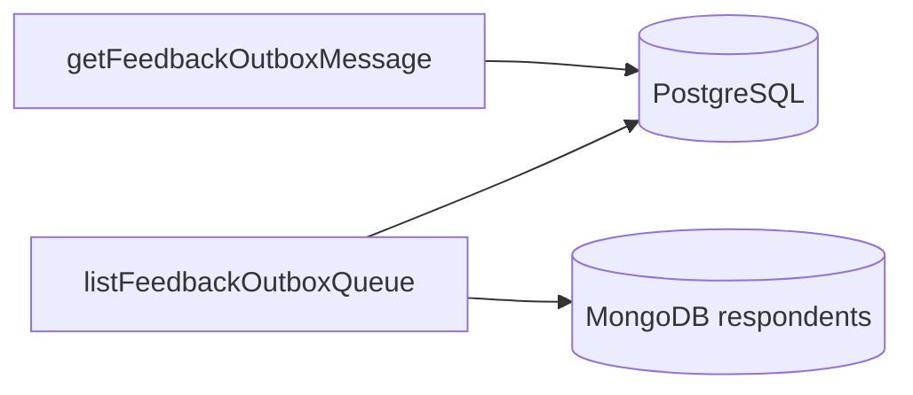

# Outbound queue screen

Status: accepted. Read-only operator surface for post-event feedback outbound
messages: waiting rows, history and one opened message. Dispatcher ownership:
[`queues.md`](../backend/mechanisms/queues.md).

## Purpose and boundary

It **reports**. No retry, cancel, promote or re-enqueue — three `GET`s only.

| Owns                                                         | Does not own                                                                 |
| ------------------------------------------------------------ | ---------------------------------------------------------------------------- |
| «Not delivered» statuses, age thresholds/tones, dispatch copy, polling, no live-region announce | Whether a row is sent; claim / ambiguous-send policy; D18 (inherits [inbox](feedback-conversations.md)) |

| Route             | View                 | Owns                                |
| ----------------- | -------------------- | ----------------------------------- |
| `/admin/outbound` | `FeedbackOutboxPage` | Queue + history, filters, open row  |

URL: `?message=<outboxId>`, `?range=`, `?status=`, `?view=queue`. Cursor stays
in component state (not the URL). Route is **not** under `/admin/feedback/` so
`AdminNavigation` `end`-match does not mark both nav items current.

## Contract

| Operation                   | Reads                                            | Polled                    |
| --------------------------- | ------------------------------------------------ | ------------------------- |
| `listFeedbackOutboxQueue`   | PostgreSQL + batched MongoDB respondents         | 3 s, both views           |
| `listFeedbackOutboxHistory` | PostgreSQL + batched MongoDB respondents         | 5 s, newest page only     |
| `getFeedbackOutboxMessage`  | PostgreSQL                                       | 3 s                       |

Generated hooks only
([api-contract](../backend/mechanisms/api-contract.md)). Queue query is **not**
gated on the visible view — its count badges the History tab.

| File                                                     | Owns                                              |
| -------------------------------------------------------- | ------------------------------------------------- |
| `src/features/feedback/outboxQueue.ts`                   | Ages, deltas, timeline, ranges, vocabulary, copy  |
| `src/features/feedback/polling.ts`                       | Three intervals                                   |
| `src/components/admin/feedback/OutboxQueueList.tsx`      | Waiting list                                      |
| `src/components/admin/feedback/OutboxHistoryList.tsx`    | Log + pager                                       |
| `src/components/admin/feedback/OutboxHistoryToolbar.tsx` | Range + status filters                            |
| `src/components/admin/feedback/OutboxMessageDetails.tsx` | Opened row                                        |
| `src/routes/FeedbackOutboxPage.tsx`                      | Wiring, selection, cursor stack                   |

Rules unit-tested in `apps/admin/test/feedback-outbox.spec.ts`.

## Load constraint

**No Redis reads.** PostgreSQL + batched MongoDB respondent lookup only. Detail
publishes durable `dispatch` (`pending | claimed | attempting | ambiguous |
sending` bridge | `sent | failed | held | cancelled`) with
`claimExpiresAt` / `sendStartedAt` / `attemptCount` / `lastError`. Claim token
never crosses HTTP. `deliveryActivityLines` owns copy: `claimed` reclaimable;
`attempting` may have started a provider call; `ambiguous` blocks automatic
resend. `attemptCount = 0` on pre-cutover `sending`/`sent` means the counter did
not exist — pane states that limit. Policy detail:
[`queues.md`](../backend/mechanisms/queues.md).

## Lists

Age is the subject; endpoint sorts by it.

| Part   | Queue                                                                 | History                                      |
| ------ | --------------------------------------------------------------------- | -------------------------------------------- |
| Lead   | Name (`line-clamp-1`; D18 via `ParticipantName`)                      | Decision-log `origin` (kind fallback)        |
| Age    | Right `tabular-nums`, toned                                           | —                                            |
| Line 2 | Kind · event title (phone on opened message)                          | Same pattern without live pause chip         |
| Chips  | Status + «Campaign paused» when dispatch blocked                      | Status alone                                 |

### Age tones

| Tone      | When                                              | Class            |
| --------- | ------------------------------------------------- | ---------------- |
| `fresh`   | under 15 s                                        | `text-ink`       |
| `slow`    | 15–60 s                                           | `text-warning`   |
| `stalled` | ≥ 60 s                                            | `text-danger`    |
| `parked`  | `held`, or campaign not `launched`                | `text-ink-muted` |

Seconds stay visible to the hour (`2m 27s`). Cap 200 rows; endpoint publishes
real per-status totals so the cap is not mistaken for the backlog. Summary count
carries **no** tone.

## Queue vs history

| View    | Default URL     | Rows                                              | Selection                                      |
| ------- | --------------- | ------------------------------------------------- | ---------------------------------------------- |
| History | bare `/admin/outbound` | Any status; `sent` quiet, `failed` loud     | Kept across pages (fetch by id)                |
| Queue   | `?view=queue`   | `pending` / `claimed` / `attempting` / `ambiguous` / bridge `sending` / `held` | Cleared when row leaves waiting |

Queue badge on the History tab carries the waiting count (including quiet `0`).
`ambiguous` stays until reconciliation even when delivery is otherwise healthy.

## History paging and filters

Keyset cursor `(created_at, id)` opaque base64url — not offset. Malformed cursor
rewinds to newest (no 400). Pager: Older / Newer / Jump to newest — **no page
numbers**. Server reads one past the page → `nextCursor`. Only the newest page
polls (and shows the live indicator). `total` is filter-scoped. Empty states:
«nothing matches» vs «nothing ever written».

| Control | Options                          | Notes                                              |
| ------- | -------------------------------- | -------------------------------------------------- |
| Range   | Last hour · Today · 7 days · All | Browser clock; ages remain server-measured         |
| Status  | Any + every table status         | Options from `outboxHistoryStatusBadge` vocabulary |

Filter change clears the cursor stack.

## Layout

Full-height route in `AdminShell` (with assistant): split at `lg`, list fixed
~18–22 rem, detail takes the rest; `main` `lg:h-dvh`. Below `lg`, ordinary
document scroll. Summary is one strip, not cards.

## Opened row

1. **Message body** first; header: person, event, launch-time phone.
2. **Timeline** — deltas between steps (`formatDelta` keeps sub-second to 1 s);
   omit steps that did not happen; sort by instant (no negative gaps).
   `claimExpiresAt` / `sendStartedAt` named; `updatedAt` only for terminal
   transitions without a better stamp. Durable status badge; provider reading
   only when timeline cannot already show it (`error` / `pending`).
3. **Why it was sent** — decision log (same transaction as the row): origin +
   per-origin facts; conversation snapshot labelled as not current. Predates
   `message_outbox_log` → stated plainly. Vocabulary from `labels.ts`, unknown
   values pass through.
4. **Dispatch activity** — durable attempt/error copy (not ephemeral jobs).
5. **Identifiers** — foot strip; copy via `CopyableId`. Campaign-running prose
   only when the campaign is **not** running.

Machine values: mono model pills + `ProviderMark`, ms timestamps, confidence
fill bar beside %, ids truncated to 8 with full value on hover/copy.

## Failure and loading states

- List owns loading / empty / error (`role="alert"`).
- Queue selection drops when the row leaves waiting.
- `getFeedbackOutboxMessage` accepts any status (just-sent explains itself).
- History uses `placeholderData` between Older clicks.
- No spinner as progress — durable state and claim/attempt times only.
- `queryClient` retries off repo-wide.

## Accessibility

- One `h1` via `JtsPageHeader`; list / message / sections labelled.
- **No live regions** (ages change every poll). Both panes use
  [`JtsLiveIndicator`](components/jts-live-indicator.md); failures still
  `role="alert"`.
- Age: compact `aria-hidden` + visually hidden spoken form; row name from
  content (no replacing `aria-label`).
- Rows are buttons; open row `aria-current`. Pager `nav`; ends `disabled` not
  hidden. Tab count: «N messages waiting». Status = text + tone.

## Remaining limit

`attemptCount` / `sendStartedAt` / `lastError` are durable for direct-dispatch
attempts, not a full per-attempt ledger. Pre-cutover terminals may lack the
counter. A future append-only attempts table is out of scope for this screen.

## Tests

`apps/admin/test/feedback-outbox.spec.ts` covers age tones (parked never
urgent), formats, vocabulary, durable dispatch copy, polling, no live region,
generated-hook boundary, paging/filter/cursor rules, opened-row body/timeline/
decision-log, and `lg` full-height layout pins. Backend dispatcher / queue-view /
history-cursor specs own the PostgreSQL contracts — see
[`queues.md`](../backend/mechanisms/queues.md).

## Decisions and references

- [ADR 0008](../decisions/0008-post-event-feedback-conversations.md)
- [`queues.md`](../backend/mechanisms/queues.md)
- [`api-contract.md`](../backend/mechanisms/api-contract.md)
- [`feedback-conversations.md`](feedback-conversations.md)
- [`theming.md`](theming.md)
