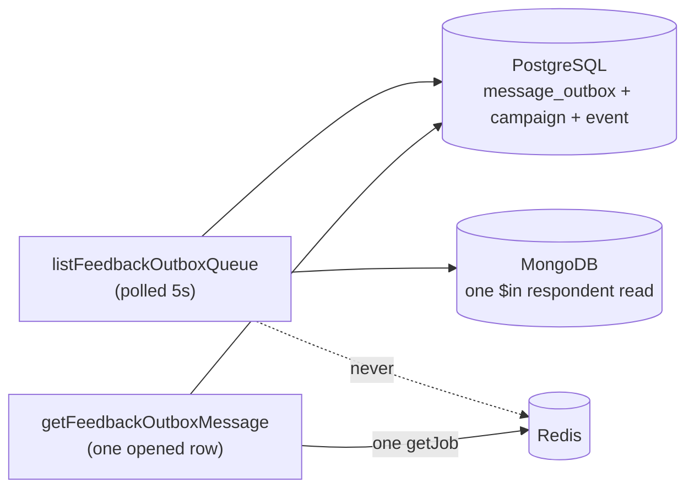

# Outbound queue screen

Status: accepted. Verified 2026-07-27 in real Chrome over the DevTools Protocol
(light and dark, 1600×1000); re-verified 2026-08-02 against the running dev
server at 1440×820 and 1280×800 after the history rebuild.

The operator surface for every outbound post-event feedback message: what was
sent and why, and what has not arrived yet. It is the admin half of the
`message_outbox` relay documented in
[`backend/mechanisms/queues.md`](../backend/mechanisms/queues.md).

## Why it exists

A rehearsal on 2026-07-27 left replies unsent for up to 147 seconds while
extraction held every worker slot, and the only way to see it was a hand-written
script against Redis. Bull Board is mounted at `/admin/queues` when enabled, but
it sits behind separate Basic credentials, speaks in job ids and knows nothing
about which participant is waiting. This screen answers the same question in the
vocabulary the rest of the admin uses: a person, a campaign, and an age.

## Purpose and boundary

It **reports**. Nothing on it retries, cancels, promotes or re-enqueues
anything; all three endpoints are `GET` — the queue, the history and the single
message — and the queue, the relay, the delivery service and the extractor are
untouched.

It **does** own: which statuses count as "not delivered", the age thresholds and
their tones, the status and job-state vocabulary, the honesty copy for a job
Redis cannot account for, the polling cadence, and the decision not to announce.

It **does not** own: whether a row is sent (the relay decides), retry policy
(`OUTBOX_RELAY_JOB_OPTIONS` and the five-minute `sending` recovery horizon), or
the `«άγνωστος συμμετέχων»` rule, which it inherits from
[the conversations screen](feedback-conversations.md).

| Route             | View                 | Owns                                          |
| ----------------- | -------------------- | --------------------------------------------- |
| `/admin/outbound` | `FeedbackOutboxPage` | Both lists, the filters, paging, the open row |

The opened row lives in `?message=<outboxId>` so a message is linkable and
survives reload, exactly as `?conversation=` does on the inbox. The filters join
it there — `?range=` and `?status=` — because «failures, today» is a view worth
sending to somebody. **The cursor does not.** A link that says «this range, this
status» still means the same thing tomorrow; one that also pinned page 4 of a
log that has grown since would not, so the walk lives in component state.

**The route is deliberately not under `/admin/feedback/`.** The queue spans every
campaign, and `AdminNavigation` `end`-matches only `/admin`, so a nested path
would leave both «Feedback & safety» and «Outbound queue» carrying
`aria-current="page"` at once.

## Contract

| Operation                   | Reads                                            | Polled          |
| --------------------------- | ------------------------------------------------ | --------------- |
| `listFeedbackOutboxQueue`   | PostgreSQL + one batched MongoDB respondent read | 5 s, both views |
| `listFeedbackOutboxHistory` | PostgreSQL + one batched MongoDB respondent read | 10 s, page 1    |
| `getFeedbackOutboxMessage`  | PostgreSQL + **one** BullMQ `getJob`             | 5 s             |

All three are consumed through the generated hooks
([api-contract](../backend/mechanisms/api-contract.md)).

The queue query is **not** gated on the visible view. Its count rides on the
Queue tab, and that badge is the only thing telling a reader of the history that
something is stuck behind them.

| File                                                     | Owns                                                                |
| -------------------------------------------------------- | ------------------------------------------------------------------- |
| `src/features/feedback/outboxQueue.ts`                   | Age tones, delta formatting, the timeline, ranges, vocabulary, copy |
| `src/features/feedback/polling.ts`                       | The three intervals                                                 |
| `src/components/admin/feedback/OutboxQueueList.tsx`      | The waiting list, its ages and its empty state                      |
| `src/components/admin/feedback/OutboxHistoryList.tsx`    | The log, its rows and its pager                                     |
| `src/components/admin/feedback/OutboxHistoryToolbar.tsx` | The range and status filters                                        |
| `src/components/admin/feedback/OutboxMessageDetails.tsx` | The opened row: the message, the timeline, the log, the live job    |
| `src/routes/FeedbackOutboxPage.tsx`                      | The queue strip, the filters, the cursor stack, selection, wiring   |

`features/feedback/outboxQueue.ts` has no React imports, so its rules are
unit-tested directly in `apps/admin/test/feedback-outbox.spec.ts`.

## The load constraint

**The list must not do a Redis lookup per row.** A polled list that opens a queue
connection for every message turns an observability page into the outage it was
meant to observe.

Of the two allowed shapes — one batched call for the whole page, or a deferred
call per opened row — this screen **defers**. The list is derived from
PostgreSQL alone; the single `getJob` happens only for the row an operator
opened, which is the same allowance
[api-contract](../backend/mechanisms/api-contract.md) already grants
`getFeedbackConversation` for its extract job. The bound is therefore one job
lookup per five seconds regardless of how long the queue is, and it is enforced
in two places: `apps/backend/src/modules/post-event-feedback/outbox/queue-view.service.spec.ts`
asserts that a 25-row list never calls `getJob`, and the admin spec asserts the
list half of the service names no queue call at all.

A batched queue-wide read was considered and left out. `getJobCounts` would say
whether any worker is alive, which the deferred read cannot — but it is a second
Redis dependency on the page's own load path for a fact readiness already
monitors, and every row an operator opens answers it for that row.

## What the list shows

Age is the subject, so it is the one column with its own scale, and the endpoint
sorts by it. Everything else on a row answers "and who does that affect".

| Part   | Treatment                                                                                                          |
| ------ | ------------------------------------------------------------------------------------------------------------------ |
| Name   | One `line-clamp-1` line; D18 italic fallback through `ParticipantName`                                             |
| Age    | Right-aligned `tabular-nums`, toned and weighted (below)                                                           |
| Line 2 | Kind `·` event title. The phone number left this row when the column ran out of width; it is on the opened message |
| Chips  | The row's own status, plus «Campaign paused» when the relay is refusing it                                         |

That anatomy is the **queue** row. A history row differs: it leads with the
decision-log origin, and it carries the status badge alone — «Campaign paused»
is a live condition and cannot apply to something already sent.

### Age tones come from the mechanism

The relay pass is 5 seconds, so:

| Tone      | When                                                  | Reads as         |
| --------- | ----------------------------------------------------- | ---------------- |
| `fresh`   | under 15 s — at most two relay passes                 | `text-ink`       |
| `slow`    | 15–60 s — three passes missed, something holds a slot | `text-warning`   |
| `stalled` | 60 s and over — the shape of the 2026-07-27 incident  | `text-danger`    |
| `parked`  | `held`, or any campaign that is not `launched`        | `text-ink-muted` |

`parked` is the important one. A paused campaign's rows are never leased and
`held` rows never are either, so an hour of age there is obedience, not an
incident — colouring it red would teach an operator that the colour means
nothing. The count in the summary row carries **no** tone for the same reason: a
backlog of six is neither good nor bad, and the age beside it is what says so.

Seconds stay visible right up to the hour (`2m 27s`, not "2 minutes ago"),
because the difference between 40 s and 90 s is the difference between fine and
broken.

The list is capped at 200 rows, oldest first, and the endpoint publishes the
real per-status totals alongside it, so a capped page states what it is showing
instead of implying that the cap is the backlog.

## Queue and history are one page, two questions — and history is the front door

The screen carries a History/Queue toggle (`?view=queue`). The queue is «who is
waiting right now»: only `pending`/`sending`/`held` rows, ages measured on the
server, and it empties itself the moment delivery is healthy. The history is
«everything ever written, and why»: rows of any status, each leading with the
decision log's one-word `origin` (kind is the fallback for rows older than the
log), with `sent` in the quiet success tone and `failed` in the loud one.

**History is what the bare URL shows**, and the queue is the explicit one. That
is the inverse of the first cut, for a reason the first cut could not see: the
queue's healthy answer is an empty list, so on a good day the screen's front
door was a page saying nothing, standing in front of the log everyone had
actually come to read. The backlog did not lose its voice — the count moved onto
the Queue tab, where it can raise a hand without taking the room. Zero is drawn
quietly rather than hidden, because a badge that vanishes states nothing while
«0» states that the question was asked and answered.

Selection behaves differently in the two halves, and the difference is the
point. The queue drops a selection the moment the row stops waiting — a pane
describing a wait that is over is worse than no pane. The history drops nothing,
**including across pages**: the opened row is fetched by id and knows nothing
about paging, so walking back through the log with one message held on screen is
exactly the comparison an operator paged for.

## Paging a log that is still being written

`message_outbox` is append-only and nothing prunes it. «The newest 200» stopped
being a usable view of it during the first campaign, so
`listFeedbackOutboxHistory` takes `limit`, `cursor`, `status`, `from` and `to`.
Every one is optional and the bare call still returns the newest page.

**Keyset, not offset.** The table is written to while an operator reads it, and
`OFFSET 50` against a growing log repeats rows it has already shown and skips
ones it has not — the two failure modes a log viewer must not have. The cursor
is `(created_at, id)`, exactly the sort key, base64url-encoded into one opaque
token. Opaque is the contract: the sort key can gain a column without breaking
stored links, and nobody can hand-craft a cursor that walks an order the query
does not have. A cursor that is not one we wrote **rewinds to the newest page**
rather than answering 400 — it arrives from a URL a person can edit, and this
endpoint only reads.

That is also why no page number appears anywhere. «Page 3 of 40» would be stale
before it finished rendering, so the pager offers exactly the two moves the
cursor supports — Older and Newer — plus «Jump to newest». The server reads one
row past the page and returns it as `nextCursor` rather than as data, which is
the difference between an «Older» button that is honest and one that offers a
page it then has to admit is empty.

**Only the newest page refreshes itself.** Once an operator has walked back, new
rows land above where they are reading; polling would either move the page under
them or spend a request proving a finished slice has not changed. The live
indicator disappears along with the polling, because a mark claiming a refresh
that is deliberately not happening is worse than no mark.

`total` is scoped to the active filter, not to the table. Under a one-hour
filter the table's own total would be a number about a different set of rows,
printed directly above the page that contradicts it. For the same reason the
empty state distinguishes «nothing matches this range and status» from «nothing
was ever written» — telling an operator the second when the first is true sends
them looking for a bug.

The index this rests on is `message_outbox_created_id_idx` on
`(created_at, id)`. The existing `(status, created_at)` composite cannot serve
it: its leading column is a status the unfiltered query does not constrain.

## Narrowing it

Paging alone answers none of the questions people bring to a log — «the failure
was somewhere in the last four thousand rows» is not an answer, it is the same
problem with a button. So the history carries two filters and no date pickers.

| Control | Options                            | Why                                           |
| ------- | ---------------------------------- | --------------------------------------------- |
| Range   | Last hour · Today · 7 days · All   | The questions people actually ask a log       |
| Status  | Any, then the six the table allows | «Show me the failures» is why logs get opened |

A pair of date pickers would make the common case cost six interactions; the day
a genuinely arbitrary range is needed it belongs here as a third control, not as
the price of the first two. The status options are built from
`outboxHistoryStatusBadge`'s own vocabulary, so a word cannot mean one thing in
the filter and another on the row it selects.

The range is computed against the **browser's** clock, and it is the one time on
this screen that is. Every age is measured on the server because an age is a
measurement and a skewed client would misreport the figure the screen exists to
show. A range is not a measurement — it is a question, and «today» is a question
about the day the person asking is having.

Changing either filter clears the cursor stack. A cursor is a position inside
one filtered set, and carrying it across a filter change asks the server to
continue from a row that may not be in the new set at all.

## It fits one laptop screen

The screen is two panes, so it takes the viewport instead of growing the
document: `AdminShell` lists `/admin/outbound` beside `/admin/assistant` as a
full-height route, each pane scrolls itself, and nothing scrolls the page.

Three things had to change together, and each was load-bearing:

- **The split is at `lg`, not `2xl`.** `2xl` is 1536px. A 1440px laptop never
  reached it, so the detail pane designed to sit beside the list spent its life
  underneath it — which is the whole reason the screen did not fit.
- **The proportions are inverted.** The list took `1fr` and the pane took 26rem;
  now the list is a fixed 18–22rem column and the pane takes the rest. A row is
  one name and one time; the thing an operator opened it for is a message, a
  decision and a timeline. The phone number left the rows along with the width
  and moved onto the opened message, where it can be acted on.
- **The height is stated once, at `main`.** Every ancestor up to `<body>` is
  sized by `min-height`, so `flex-1` had no definite basis to resolve against —
  and `flex: 1 1 0%` sets a `flex-basis` that wins over `height` on the main
  axis, so it also swallowed any height stated further in. `main` now takes
  `lg:h-dvh` and no flex sizing at all. Only from `lg`, because below it the
  shell puts a sticky top bar above `main`, and a narrow screen wants the
  ordinary scrolling page anyway.

The three summary figures became one strip. As cards they cost about a fifth of
a laptop screen for numbers that are single digits on a healthy day, and that
height came straight out of the two panes doing the work.

## What an opened row shows

It opens with the message itself. For a year the pane that exists to explain a
message never showed the one thing the participant actually saw, and everything
else on it is context for those words — so `body` is now on the delivery DTO and
first in the pane. The header names the person, the event and the launch-time
phone for the same reason: both lists carried them and the opened row did not,
so an operator who followed a link into a row had to go back to a list to find
out whose message it was.

Below that, two halves kept visibly apart because their reliability differs.

### The timeline, not a stack of timestamps

«What happened, and how fast» replaced six labelled times — Created, Row last
changed, Delivery last changed, Sent, Delivered, Read — of which two named the
same instant and two were usually an em dash. What an operator reads that stack
to find is never an absolute time; it is the distance between two of them. So
the distance is what is printed, the absolute time keeps its pill beside it, and
steps that did not happen are simply not steps.

`formatDelta` keeps sub-second resolution up to a second (`+412ms`, `+1.4s`,
then `+2m 27s`) because that is the entire scale a healthy delivery lives on:
written, leased and sent inside the same second is the normal case, and
`formatWaiting` would print all three of those gaps as `0s` — three zeros in a
column whose only job is to show that nothing was slow.

`updatedAt` earns a step only where it means something nameable: the lease on a
`sending` row, and the moment a `failed` or `cancelled` row stopped. Anywhere
else it is a column that changes for reasons the screen has no word for, which
is what made it noise. Steps are sorted by their own instant rather than by the
order they are assembled — a row that failed after a provider call has an
`updatedAt` later than its `sentAt`, and printing them the other way round would
invent a negative gap out of correct data.

The row's two statuses became one badge and, sometimes, a second. The durable
row status is the truth and carries the vocabulary. The provider's own reading
appears **only** when the timeline cannot already draw it: `sent`, `delivered`,
`read` and `played` are exactly the steps above with their times attached, so
repeating them as a bare word is strictly less information in more space. The
two that survive — `error` and `pending` — are the two with no timestamp of
their own.

### Why it was sent

The outbound decision log sits on the durable side of the reliability line,
because it is written in the same transaction as the row itself. «Why this was
sent» renders the log's origin and per-origin decision facts (model, confidence
and goal statuses for a model reply; the failure cause for the fallback origins;
the triggering ingress, staff actor, intro created-vs-relaunched or reminder
rung for the rest), and «Conversation as it stood» renders the conversation
snapshot the writer decided against, with one quiet line saying it is not the
conversation now. A row that predates `message_outbox_log` states that plainly
instead of hiding the section — an empty section would teach an operator that
the log is unreliable, when the record is simply older than the table.
Vocabulary is reused from `labels.ts`, tolerant of values the log outlived: an
unrecognised goal status or failure cause passes through verbatim.

Machine values in the opened pane carry their own quiet treatment, decided by
the React-free fact builder's `kind` and painted only in the component: model
ids sit in a mono pill with a provider mark (OpenAI's own for `openai/*`
direct models, a neutral glyph for OpenRouter-routed ones — no redrawn
third-party logos), timestamps sit in the same pill at millisecond precision
(they are evidence, and the minute would flatten exactly the differences the
row was opened to measure), confidence renders as a small `aria-hidden` fill
bar beside the percentage that remains the fact, and every id is truncated to
eight characters with the full value on hover and one click to copy
(`CopyableId` — glyph-swap confirmation, no layout shift, silent when the
clipboard is unavailable).

### What stopped being printed on every row

Three things were paying rent on every opened row for a fact needed on almost
none of them, and each moved rather than vanished:

| Was                                        | Is                                              |
| ------------------------------------------ | ----------------------------------------------- |
| Three ids as labelled fact rows            | One «Identifiers» strip at the foot of the pane |
| A paragraph saying the campaign is running | Printed only when it is **not** running         |
| Five lines on the missing retry history    | A `
` under the state that prompts it   |

The ids are not read on this screen; they exist to be pasted somewhere else, so
they are grouped by that purpose and placed where a reader arrives only when
they went looking. The campaign sentence was true on every healthy row, which
taught operators to skip the paragraph that matters on the rows where it is not.
The retry-history limit is needed once — the first time «άγνωστο» surprises
someone — and it now sits directly under the state that raises the question.

## Failure and loading states

- The list owns its loading, empty and error states; the error is `role="alert"`.
- A selection that leaves the queue (the message reached the participant between
  two polls) falls away rather than pinning a stale pane.
- `getFeedbackOutboxMessage` accepts **any** outbox status, so a row that has
  just been sent explains itself instead of answering 404.
- `queryClient` retries are off repo-wide, so the one bounded "Reading this
  message's delivery job…" line always resolves or becomes an error.
- A history page keeps the previous one on screen while the next loads
  (`placeholderData`), so the list never blinks to an empty state between two
  clicks of «Older».
- **No spinner anywhere states progress.** A dead worker and a busy one look
  identical from Redis; the pane gives a state and a time, or «άγνωστο».

## Accessibility

- One `h1` through `JtsPageHeader`; the list, the opened row and each of its
  sections are labelled `section`s with their own heading.
- **Nothing on this page is a live region, and that is deliberate.** The
  extraction block on the inbox _is_ a polite live region because it is one short
  sentence that mostly holds still. Here every age changes on every poll by
  construction, so `aria-live` would announce forever and make the screen
  unusable. Instead both panes carry
  [`JtsLiveIndicator`](components/jts-live-indicator.md), whose hidden sentence
  states once that the pane refreshes itself and that ages are measured on the
  server. Failures still announce through `role="alert"`.
- The age is rendered twice: `2m 27s` for scanning, `aria-hidden`, beside a
  visually hidden «waiting 2 minutes 27 seconds», because a reader voices the
  compact form as punctuation. No `aria-label` is placed on the row, so its
  accessible name stays computed from its own visible content (WCAG 2.5.3).
- Rows are buttons in a list; the opened row carries `aria-current`. The pager
  is a `nav` with its own label, and its two ends are `disabled` rather than
  hidden, so the control does not move under the pointer at the edges of the log.
- The queue count on the tab is a number for the eye and a sentence for a
  reader: «3 messages waiting», not a bare «3» beside a word.
- Status is text plus tone, never tone alone: every chip carries its label and
  every age has its status chip beside it.
- Verified 2026-07-27 over the DevTools Protocol at 1600×1000: one `h1`, **zero**
  `[aria-live]` nodes, **zero** unnamed interactive nodes in the full
  accessibility tree, exactly **one** `nav a[aria-current]`, no horizontal
  document overflow, and no console errors, in both themes.
- Re-verified 2026-08-02 at 1440×820 and 1280×800 after the rebuild: the same
  five invariants, plus `scrollHeight === clientHeight` on the document (the
  page itself does not scroll), heading order `h1 → h2 list → h2 message → h3
sections`, and exactly one `aria-current` row with a message open.

## Extension

The honest gap this screen exposes is that **the system does not durably record
delivery attempts.** Everything an operator would want for a post-incident
question — how many times this message was tried, when, and why each attempt
failed — lives only as BullMQ job state that `removeOnComplete` /
`removeOnFail` deletes immediately. Closing it means a durable attempt log
(a `message_outbox_attempts` table written by the deliver consumer, or an
attempt counter plus last-failure columns on `message_outbox`), which is a
migration and a change to the delivery path — not something an observability
screen may invent. Until then, «άγνωστο» is the correct word.

## Tests

`apps/admin/test/feedback-outbox.spec.ts` covers the age thresholds against the
relay's own pass, that a parked row never takes an urgent tone, the compact and
spoken age formats, the status and kind vocabulary, the summary's real totals and
oldest age, every branch of the job copy (including all three «άγνωστο» cases and
the reclaim time instead of a spinner), the attempt answer, the polling policy,
the absence of any live region, the generated-hook boundary, that the backend
list path names no queue call, the route/navigation registration, and that the
screen colours itself from tokens alone. A «why the row was written» block
covers the decision-log facts per origin, that no confidence is invented when
the model reported none, the verbatim passthrough of an unrecognised failure
cause, the conversation-state wording, the predates-the-log statement, and
that both log sections render above «Delivery job».

Three blocks cover the rebuild. **Paging the log** asserts the cursor walk, the
absence of any page number, that only the newest page polls, and that a filter
change clears the stack. **Narrowing the log** asserts the four ranges, that
«all» sends no bound, that a range is computed against the browser's own
midnight, that the status options reuse the badge vocabulary, that an invented
range or status in the URL is refused, and that an empty filter says so instead
of claiming an empty table. **The opened row** asserts the body and the header
facts, the timeline's deltas and its sub-second scale, that steps which did not
happen are omitted, that `updatedAt` appears only where it is nameable, that
steps sort by instant so no negative gap can be printed, the provider-reading
rule, and that the campaign paragraph and the retry-history note stopped being
unconditional. **Fitting a laptop screen** pins the `lg` breakpoint, the absence
of `max-h-[78vh]`, and that the panes take the viewport.

Backend: `inspect-deliver-job.spec.ts` covers the job read (state, due time,
bounded failure reason, a missing job as `unknown`, and an unrecognised BullMQ
state as `unknown`); `queue-view.service.spec.ts` covers the no-Redis list
invariant, server-measured ages, the D18-shaped fallback, capped totals, the
single opened-row lookup, the reclaim horizon and a already-sent row, the
decision log on the opened row — present, absent, and unreadable-jsonb-as-null —
the message, person and event the pane names a row by, and the paging contract:
the read-one-past-the-page cursor, the end of the log, continuing from the
cursor it handed out, rewinding on a cursor we did not write, and that the total
is counted within the filter. `history-cursor.spec.ts` covers the round trip,
the retained millisecond, that no `+`, `/` or `=` survives into a query string,
and five malformed inputs that must produce `null` rather than a predicate.

## Decisions and references

- [ADR 0008](../decisions/0008-post-event-feedback-conversations.md) — post-event
  feedback conversations
- [`queues.md`](../backend/mechanisms/queues.md) — the relay, the deliver job
  contract and its retention
- [`api-contract.md`](../backend/mechanisms/api-contract.md) — the rule this
  screen's list obeys
- [`feedback-conversations.md`](feedback-conversations.md) — the inbox it links
  into, and the D18 fallback it inherits
- [`theming.md`](theming.md) — tokens
- [BullMQ auto-removal](https://docs.bullmq.io/guide/queues/auto-removal-of-jobs)
  and [job ids](https://docs.bullmq.io/guide/jobs/job-ids) (5.80.10, verified
  2026-07-27)
