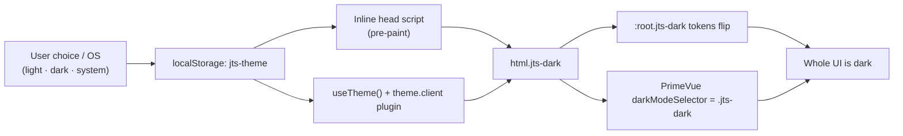

# Theming, design tokens and dark mode

Status: accepted, verified 2026-07-22 (Nuxt 4.5.0, PrimeVue 4.5.5,
`@primeuix/themes` 2.0.3, `@fontsource-variable/manrope` 5.3.0).

This is the base every admin screen is built on. Its promise: **to style a new
screen you use a semantic token or a plain PrimeVue component, and light + dark
are correct with no colour plumbing.** See
[ADR 0005](../decisions/0005-theming-and-dark-mode.md) for the decision record.

## Purpose and boundary

- `packages/design-tokens/src/tokens.css` owns every shared visual value and is
  framework-neutral. It is the single source of truth.
- `apps/web/app/theme/jts-preset.ts` maps PrimeVue's semantic slots onto those
  tokens. It owns no colours of its own.
- `apps/web/app/assets/css/main.css` styles the admin shell and shared
  components using only semantic tokens.
- `apps/web/app/composables/useTheme.ts` + `plugins/theme.client.ts` own the
  light/dark/system preference and the `jts-dark` class.

If you are adding colour, spacing or type to a screen and reach for a literal
value, stop — add or reuse a token instead.

## Token layers

Tokens are layered. Consume the semantic layer; never hardcode primitives.

| Layer         | Example                                   | Use it for                                  |
| ------------- | ----------------------------------------- | ------------------------------------------- |
| Primitive     | `--jts-wine-700`, `--jts-clay-300`        | Defining semantics only. Not in components. |
| Semantic      | `--jts-color-primary`, `--jts-color-text` | Everything you build. Carries light/dark.   |
| Scale (type…) | `--jts-space-4`, `--jts-radius-lg`        | Layout, rhythm, type, shadow, z, motion.    |

### Semantic colour tokens you will actually use

| Token                                                                    | Meaning                                      |
| ------------------------------------------------------------------------ | -------------------------------------------- |
| `--jts-color-canvas`                                                     | App background                               |
| `--jts-color-surface`                                                    | Card / panel background                      |
| `--jts-color-surface-raised` / `-sunken`                                 | Inputs & overlays / insets, table stripes    |
| `--jts-color-surface-strong`                                             | Inverse (the wine sidebar)                   |
| `--jts-color-border` / `-subtle` / `-strong`                             | Hairlines and dividers                       |
| `--jts-color-text` / `-muted` / `-subtle`                                | Body / secondary / tertiary text             |
| `--jts-color-text-on-strong`                                             | Text on the wine sidebar                     |
| `--jts-color-primary` (`-hover`/`-active`/`-soft`/`-contrast`)           | Brand actions & emphasis                     |
| `--jts-color-accent`, `--jts-color-link`                                 | Warm secondary accent, links                 |
| `--jts-color-focus`, `--jts-focus-ring`                                  | Focus outline and ring                       |
| `--jts-color-success`/`-warning`/`-danger`/`-info` (+ `-soft`/`-border`) | Status: fg, fill, border                     |
| `--jts-color-sidebar-*`                                                  | Sidebar nav states (composed from the above) |

Non-colour scales: `--jts-space-{1..24}`, `--jts-radius-{xs..xl,pill,circle}`,
`--jts-shadow-{xs,sm,md,lg}`, `--jts-z-{base..max}`,
`--jts-duration-*` / `--jts-ease-*`, and type
(`--jts-font-{sans,display,mono}`, `--jts-text-{xs..3xl}`,
`--jts-weight-*`, `--jts-tracking-*`, `--jts-leading-*`,
`--jts-numeric-tabular`).

## Dark mode: one class, one source

Everything dark is decided by the `jts-dark` class on `<html>`. Nothing else.

- **No flash.** An inline script in `nuxt.config.ts` (`app.head.script`) reads
  the stored preference and sets `jts-dark` before the first paint. It mirrors
  `useTheme()` exactly.
- **State.** `useTheme()` exposes `mode` (`light`/`dark`/`system`), `resolved`,
  `isDark` and `setMode()`. `setMode` persists to `localStorage` and toggles the
  class. `plugins/theme.client.ts` hydrates state and follows OS changes while
  in `system`.
- **Control.** `AdminUserMenu.vue` (top-right) renders a Light/Dark/Auto
  `SelectButton` bound to `useTheme()`.

## PrimeVue integration

`jts-preset.ts` sets each PrimeVue semantic slot to a `var(--jts-*)` reference,
so a PrimeVue component and a hand-written element render the same colour and
flip together. `jts-theme.ts` sets `darkModeSelector: ".jts-dark"` and enables
`cssLayer` (`{ name: "primevue", order: "theme, base, primevue" }`).

- **To restyle globally:** edit a token in `tokens.css`. PrimeVue and CSS both
  update, in both themes.
- **To adjust one PrimeVue component's shape/spacing:** add a component entry in
  `jts-preset.ts` (see `button`, `dialog`, `datatable`), preferring token values.
- **To override PrimeVue layout from CSS:** write a normal (unlayered) rule in
  `main.css`. Because PrimeVue lives in the `primevue` layer, your rule wins
  without escalating specificity.

Do not reintroduce a second source of colour (e.g. hardcoding hex in the preset
or a component). That is the "shenanigan" this base exists to prevent.

## Typography

Manrope (variable, `@fontsource-variable/manrope/wght.css`) is the only family:
display, UI and body. It ships **Latin and Greek**, so Greek and English look
identical for the operator. Numbers that are scanned or compared use
`font-variant-numeric: var(--jts-numeric-tabular)` (already applied to stat
values and table bodies via the `.tabular` helper). System sans is the fallback.

## Motion

`MotionConfig` uses `reduced-motion="user"` and CSS collapses animation under
`prefers-reduced-motion`. Motion signals continuity or state change and never
carries status by itself. Durations/easings come from `--jts-duration-*` /
`--jts-ease-*`.

## Invariants

- Components consume semantic tokens, never primitives or literals.
- `jts-dark` on `<html>` is the only dark-mode signal.
- No glows, blurred circles, gradient washes or pulsing dots. Flat accents
  only, plus the six-dot `.brand__mark` logo and one static `.status-dot`.
- The signature emphasis motif is **the 3px marker** (`--jts-color-primary` or
  a status tone): horizontal under the page title, vertical on the left edge of
  accented cards. It means "this matters / something happened" — never "you are
  here" (the active sidebar item lights its index numeral instead) — and do not
  invent parallel emphasis devices.
- Metadata text (tags, table column headers, labels, kickers) is tracked
  micro-caps; content and numbers stay sentence case with tabular figures.
- Both themes stay at or above WCAG AA for text.

## Tests

- `packages/design-tokens/scripts/verify-tokens.mjs` — required token names.
- `apps/web/test/theme-tokens.spec.ts` — AA contrast for critical pairs, light
  and dark, resolved from `tokens.css`.
- `apps/web/test/jts-preset.spec.ts` — the preset consumes tokens and keeps
  DataTable colours scheme-scoped.
- `apps/web/test/theme-switch.spec.ts` — resolve logic and the single-class
  wiring (pre-paint script, `darkModeSelector`, the user-menu control).

## References

- [ADR 0005](../decisions/0005-theming-and-dark-mode.md)
- PrimeVue 4 styled theming — <https://primevue.dev/theming/styled/> (2026-07-22)
- Fontsource Manrope — <https://fontsource.org/fonts/manrope>
