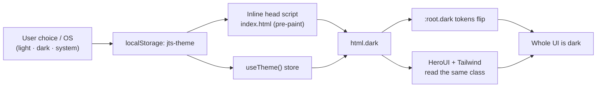

# Theming, design tokens and dark mode

Status: accepted, verified 2026-08-02 (React 19.2.8, HeroUI `@heroui/react`
3.2.2, Tailwind CSS 4.3.3, Vite 8.1.5, `@fontsource-variable/manrope` 5.3.0,
`@fontsource-variable/commissioner` 5.2.10,
`@fontsource-variable/sora` 5.3.0).

Base every admin screen builds on: style with a semantic token or plain HeroUI
component; light + dark stay correct without colour plumbing. Decisions:
[ADR 0005](../decisions/0005-theming-and-dark-mode.md),
[ADR 0006](../decisions/0006-react-admin-runtime.md) (HeroUI consumer),
[ADR 0012](../decisions/0012-selectable-palettes.md) (palette axis).
Consumer rules (no literals, no `dark:` colour branches) live in
[`apps/admin/AGENTS.md`](../../apps/admin/AGENTS.md) — this doc owns the token
graph, bridge and appearance axes.

## Purpose and boundary

| Owner | Owns |
| ----- | ---- |
| `packages/design-tokens/src/tokens.css` | Shared visual values and the house theme (Join The Six). Framework-neutral. A colour added only here is correct in one theme of six. |
| `packages/design-tokens/src/palettes.css` | The five override themes (`data-palette` on `<html>`): flat resolved hexes for the **semantic colour layer only**. |
| `apps/admin/src/styles/globals.css` | The **bridge**: HeroUI + Tailwind consume tokens. Owns no colours. |
| `apps/admin/src/lib/useTheme.ts` + `index.html` pre-paint | Light/dark/system → `dark` class on `<html>`. |
| `apps/admin/src/lib/usePalette.ts` + same pre-paint | Theme id → `data-palette` on `<html>`. |

Components use bridge utilities (`bg-canvas`, `text-ink-muted`, `bg-accent`, …).
If a needed semantic is missing, add a token — do not hardcode.

## Token layers

Consume the semantic layer; never hardcode primitives.

| Layer | Example | Use |
| ----- | ------- | --- |
| Primitive | `--jts-wine-700`, `--jts-clay-300` | Defining semantics only. Not in components. |
| Semantic | `--jts-color-primary`, `--jts-color-text` | Everything you build. Carries light/dark. |
| Scale | `--jts-space-4`, `--jts-radius-lg` | Layout, rhythm, type, shadow, z, motion. |

### Semantic colour tokens

| Token | Meaning |
| ----- | ------- |
| `--jts-color-canvas` | App background |
| `--jts-color-surface` | Card / panel background |
| `--jts-color-surface-raised` / `-sunken` | Inputs & overlays / insets, table stripes |
| `--jts-color-surface-strong` | Inverse (wine sidebar) |
| `--jts-color-border` / `-subtle` / `-strong` | Hairlines and dividers |
| `--jts-color-text` / `-muted` / `-subtle` | Body / secondary / tertiary |
| `--jts-color-text-on-strong` | Text on the wine sidebar |
| `--jts-color-primary` (`-hover`/`-active`/`-soft`/`-contrast`) | Brand actions & emphasis |
| `--jts-color-accent`, `--jts-color-link` | Warm secondary (copper), links |
| `--jts-color-focus`, `--jts-focus-ring` | Focus outline and ring |
| `--jts-color-success`/`-warning`/`-danger`/`-info` (+ `-soft`/`-border`) | Status: fg, fill, border |
| `--jts-color-sidebar-*` | Sidebar nav states (composed from above) |

Non-colour scales: `--jts-space-{1..24}`, `--jts-radius-{xs..xl,pill,circle}`,
`--jts-shadow-{xs,sm,md,lg}`, `--jts-z-{base..max}`,
`--jts-duration-*` / `--jts-ease-*`, and type
(`--jts-font-{sans,display,brand,mono}`, `--jts-text-{2xs..3xl}`,
`--jts-weight-*`, `--jts-tracking-*`, `--jts-leading-*`,
`--jts-numeric-tabular`).

## Dark mode: one class, one source

`dark` on `<html>` is the only dark-mode signal — tokens, HeroUI and Tailwind
all read it.

- **No flash.** Pre-paint script mirrors `useTheme()` (preference + OS when
  `system`); re-apply on mount is idempotent.
- **State.** `useTheme()` is a `useSyncExternalStore` module store:
  `mode` / `resolved` / `isDark` / `setMode()`. Persists under `jts-theme`;
  follows OS while in `system`.
- **Control.** `AdminUserMenu` Appearance group (Light / Dark / Auto) in sidebar
  footer and small-screen top bar.

## Themes: the second appearance axis

Operator **Theme** group × Appearance = 6×2 grid. Axes never mix. Each theme
owns its own primary, accent, link, focus and status tones — not a field wash
over a fixed wine brand.

| Theme | Field | Brand | Accent |
| ----- | ----- | ----- | ------ |
| Join The Six | warm rosewood paper (default) | wine | copper |
| Graphite | cool neutral | azure | violet |
| Noir | greyscale | ink | violet |
| Amphora | Flexoki ink on paper | teal | orange |
| Linen | Radix Colors sand | copper | indigo |
| Iris | Rosé Pine | iris | foam |

- **Join The Six** = absence of `data-palette` (`tokens.css`). Overrides live in
  `palettes.css` as flat hexes; type, space, radius, shadows and primitives stay
  shared.
- Light blocks are scoped `:not(.dark)` so they tie with `:root.dark` on
  specificity (`palettes.css` imports after `tokens.css`) — same pattern as
  HeroUI's `[data-vibrant-palette="true"]`.
- `usePalette` + pre-paint stamp `data-palette` from `localStorage`
  (`jts-palette`); neither axis flashes.
- **Noir** is monochrome in brand only; status tones stay real hues so warning /
  danger / accent remain distinct.
- Retune an override in its `palettes.css` block; retune the house theme in
  `tokens.css`.

### Rules a theme must pass

Gated by `apps/admin/test/palettes.spec.ts` (five overrides) and
`theme-tokens.spec.ts` (house); floors in
`apps/admin/test/colour-metrics.ts` (CIEDE2000, not hex `!==`).

| Rule | Floor |
| ---- | ----- |
| Twelve AA text/background pairs, both modes | 4.5:1 |
| Each badge tone on its `-soft` tint; `canvas` on its solid | 4.5:1 |
| `accent` as label ink on `surface` | 4.5:1 |
| Badge tones (`info` `success` `warning` `danger` `accent`) pairwise | ΔE 12 |
| `primary` against each status tone | ΔE 10 |
| Brand colour and sidebar slab, across themes | distinct |

**Sidebar numeral.** `--jts-color-sidebar-active-index` is the theme's **dark
primary** in both modes (the slab is always dark). Matches
`AdminNavigation`'s mobile drawer `text-primary`.

## HeroUI + Tailwind bridge

HeroUI v3 is CSS-first (no theme provider / JS theme object). `globals.css`
points HeroUI variables at tokens via four mechanisms:

1. **Unlayered `:root` override** of HeroUI base tokens (`--background`,
   `--surface`, `--accent`, `--danger`, `--field-*`, `--radius`, …) as
   `var(--jts-*)`. Unlayered beats `@layer base`; `:root.dark` flips HeroUI with
   the tokens — no second theme definition.
2. **`@theme inline`** — jts Tailwind vocabulary (`canvas`, `ink`/`ink-muted`,
   `primary`, `copper`, `info`, `*-border`, `sidebar-*`) plus font/radius/shadow/
   tracking mapped to `var(--jts-*)`. **Type scale is not mapped:** use
   `text-[length:var(--jts-text-lg)]` (no `--text-*`); `text-lg` stays Tailwind's.
   Status hairlines (`border-warning-border`, …) exist because HeroUI models
   status as fill + soft + text only. Inline theme emits runtime `var()` so
   utilities flip with tokens.
3. **`@custom-variant dark (&:is(.dark *))`** — Tailwind `dark:` on the same
   class. Colours never need it; tokens already flip.
4. **`@utility jts-overline`** — metadata recipe (`--jts-text-2xs`, extrabold,
   uppercase, `--jts-tracking-caps`). `jts-` prefix required: Tailwind ships a
   core `overline` (text-decoration).

### Extending

- **Global restyle:** edit `tokens.css` (or a palette block).
- **One HeroUI component:** `className` / `classNames` with token utilities, or
  local `--field-*` override. Never wrap HeroUI just to rename props.
- **New utility vocabulary:** `--color-*` / `--radius-* …` under `@theme inline`
  (or `:root` HeroUI base override).

### Auditing

`/admin/cookbook` (DEV-only) renders the vocabulary — real utilities and real
components. Change → read page → flip Appearance → read again. No side-by-side
dark preview (`dark` is the only signal). New token / bridge utility / badge
tone / `Jts*` lands on the cookbook in the same change. Contract:
[admin-cookbook.md](admin-cookbook.md).

## Typography

Three Fontsource variable families
([ADR 0011](../decisions/0011-display-typeface.md)):

| Face | Token / utility | Use |
| ---- | --------------- | --- |
| Manrope | `--jts-font-sans` | UI and body (Latin + Greek) |
| Commissioner | `--jts-font-display` / `font-display` | Display headings (Latin + Greek) |
| Sora | `--jts-font-brand` / `font-brand` | Wordmark only — [`BrandLockup`](../../apps/admin/src/components/admin/BrandLockup.tsx); never UI copy |

Scanned/compared numbers: `tabular-nums`. `font-mono` → `--jts-font-mono`
(machine strings only: ids, model names, ms timestamps — never prose).

## Motion

- `AdminShell`: 200ms opacity/8px-rise route entrance (`motion/react`); off under
  `useReducedMotion()`. Key is pathname except assistant threads, which share
  `/admin/assistant` so conversation switches do not remount.
- Shared wait: `jts-breathe` (1.6s opacity) on `.assistant-thinking` and
  `.jts-pending` (sunken block; stills under reduced motion).
- `.jts-disclosure`: `
` body slides via `::details-content`
  `block-size` `0` → `calc-size(auto, size)`, behind
  `@supports (block-size: calc-size(auto, size))`, with its own reduced-motion
  rule. Only disclosures whose body has its own padding — `overflow: hidden`
  clips mid-slide focus rings otherwise.
- Base `globals.css` collapses animation under `prefers-reduced-motion`. Motion
  never carries status alone.

## Invariants

- Semantic tokens via bridge utilities — never primitives or literals.
- `dark` on `<html>` is the only dark-mode signal; `data-palette` is the only
  theme signal.
- No glows, blurred circles, gradient washes or pulsing dots. Flat accents only.
- Logo: `BrandLockup` / `BrandMark` (SVG five-people + empty chair, `currentColor`).
  Mark wears brand on its slab (`text-sidebar-active-index` on inverse,
  `text-primary` on paper); wordmark keeps surface foreground. CSS `.brand-mark`
  is decorative only; one static `.status-dot` is the environment indicator.
- Two emphasis motifs, no third: **`jts-title-mark`** (page titles — six 3px
  dots, five primary + sixth accent) and the **vertical 3px marker** (primary or
  status on an accented card). Neither means "you are here" (sidebar lights the
  index numeral); neither animates.
- Metadata: `jts-overline`. Content/numbers: sentence case + tabular figures.
- Both modes ≥ WCAG AA for text (pre-verified in token specs).

## Tests

| Spec / script | Guards |
| ------------- | ------ |
| `packages/design-tokens/scripts/verify-tokens.mjs` | Required names; palette blocks parse, cover semantics in flat hexes, light numeral with dark primary |
| `apps/admin/test/colour-metrics.ts` | Shared WCAG + CIEDE2000 floors |
| `theme-tokens.spec.ts` | House AA pairs, tone separation, lit numeral |
| `theme-switch.spec.ts` | `resolveTheme`, pre-paint, `@custom-variant dark`, `--accent` bridge, `useTheme` exports |
| `page-chrome.spec.ts` | Title mark, `JtsBackLink`, route gap / full-height grammar, `.jts-disclosure` |
| `palettes.spec.ts` | Override cover, `:not(.dark)`, AA + ΔE + numeral, id-list wiring |
| `delivery-shell.spec.ts` | Pre-paint script, robots meta, `#main-content` |
| `cookbook.spec.ts` | DEV gates, gallery token names, no literal colour |

## References

- [ADR 0005](../decisions/0005-theming-and-dark-mode.md),
  [ADR 0006](../decisions/0006-react-admin-runtime.md),
  [ADR 0011](../decisions/0011-display-typeface.md),
  [ADR 0012](../decisions/0012-selectable-palettes.md)
- HeroUI v3 theming — <https://heroui.com/en/docs/react/getting-started/theming>
  (2026-07-23)
- Tailwind CSS v4 theme / dark mode —
  <https://tailwindcss.com/docs/theme>,
  <https://tailwindcss.com/docs/dark-mode> (2026-07-23)
- Fontsource: [Manrope](https://fontsource.org/fonts/manrope),
  [Commissioner](https://fontsource.org/fonts/commissioner),
  [Sora](https://fontsource.org/fonts/sora)
