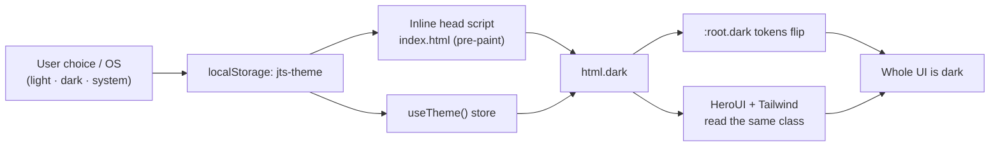

# Theming, design tokens and dark mode

Status: accepted, verified 2026-07-23 (React 19.2.8, HeroUI `@heroui/react`
3.2.2, Tailwind CSS 4.3.3, Vite 8.1.5, `@fontsource-variable/manrope` 5.3.0).

This is the base every admin screen is built on. Its promise: **to style a new
screen you use a semantic token or a plain HeroUI component, and light + dark are
correct with no colour plumbing.** See
[ADR 0005](../decisions/0005-theming-and-dark-mode.md) for the decision record
and [ADR 0006](../decisions/0006-react-admin-runtime.md) for the move from PrimeVue
to HeroUI as the consumer of this system.

## Purpose and boundary

- `packages/design-tokens/src/tokens.css` owns every shared visual value and is
  framework-neutral. It is the single source of truth.
- `apps/admin/src/styles/globals.css` is the **bridge**: it makes HeroUI and
  Tailwind consume those tokens. It owns no colours of its own.
- `apps/admin/src/lib/useTheme.ts` owns the light/dark/system preference and the
  `dark` class on `<html>`; the pre-paint script in `apps/admin/index.html`
  applies that class before first paint.
- Components style themselves with the semantic utilities the bridge exposes
  (`bg-canvas`, `text-ink-muted`, `bg-accent`, …) — never literal colours.

If you are adding colour, spacing or type to a screen and reach for a literal
value, stop — add or reuse a token instead.

## Token layers

Tokens are layered. Consume the semantic layer; never hardcode primitives.

| Layer         | Example                                   | Use it for                                  |
| ------------- | ----------------------------------------- | ------------------------------------------- |
| Primitive     | `--jts-wine-700`, `--jts-clay-300`        | Defining semantics only. Not in components. |
| Semantic      | `--jts-color-primary`, `--jts-color-text` | Everything you build. Carries light/dark.   |
| Scale (type…) | `--jts-space-4`, `--jts-radius-lg`        | Layout, rhythm, type, shadow, z, motion.    |

### Semantic colour tokens you will actually use

| Token                                                                    | Meaning                                      |
| ------------------------------------------------------------------------ | -------------------------------------------- |
| `--jts-color-canvas`                                                     | App background                               |
| `--jts-color-surface`                                                    | Card / panel background                      |
| `--jts-color-surface-raised` / `-sunken`                                 | Inputs & overlays / insets, table stripes    |
| `--jts-color-surface-strong`                                             | Inverse (the wine sidebar)                   |
| `--jts-color-border` / `-subtle` / `-strong`                             | Hairlines and dividers                       |
| `--jts-color-text` / `-muted` / `-subtle`                                | Body / secondary / tertiary text             |
| `--jts-color-text-on-strong`                                             | Text on the wine sidebar                     |
| `--jts-color-primary` (`-hover`/`-active`/`-soft`/`-contrast`)           | Brand actions & emphasis                     |
| `--jts-color-accent`, `--jts-color-link`                                 | Warm secondary accent (copper), links        |
| `--jts-color-focus`, `--jts-focus-ring`                                  | Focus outline and ring                       |
| `--jts-color-success`/`-warning`/`-danger`/`-info` (+ `-soft`/`-border`) | Status: fg, fill, border                     |
| `--jts-color-sidebar-*`                                                  | Sidebar nav states (composed from the above) |

Non-colour scales: `--jts-space-{1..24}`, `--jts-radius-{xs..xl,pill,circle}`,
`--jts-shadow-{xs,sm,md,lg}`, `--jts-z-{base..max}`,
`--jts-duration-*` / `--jts-ease-*`, and type
(`--jts-font-{sans,display,mono}`, `--jts-text-{2xs..3xl}`,
`--jts-weight-*`, `--jts-tracking-*`, `--jts-leading-*`,
`--jts-numeric-tabular`).

## Dark mode: one class, one source

Everything dark is decided by the `dark` class on `<html>`. Nothing else — it is
the class the design tokens, HeroUI and Tailwind all read.

- **No flash.** The inline script in `apps/admin/index.html` reads the stored
  preference (and the OS query when unset/`system`) and toggles `dark` before the
  first paint. It mirrors `useTheme()` exactly; re-applying on mount is
  idempotent.
- **State.** `useTheme()` (a `useSyncExternalStore` module store, not context, so
  every consumer stays in sync) exposes `mode` (`light`/`dark`/`system`),
  `resolved`, `isDark` and `setMode()`. `setMode` persists to `localStorage`
  under `jts-theme` and toggles the class; the store follows OS changes while in
  `system`.
- **Control.** `AdminUserMenu` renders an "Appearance" HeroUI `ToggleButtonGroup`
  (Light / Dark / Auto) bound to `useTheme()`. The menu appears in both the
  sidebar footer and the small-screen top bar, so both stay in step.

## Themes: the second and last appearance axis

The operator menu's **Theme** group selects one of six themes; the appearance
system is a 6×2 grid (theme × light/dark), and the two axes never mix.

| Theme        | Field                         | Brand colour   |
| ------------ | ----------------------------- | -------------- |
| Join The Six | warm rosewood paper (default) | wine           |
| Graphite     | cool neutral                  | steel blue     |
| Noir         | greyscale                     | ink, see below |
| Amphora      | Flexoki ink on paper          | Aegean cyan    |
| Linen        | Radix Colors sand             | copper         |
| Iris         | Rosé Pine                     | iris           |

- **Every theme owns its brand colour.** The first cut kept wine as the primary
  in all of them, so whatever an operator picked, the buttons, the chat bubbles
  and the progress bars stayed pink — the field changed and nothing else did. A
  theme states its own primary, accent, link, focus and status tones.
- **Noir** is the monochrome one: the field is grey, the primary is ink, and
  the single amber is spent only on `warning` and `danger`. Colour there means
  «a human is wanted», which is why the button pressed all day is not allowed
  to wear it.
- `packages/design-tokens/src/palettes.css` holds the five override themes,
  keyed by `data-palette` on `<html>`, each repainting the **semantic colour
  layer only** as flat resolved hexes; type, space, radius, shadows and the
  primitives stay shared. **Join The Six**, the default, is the absence of the
  attribute: `tokens.css` itself.
- The light blocks are scoped `:not(.dark)` because they tie with `:root.dark`
  on specificity and `palettes.css` imports after `tokens.css`. This mirrors
  HeroUI v3's own mechanism for a palette variant, which scopes
  `[data-vibrant-palette="true"]` exactly the same way — HeroUI is CSS-first
  and has no theme object, so a theme is this and nothing more.
- `apps/admin/src/lib/usePalette.ts` mirrors `useTheme`: a module store over
  `localStorage` (`jts-palette`) that stamps the attribute; the pre-paint script
  in `index.html` stamps it before first paint, so neither axis flashes.

To retune a theme, edit its block in `palettes.css` (flat hexes — a theme is a
finished coat of paint, not a second token graph). To retune **Join The Six**,
edit `tokens.css` as always. `apps/admin/test/palettes.spec.ts` is the gate:
every theme must clear the same twelve AA pairs in both modes, own a distinct
brand colour and sidebar, keep its five status meanings mutually distinct, and
the file must parse as nothing but comments and well-formed rule blocks.

## HeroUI + Tailwind bridge

HeroUI v3 is CSS-first: there is no theme provider and no JS theme object.
Components read plain CSS variables, and `apps/admin/src/styles/globals.css`
points those variables at the tokens. Four mechanisms do it:

1. **Unlayered `:root` override of HeroUI's base tokens.** HeroUI defines its
   base tokens (`--background`, `--surface`, `--accent`, `--danger`, `--field-*`,
   `--radius`, …) in `@layer base`. `globals.css` redefines them **unlayered** in
   `:root`, each as a `var(--jts-*)` reference (e.g.
   `--accent: var(--jts-color-primary)`). Unlayered rules beat layered ones, so
   our values win without specificity fights; and because the `--jts-*` tokens
   themselves flip under `:root.dark`, HeroUI flips with them. No second theme
   definition exists anywhere.
2. **`@theme inline` — the Tailwind utility vocabulary.** HeroUI already maps its
   tokens to utilities (`bg-surface`, `bg-accent`, …); `globals.css` adds the jts
   vocabulary (`canvas`, `ink`/`ink-muted`, `primary`, `copper`, `info`,
   `*-border`, `sidebar-*`) and overrides the type/radius/shadow/tracking
   scales, each mapped to a `var(--jts-*)`. The status hairlines are ours
   because HeroUI models a status as fill + soft fill + text and stops there:
   until `--color-{success,warning,danger,info}-border` existed,
   `border-warning-border` was a name Tailwind had never heard of and emitted
   no rule at all, so a tinted block silently lost its edge. Because it is `@theme inline`, the utilities emit the
   `var()` reference itself (rather than baking a colour at build time), so
   `bg-canvas` and friends resolve at runtime and flip with the tokens too.
3. **`@custom-variant dark (&:is(.dark *))`.** This makes Tailwind's `dark:`
   variant key off the same `dark` class, for the rare genuinely structural
   override. Colours never need it — the tokens already flip.
4. **`@utility jts-overline` — the one multi-property type recipe.** Metadata
   labels repeat the same four declarations (`--jts-text-2xs`, extrabold,
   uppercase, `--jts-tracking-caps`) on 23 elements, which no single `@theme`
   entry can express. The `jts-` prefix is required: Tailwind 4.3.3 ships a core
   `overline` utility that sets `text-decoration-line`, v4 dropped
   `corePlugins`, and both rules would emit against the same class.

### Extending it

- **To restyle globally:** edit a token in `tokens.css`. HeroUI components,
  Tailwind utilities and hand-written CSS all update, in both themes.
- **To adjust one HeroUI component:** pass `className` (or per-slot `classNames`)
  using token utilities, or override its `--field-*`/component token locally.
  Never wrap a HeroUI component just to rename its props.
- **To add utility vocabulary:** add a `--color-*` / `--radius-* …` line under
  `@theme inline` mapping to a token (or override a HeroUI base token in `:root`).
  No component edits — this is the "add a status tone" litmus test.

Do not reintroduce a second source of colour: no hex/rgb/oklch in components, no
default Tailwind palette classes (`bg-red-500`, `text-slate-600`, …), no inline
style colours. That is the "shenanigan" this base exists to prevent — if a needed
semantic doesn't exist, add a token, don't hardcode.

### Auditing changes

Every claim above is checkable on one screen. `/admin/cookbook` renders the whole
vocabulary — each swatch painted by the utility it names, each HeroUI and `Jts*`
specimen the real component — so a token or bridge edit can be judged in one
place instead of by touring the product and hoping the tour covered it. Make the
change, read the page, then flip **Appearance** in the operator menu and read it
again; there is no side-by-side dark preview, because the `dark` class is the
only theme signal and a faked second theme would be the one thing there that
cannot be trusted. The page is gated on `import.meta.env.DEV`, so production
never ships it. New vocabulary — a token, a bridge utility, a badge tone, a
`Jts*` component — is added to it in the same change. See
[the cookbook contract](admin-cookbook.md).

## Typography

Manrope (variable, `@fontsource-variable/manrope/wght.css`) is the only family:
display, UI and body. It ships **Latin and Greek**, so Greek and English look
identical for the operator. Numbers that are scanned or compared use tabular
figures (the `tabular-nums` utility, applied to stat values and table bodies).
System sans is the fallback.

`font-mono` is mapped to `--jts-font-mono` in `globals.css` so Tailwind's own
default mono stack never becomes a second source. It is for machine strings an
operator copies or compares — ids, model names, millisecond timestamps — never
for prose.

## Motion

`AdminShell` wraps each route in a 200ms opacity/8px-rise entrance
(`motion/react`), keyed by pathname, and drops to no motion when
`useReducedMotion()` reports a preference. A base rule in `globals.css` also
collapses all animation under `prefers-reduced-motion`. Motion signals
continuity or state change and never carries status by itself.

## Invariants

- Components consume semantic tokens (via the bridge utilities), never
  primitives or literals.
- `dark` on `<html>` is the only dark-mode signal.
- No glows, blurred circles, gradient washes or pulsing dots. Flat accents
  only, plus the six-dot `.brand-mark` logo and one static `.status-dot`.
- The signature emphasis motif is **the 3px marker** (`--jts-color-primary` or
  a status tone): horizontal under the page title, vertical on the left edge of
  accented cards. It means "this matters / something happened" — never "you are
  here" (the active sidebar item lights its index numeral instead) — and do not
  invent parallel emphasis devices.
- Metadata text (tags, table column headers, labels, kickers) is tracked
  micro-caps via `jts-overline`, not a hand-written size/weight/tracking triple;
  content and numbers stay sentence case with tabular figures.
- Both themes stay at or above WCAG AA for text.

## Tests

- `packages/design-tokens/scripts/verify-tokens.mjs` — required token names.
- `apps/admin/test/theme-tokens.spec.ts` — AA contrast for critical text/
  background pairs, light and dark, resolved from `tokens.css`.
- `apps/admin/test/theme-switch.spec.ts` — the `resolveTheme` logic and the
  single-class wiring: the pre-paint script, `@custom-variant dark`, the
  `--accent: var(--jts-color-primary)` bridge, `:root.dark`, and the
  `useTheme`/`setThemeMode`/`THEME_STORAGE_KEY` exports.
- `apps/admin/test/palettes.spec.ts` — every palette in `palettes.css`:
  complete semantic cover, the `:not(.dark)` scoping, the same twelve AA pairs
  in both themes, and the one-id-list wiring across CSS, store, pre-paint
  script and operator menu.
- `apps/admin/test/delivery-shell.spec.ts` — the `index.html` shell: pre-paint
  theme script, unindexed robots meta, and the focusable `#main-content`
  landmark fallback.
- `apps/admin/test/cookbook.spec.ts` — the audit surface: both
  `import.meta.env.DEV` gates, that the gallery names only tokens that exist in
  `tokens.css`, and that it carries no literal colour of its own.

## References

- [ADR 0005](../decisions/0005-theming-and-dark-mode.md),
  [ADR 0006](../decisions/0006-react-admin-runtime.md)
- HeroUI v3 theming — <https://heroui.com/en/docs/react/getting-started/theming>
  (2026-07-23)
- Tailwind CSS v4 theme (`@theme`) — <https://tailwindcss.com/docs/theme>
  (2026-07-23)
- Tailwind CSS v4 dark mode (`@custom-variant`) —
  <https://tailwindcss.com/docs/dark-mode> (2026-07-23)
- Fontsource Manrope — <https://fontsource.org/fonts/manrope>
